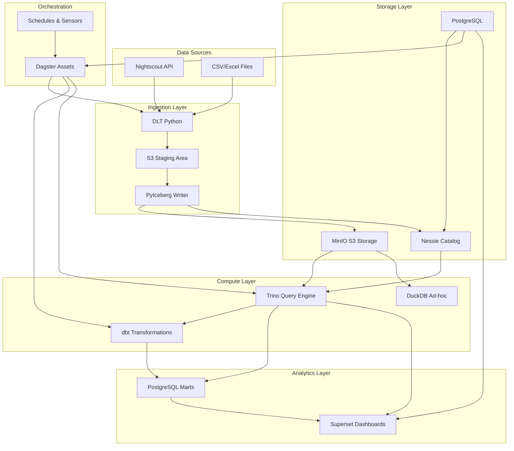
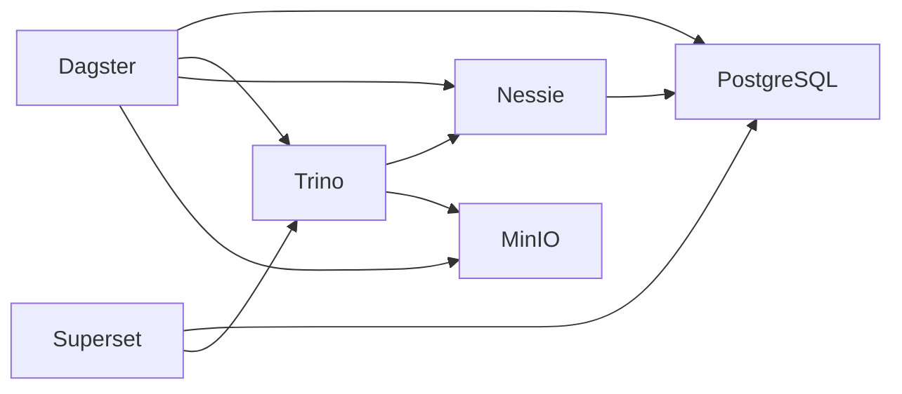
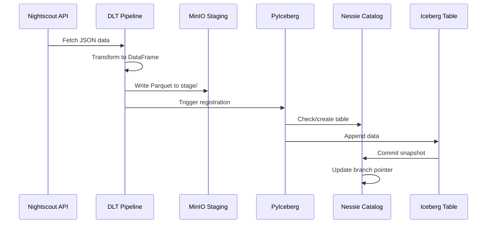
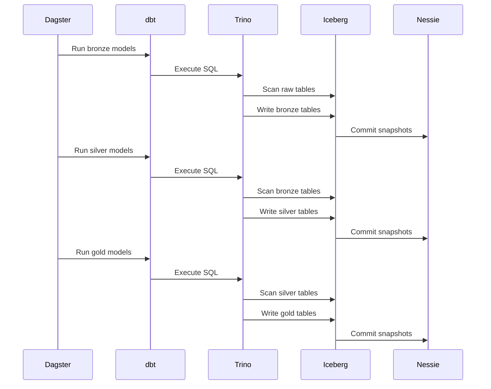
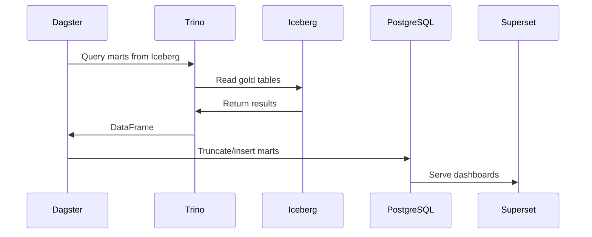
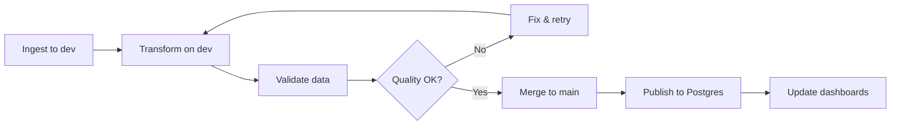
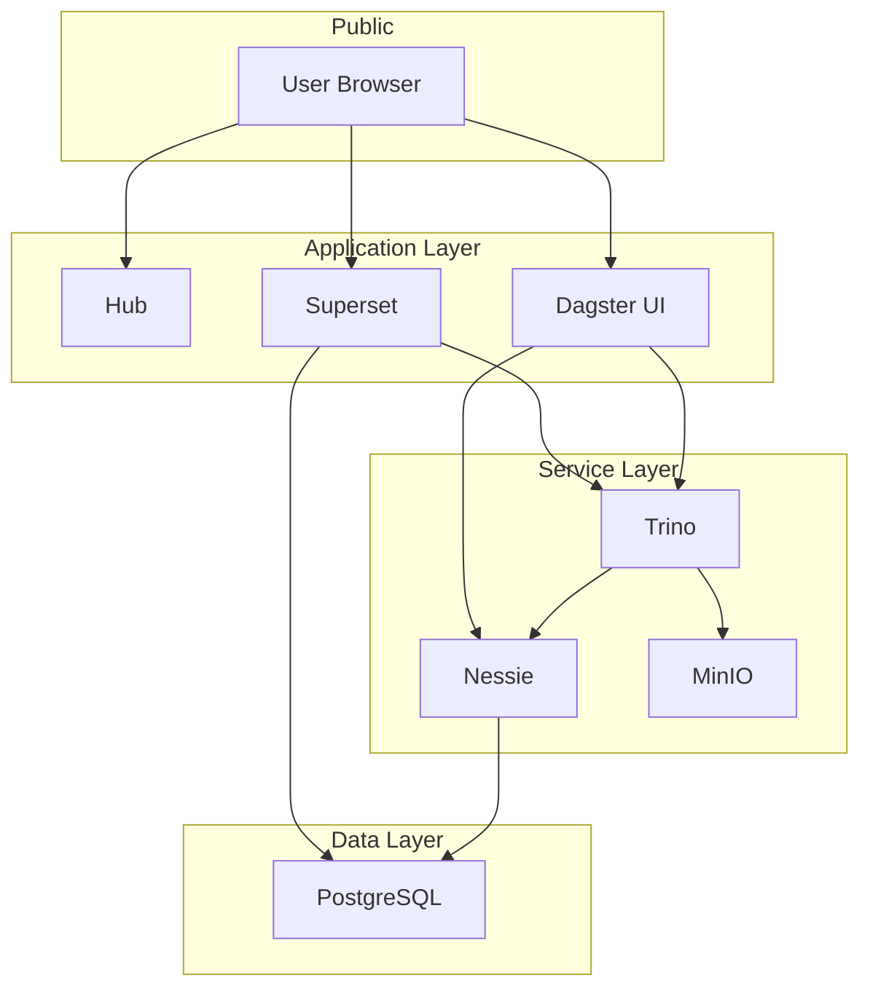

# Cascade Architecture

## Overview

Cascade is built on modern lakehouse principles using Apache Iceberg as the table format and Project Nessie as a Git-like catalog. This architecture provides ACID transactions, schema evolution, time travel, and branch isolation for data engineering workflows.

## Design Principles

### 1. Open Standards
- Apache Iceberg for table format (open spec, multi-engine support)
- S3-compatible storage (portable across cloud providers)
- Standard SQL via Trino
- Open-source components throughout

### 2. Stateless Services
- All state stored in volumes (MinIO, PostgreSQL)
- Services can be restarted without data loss
- Configuration via environment variables
- 12-factor app compliance

### 3. Git-Like Workflows
- Branch isolation (dev/staging/prod)
- Atomic multi-table commits
- Time travel to any point in history
- Tag releases for reproducibility

### 4. Asset-Based Orchestration
- Declarative data assets in Dagster
- Automatic lineage tracking
- Partition-aware dependencies
- Freshness policies for monitoring

## System Architecture

### High-Level Component Diagram



### Service Dependencies



## Core Components

### 1. Apache Iceberg (Table Format)

**Purpose**: Open table format providing ACID transactions, schema evolution, and time travel.

**Key Features**:
- Snapshot isolation for consistent reads
- Hidden partitioning (transparent to users)
- Schema evolution without rewrites
- Time travel via snapshot IDs
- Partition pruning for performance

**Storage Layout**:
```
s3://lake/warehouse/
├── raw/
│   └── entries/
│       ├── metadata/
│       │   ├── v1.metadata.json
│       │   └── snap-123.avro
│       └── data/
│           ├── part-00001.parquet
│           └── part-00002.parquet
├── bronze/
│   └── stg_entries/
├── silver/
│   └── fct_glucose_readings/
└── gold/
    └── dim_date/
```

**Configuration** (in Trino catalog):
```properties
connector.name=iceberg
iceberg.catalog.type=rest
iceberg.rest-catalog.uri=http://nessie:19120/iceberg
fs.native-s3.enabled=true
s3.endpoint=http://minio:9000
s3.path-style-access=true
```

### 2. Project Nessie (Catalog)

**Purpose**: Git-like catalog providing branching, tagging, and multi-table transactions.

**Key Features**:
- Branch isolation (dev/staging/prod)
- Atomic commits across multiple tables
- Merge operations for promoting changes
- Tag snapshots for releases
- REST API for automation

**Branch Strategy**:
```
main (production)
  └── Always stable, validated data

dev (development)
  └── Daily ingestion and transformation testing
  └── Merge to main after validation
```

**API Endpoints**:
- `/api/v2/trees` - List branches
- `/api/v2/trees/branch/{branch}` - Branch operations
- `/api/v2/trees/{branch}/contents` - Table metadata
- `/api/v2/trees/{branch}/history` - Commit history

**Storage**:
- Metadata stored in PostgreSQL
- Table metadata in MinIO (referenced by Nessie)

### 3. Trino (Query Engine)

**Purpose**: Distributed SQL query engine for querying and transforming Iceberg tables.

**Key Features**:
- Native Iceberg connector
- Pushdown optimization to Iceberg
- Distributed joins and aggregations
- Session properties for branch selection

**Query Patterns**:

```sql
-- Set branch context
SET SESSION iceberg.nessie_reference_name = 'dev';

-- Query with partition pruning
SELECT * FROM iceberg.bronze.stg_entries
WHERE date = DATE '2024-10-15';

-- Cross-table join
SELECT e.*, d.day_of_week
FROM iceberg.silver.fct_glucose_readings e
JOIN iceberg.gold.dim_date d ON e.date = d.date;

-- Time travel
SELECT * FROM iceberg.silver.fct_glucose_readings
FOR VERSION AS OF '1234567890';
```

**Resource Configuration**:
- Coordinator: 2-4 GB memory
- Workers: 2-4 GB memory per worker
- Spill to disk for large aggregations

### 4. dbt (Transformations)

**Purpose**: SQL-based data modeling and transformation framework.

**Layered Architecture**:

```
sources (raw Iceberg tables)
  ↓
bronze (staging models)
  ↓
silver (fact tables)
  ↓
gold (dimension tables)
  ↓
marts (business metrics)
```

**Profile Configuration** (`profiles.yml`):
```yaml
cascade:
  target: dev
  outputs:
    dev:
      type: trino
      host: trino
      port: 8080
      catalog: iceberg
      schema: bronze
      session_properties:
        iceberg.nessie_reference_name: dev

    prod:
      type: trino
      host: trino
      port: 8080
      catalog: iceberg
      schema: bronze
      session_properties:
        iceberg.nessie_reference_name: main
```

**Materialization Strategy**:
- Bronze/Silver/Gold: `materialized='table'` (Iceberg tables)
- Marts: `materialized='incremental'` or Postgres publishing

### 5. Dagster (Orchestration)

**Purpose**: Asset-based orchestration with lineage tracking and partitioning.

**Asset Graph**:

```
nightscout_api (external)
  ↓
entries (Iceberg raw.entries)
  ↓
nessie_dev_branch (ensures dev branch exists)
  ↓
dbt:bronze.stg_entries (Trino/Iceberg)
  ↓
dbt:silver.fct_glucose_readings (Trino/Iceberg)
  ↓
dbt:gold.dim_date (Trino/Iceberg)
  ↓
promote_dev_to_main (Nessie merge)
  ↓
postgres_marts (Postgres publishing)
  ↓
superset_dashboards (external)
```

**Resource Architecture**:

```python
@resource
def trino_resource(context) -> trino.dbapi.Connection:
    """Trino connection for querying Iceberg."""
    return trino.dbapi.connect(...)

@resource
def iceberg_catalog(context) -> Catalog:
    """PyIceberg catalog for table operations."""
    return load_catalog('rest', uri=nessie_uri, ...)

@resource
def nessie_resource(context) -> NessieClient:
    """Nessie REST API client for branch operations."""
    return NessieClient(uri=nessie_uri)
```

**Partitioning**:
- Daily partitions: `DailyPartitionsDefinition(start_date="2024-01-01")`
- Dynamic partitions: `DynamicPartitionsDefinition(name="custom")`
- Multi-dimensional: `MultiPartitionsDefinition(...)`

### 6. MinIO (Storage)

**Purpose**: S3-compatible object storage for data and metadata files.

**Bucket Structure**:
```
lake/
├── stage/           # DLT staging area (parquet files)
│   └── nightscout/
│       └── entries/
│           └── 2024-10-15/
├── warehouse/       # Iceberg table data and metadata
│   ├── raw/
│   ├── bronze/
│   ├── silver/
│   └── gold/
└── archive/         # Optional: archived snapshots
```

**Access Configuration**:
- Endpoint: `http://minio:9000`
- Path-style access: enabled
- Credentials: via environment variables

### 7. PostgreSQL (Metadata & Marts)

**Purpose**: Relational database for service metadata and BI marts.

**Database Layout**:

```
lakehouse (main database)
├── nessie_*         # Nessie catalog tables
├── dagster_*        # Dagster metadata
├── superset_*       # Superset metadata
└── marts            # Published analytics tables
    ├── mrt_glucose_overview
    └── mrt_glucose_hourly_patterns
```

**Connection Pooling**:
- Max connections: 100
- Idle timeout: 300 seconds
- Statement timeout: 60 seconds

## Data Flow

### Ingestion Pipeline



### Transformation Pipeline



### Publishing Pipeline



## Branching Workflow

### Development Branch Workflow



### Nessie Branch Operations

**Create Branch**:
```python
@asset
def nessie_dev_branch(nessie: NessieResource) -> None:
    """Ensure dev branch exists."""
    branches = nessie.list_branches()
    if 'dev' not in [b.name for b in branches]:
        nessie.create_branch('dev', from_branch='main')
```

**Promote to Main**:
```python
@asset(deps=[nessie_dev_branch, "dbt:*"])
def promote_dev_to_main(nessie: NessieResource) -> None:
    """Merge dev branch to main."""
    nessie.merge_branch(
        from_branch='dev',
        to_branch='main',
        message='Promote validated data to production'
    )
```

### Branch Isolation

```
dev branch
├── Raw data: 2024-10-15 (snapshot_id: abc123)
├── Bronze: stg_entries (snapshot_id: def456)
└── Silver: fct_glucose_readings (snapshot_id: ghi789)

main branch
├── Raw data: 2024-10-14 (snapshot_id: xyz000)
├── Bronze: stg_entries (snapshot_id: uvw111)
└── Silver: fct_glucose_readings (snapshot_id: rst222)
```

Branches have independent snapshots; merging updates main's pointers atomically.

## Performance Optimization

### Query Performance

**Partition Pruning**:
```sql
-- Good: Uses partition filter
SELECT * FROM iceberg.raw.entries
WHERE day(mills) = DATE '2024-10-15';

-- Bad: Full table scan
SELECT * FROM iceberg.raw.entries
WHERE sgv > 100;
```

**Projection Pushdown**:
```sql
-- Good: Only reads required columns
SELECT sgv, mills FROM iceberg.raw.entries;

-- Bad: Reads all columns
SELECT * FROM iceberg.raw.entries;
```

**File Compaction**:
- Run periodic compaction on large tables
- Target file size: 128-512 MB
- Combine small files to reduce metadata overhead

### Concurrency

**Optimistic Concurrency Control**:
- Writers take no locks
- Snapshots committed atomically
- Retry on conflict (rare)

**Reader Isolation**:
- Readers never block writers
- Readers see consistent snapshot
- No lock contention

## Security

### Network Isolation



### Access Control

**MinIO**:
- Access key/secret key authentication
- Bucket policies for read/write permissions
- Optional: IAM integration

**Trino**:
- Development: No auth (trusted network)
- Production: LDAP/Kerberos/OAuth
- Row-level security via views

**Nessie**:
- Development: Open API
- Production: OAuth2/OIDC
- Branch-level permissions (future)

**PostgreSQL**:
- Role-based access control
- SSL connections required
- Password authentication

## Observability

### Metrics

**Service Health**:
- Nessie: `/api/v2/config` endpoint
- Trino: `/v1/info` endpoint
- MinIO: Health check endpoint
- Dagster: `/server_info` endpoint

**Pipeline Metrics**:
- Asset materialization duration
- Freshness checks (24h fail window)
- Data quality checks (Pandera)
- Row counts and data volumes

### Logging

**Structured Logs**:
```json
{
  "timestamp": "2024-10-15T10:30:00Z",
  "service": "dagster",
  "level": "INFO",
  "asset": "entries",
  "partition": "2024-10-15",
  "rows": 1234,
  "duration_ms": 5678
}
```

**Log Aggregation**:
- All services log to stdout
- Docker logs driver captures output
- Optional: Ship to Loki/Elasticsearch

### Lineage

**Dagster Lineage Graph**:
- Automatic lineage from asset dependencies
- Partition-level granularity
- Cross-asset dependencies

**External Lineage**:
- OpenLineage integration (future)
- Export to DataHub/Marquez (optional)

## Disaster Recovery

### Backup Strategy

**Nessie Metadata**:
- PostgreSQL dumps (pg_dump)
- Frequency: Daily
- Retention: 30 days

**Iceberg Data**:
- MinIO versioning enabled
- Snapshot retention policy (90 days)
- Optional: S3 replication to secondary region

**Configuration**:
- `.env` file backup
- Docker Compose file versioned in Git
- dbt models versioned in Git

### Recovery Procedures

**Full Restore**:
1. Restore PostgreSQL from dump
2. Restore MinIO bucket from backup
3. Verify Nessie catalog integrity
4. Restart services

**Point-in-Time Recovery**:
1. Use Nessie time travel to query historical state
2. Create new branch from historical snapshot
3. Validate data integrity
4. Promote branch to main if needed

## Deployment Options

### Docker Compose (Current)

**Pros**:
- Simple setup
- Good for POC and small deployments
- Easy local development

**Cons**:
- Single host (no distribution)
- Manual scaling
- Limited high availability

### Kubernetes (Future)

**Architecture**:
```
Namespace: cascade
├── StatefulSet: nessie (3 replicas)
├── StatefulSet: trino-coordinator (1 replica)
├── Deployment: trino-workers (3-10 replicas)
├── Deployment: dagster-webserver (2 replicas)
├── Deployment: dagster-daemon (1 replica)
├── PVC: minio-data (or external S3)
└── PVC: postgres-data
```

**Helm Chart** (planned):
- Parameterized service configs
- Autoscaling for Trino workers
- Rolling updates with zero downtime
- Secrets management via K8s secrets

### Cloud Migration

**Storage Options**:
- AWS S3 instead of MinIO
- Google Cloud Storage
- Azure Blob Storage

**Compute Options**:
- Managed Trino (Starburst, AWS EMR)
- Cloud-native Iceberg (Snowflake, Databricks)
- Serverless Spark for transformations

**Benefits**:
- Unlimited scale
- Managed services (reduced ops burden)
- Global replication
- Integration with cloud-native tools

## Testing Strategy

### Unit Tests

```python
def test_ensure_table_creates_table(mocker):
    """Test table creation logic."""
    catalog = mocker.Mock()
    ensure_table(catalog, 'test', schema, partition_spec)
    catalog.create_table.assert_called_once()
```

### Integration Tests

```bash
# Test Nessie API
curl http://localhost:19120/api/v2/config

# Test Trino connection
docker exec trino trino --execute "SHOW CATALOGS;"

# Test PyIceberg catalog
python -c "from cascade.iceberg.catalog import get_catalog; get_catalog().list_namespaces()"
```

### End-to-End Tests

```bash
# Full pipeline test
dagster asset materialize --select entries
dagster asset materialize --select "dbt:*"
dagster asset materialize --select postgres_*
```

## Performance Benchmarks

### Ingestion Throughput

- **DLT + PyIceberg**: 10K-50K rows/second (single partition)
- **Bottleneck**: Network to MinIO
- **Optimization**: Batch writes, larger Parquet row groups

### Query Performance

- **Bronze queries** (staged data): 100ms-1s for single partition
- **Silver queries** (fact tables): 500ms-5s for filtered queries
- **Gold queries** (dimensions): <100ms (small tables)
- **Marts queries** (Postgres): <50ms (indexed, materialized)

### Transformation Duration

- **Bronze layer**: 10-30 seconds (simple type conversions)
- **Silver layer**: 30-60 seconds (joins, aggregations)
- **Gold layer**: 5-10 seconds (small dimensions)
- **Full pipeline**: 2-5 minutes (end-to-end)

## Future Enhancements

### Near-Term (Phases 11-12)

- Complete documentation
- Production hardening (auth, TLS)
- Monitoring dashboards (Prometheus + Grafana)
- Automated testing in CI/CD

### Medium-Term

- Kubernetes Helm chart
- DuckDB integration in Hub app
- Additional data sources (CSV, Excel, databases)
- Schema registry integration

### Long-Term

- Multi-cluster Trino (separate coordinator/workers)
- Spark integration for ML workloads
- Real-time ingestion (Kafka → Iceberg)
- Cloud deployment guides (AWS, GCP, Azure)

## References

- [Apache Iceberg Spec](https://iceberg.apache.org/spec/)
- [Project Nessie Documentation](https://projectnessie.org/docs/)
- [Trino Documentation](https://trino.io/docs/current/)
- [dbt Documentation](https://docs.getdbt.com/)
- [Dagster Documentation](https://docs.dagster.io/)
