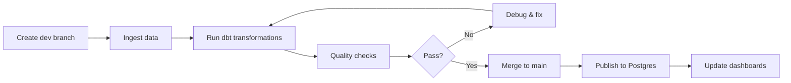

# Nessie Workflow Guide

This guide covers Project Nessie's Git-like branching workflow for data engineering.

## Overview

Project Nessie provides version control for data tables, similar to Git for code. It enables:

- **Branch isolation**: Test changes on dev without affecting production
- **Atomic commits**: Update multiple tables in a single transaction
- **Time travel**: Query data as it existed at any point in history
- **Merge operations**: Promote validated changes from dev to main
- **Tag releases**: Mark specific points for reproducibility

## Branch Strategy

Cascade uses a simple two-branch strategy:

```
main (production)
  - Stable, validated data
  - Published to PostgreSQL marts
  - Queried by Superset dashboards
  - Never written to directly

dev (development)
  - Daily ingestion and transformations
  - Data quality testing
  - Validated before promotion
  - Merged to main when ready
```

### Branch Lifecycle



## Creating and Managing Branches

### Via Dagster Assets

Cascade includes built-in assets for branch management:

```python
# Ensure dev branch exists
dagster asset materialize --select nessie_dev_branch

# Promote dev to main
dagster asset materialize --select promote_dev_to_main

# Check branch status
dagster asset materialize --select nessie_branch_status
```

### Via Python API

```python
from cascade.defs.resources.nessie import NessieClient

# Initialize client
nessie = NessieClient()

# List branches
branches = nessie.list_branches()
for branch in branches:
    print(f"Branch: {branch.name}, Hash: {branch.hash}")

# Create a new branch
nessie.create_branch('feature', from_branch='dev')

# Delete a branch
nessie.delete_branch('feature')

# Tag a specific state
nessie.create_tag('release-2024-10-15', from_branch='main')
```

### Via REST API

```bash
# List branches
curl http://localhost:19120/api/v2/trees

# Get branch details
curl http://localhost:19120/api/v2/trees/branch/dev

# Create branch
curl -X POST http://localhost:19120/api/v2/trees/branch/feature \
  -H "Content-Type: application/json" \
  -d '{"sourceRefName": "dev"}'

# Create tag
curl -X POST http://localhost:19120/api/v2/trees/tag/release-2024-10-15 \
  -H "Content-Type: application/json" \
  -d '{"sourceRefName": "main"}'
```

## Working on the Dev Branch

### 1. Ingestion on Dev

The `entries` asset automatically uses the dev branch:

```python
@asset(deps=[nessie_dev_branch])
def entries(iceberg: IcebergResource, context: AssetExecutionContext) -> None:
    """Ingest Nightscout data to dev branch."""
    # IcebergResource configured with ref='dev'
    catalog = iceberg.get_catalog()
    table = catalog.load_table('raw.entries')
    # ... write data
```

Run ingestion:

```bash
docker exec dagster-webserver dagster asset materialize --select entries
```

### 2. Transformation on Dev

The `dbt` resource uses the dev branch by default:

```yaml
# profiles.yml
cascade:
  outputs:
    dev:
      type: trino
      session_properties:
        iceberg.nessie_reference_name: dev
```

Run dbt:

```bash
docker exec dagster-webserver dagster asset materialize --select "dbt:*"
```

### 3. Query Dev Branch

**Via Trino:**

```sql
-- Set branch context
SET SESSION iceberg.nessie_reference_name = 'dev';

-- Query tables
SELECT * FROM iceberg.bronze.stg_entries LIMIT 10;
SELECT * FROM iceberg.silver.fct_glucose_readings LIMIT 10;
```

**Via DuckDB:**

```python
import duckdb

conn = duckdb.connect()
conn.execute("INSTALL iceberg; LOAD iceberg;")
conn.execute("INSTALL httpfs; LOAD httpfs;")

# Configure S3
conn.execute("""
    SET s3_endpoint='localhost:9000';
    SET s3_use_ssl=false;
    SET s3_access_key_id='minioadmin';
    SET s3_secret_access_key='password123';
""")

# Query from dev branch
# Note: Must use dev-specific metadata path
result = conn.execute("""
    SELECT * FROM iceberg_scan('s3://lake/warehouse/raw/entries/metadata/v1.metadata.json')
    LIMIT 10;
""").fetchdf()

print(result)
```

**Via PyIceberg:**

```python
from cascade.iceberg.catalog import get_catalog

# Connect to dev branch
cat = get_catalog(ref='dev')

# Load table
table = cat.load_table('raw.entries')

# Scan to DataFrame
df = table.scan().to_pandas()
print(f"Dev branch: {len(df)} rows")
```

## Merging Dev to Main

### Automated Promotion

Use the `promote_dev_to_main` asset:

```bash
# Promote all changes from dev to main
docker exec dagster-webserver dagster asset materialize --select promote_dev_to_main
```

This performs an atomic merge operation, updating all table pointers on main to match dev.

### Manual Promotion via Python

```python
from cascade.defs.resources.nessie import NessieClient

nessie = NessieClient()

# Merge dev into main
nessie.merge_branch(
    from_branch='dev',
    to_branch='main',
    message='Promote validated data from dev to production'
)

print("✓ Dev successfully merged to main")
```

### Manual Promotion via API

```bash
# Get dev branch hash
DEV_HASH=$(curl -s http://localhost:19120/api/v2/trees/branch/dev | jq -r '.hash')

# Get main branch hash
MAIN_HASH=$(curl -s http://localhost:19120/api/v2/trees/branch/main | jq -r '.hash')

# Merge dev to main
curl -X POST "http://localhost:19120/api/v2/trees/branch/main/merge" \
  -H "Content-Type: application/json" \
  -d "{
    \"fromHash\": \"$DEV_HASH\",
    \"message\": \"Promote dev to main\"
  }"
```

### Verification After Merge

```bash
# Query main branch via Trino
docker exec trino trino --execute "
SET SESSION iceberg.nessie_reference_name = 'main';
SELECT COUNT(*) FROM iceberg.raw.entries;
"

# Compare row counts
docker exec dagster-webserver python -c "
from cascade.iceberg.catalog import get_catalog

dev_cat = get_catalog(ref='dev')
main_cat = get_catalog(ref='main')

dev_table = dev_cat.load_table('raw.entries')
main_table = main_cat.load_table('raw.entries')

dev_rows = dev_table.scan().to_arrow().num_rows
main_rows = main_table.scan().to_arrow().num_rows

print(f'Dev: {dev_rows:,} rows')
print(f'Main: {main_rows:,} rows')
"
```

## Time Travel

### Query Historical Snapshots

Every commit creates a snapshot. Query data as it existed at any point in time.

**Via Trino:**

```sql
-- Query as of timestamp
SELECT * FROM iceberg.silver.fct_glucose_readings
FOR TIMESTAMP AS OF TIMESTAMP '2024-10-15 12:00:00';

-- Query specific snapshot ID
SELECT * FROM iceberg.silver.fct_glucose_readings
FOR VERSION AS OF 1234567890;
```

**Via PyIceberg:**

```python
from cascade.iceberg.catalog import get_catalog
from datetime import datetime

cat = get_catalog(ref='main')
table = cat.load_table('silver.fct_glucose_readings')

# Query as of timestamp
snapshot_time = datetime(2024, 10, 15, 12, 0, 0)
df = table.scan(snapshot_id=table.history()[0].snapshot_id).to_pandas()

print(f"Historical data: {len(df)} rows")
```

### View Snapshot History

**Via Trino:**

```sql
-- List snapshots
SELECT * FROM iceberg.silver."fct_glucose_readings$snapshots"
ORDER BY committed_at DESC
LIMIT 10;

-- List history
SELECT * FROM iceberg.silver."fct_glucose_readings$history"
ORDER BY made_current_at DESC
LIMIT 10;
```

**Via PyIceberg:**

```python
from cascade.iceberg.catalog import get_catalog

cat = get_catalog(ref='main')
table = cat.load_table('silver.fct_glucose_readings')

# List snapshots
for snapshot in table.history():
    print(f"Snapshot {snapshot.snapshot_id}: {snapshot.timestamp_ms}")

# Get current snapshot
current = table.current_snapshot()
print(f"Current snapshot: {current.snapshot_id}")
```

### Restore from Snapshot

**Via Trino:**

```sql
-- Rollback to previous snapshot
CALL iceberg.system.rollback_to_snapshot(
  'silver.fct_glucose_readings',
  1234567890
);
```

**Via PyIceberg:**

```python
from cascade.iceberg.catalog import get_catalog

cat = get_catalog(ref='dev')
table = cat.load_table('silver.fct_glucose_readings')

# Rollback to previous snapshot
previous_snapshot_id = table.history()[-2].snapshot_id
table.update_spec().rollback_to_snapshot(previous_snapshot_id).commit()
```

## Advanced Workflows

### Feature Branch Development

For experimental work, create a feature branch:

```python
from cascade.defs.resources.nessie import NessieClient

nessie = NessieClient()

# Create feature branch from dev
nessie.create_branch('feature/new-metric', from_branch='dev')

# Work on feature branch
# ... run transformations with ref='feature/new-metric'

# Merge back to dev when ready
nessie.merge_branch(
    from_branch='feature/new-metric',
    to_branch='dev',
    message='Add new glucose variability metric'
)

# Delete feature branch
nessie.delete_branch('feature/new-metric')
```

### Release Tagging

Tag production releases for reproducibility:

```python
from cascade.defs.resources.nessie import NessieClient
from datetime import datetime

nessie = NessieClient()

# Tag current main state
tag_name = f"release-{datetime.now().strftime('%Y-%m-%d')}"
nessie.create_tag(tag_name, from_branch='main')

print(f"✓ Created tag: {tag_name}")
```

Query tagged releases:

```sql
-- Query specific release
SET SESSION iceberg.nessie_reference_name = 'release-2024-10-15';
SELECT * FROM iceberg.silver.fct_glucose_readings;
```

### Multi-Table Transactions

Nessie commits are atomic across multiple tables:

```python
from cascade.iceberg.catalog import get_catalog

cat = get_catalog(ref='dev')

# Write to multiple tables
table1 = cat.load_table('bronze.stg_entries')
table2 = cat.load_table('bronze.stg_treatments')

# Both writes committed atomically by Nessie
table1.append(df1)
table2.append(df2)

# If either fails, neither is committed
```

## Best Practices

### 1. Always Work on Dev

Never write directly to main. Use dev for all ingestion and transformation work.

```bash
# Good
dagster asset materialize --select entries  # writes to dev
dagster asset materialize --select "dbt:*"  # transforms on dev

# Bad (don't do this)
# Manually writing to main branch
```

### 2. Validate Before Promotion

Run quality checks before merging to main:

```bash
# Run quality checks
dagster asset materialize --select "quality:*"

# Review results in Dagster UI
open http://localhost:3000

# Promote only if checks pass
dagster asset materialize --select promote_dev_to_main
```

### 3. Use Daily Promotion Schedule

Automate daily validation and promotion:

```python
@schedule(
    cron_schedule="0 6 * * *",  # 6 AM daily
    job=prod_promotion_job,
    execution_timezone="Europe/London"
)
def daily_promotion_schedule():
    """Promote dev to main after morning validation."""
    return RunRequest()
```

### 4. Tag Monthly Releases

Create tags for month-end reporting:

```bash
# Create monthly tag
docker exec dagster-webserver python -c "
from cascade.defs.resources.nessie import NessieClient
from datetime import datetime

nessie = NessieClient()
tag = f'monthly-{datetime.now().strftime(\"%Y-%m\")}'
nessie.create_tag(tag, from_branch='main')
print(f'Created tag: {tag}')
"
```

### 5. Branch Naming Conventions

Use descriptive branch names:

- `main`: Production data
- `dev`: Daily development
- `feature/<name>`: Experimental features
- `hotfix/<issue>`: Emergency fixes
- `staging`: Pre-production testing

### 6. Monitor Branch Divergence

Track how far dev is ahead of main:

```python
from cascade.defs.resources.nessie import NessieClient

nessie = NessieClient()

dev_commits = nessie.list_commits('dev')
main_commits = nessie.list_commits('main')

print(f"Dev has {len(dev_commits) - len(main_commits)} commits ahead of main")
```

## Troubleshooting

### Branch Not Found

```bash
# List all branches
curl http://localhost:19120/api/v2/trees

# Recreate dev branch if missing
docker exec dagster-webserver dagster asset materialize --select nessie_dev_branch
```

### Merge Conflicts

Nessie uses optimistic concurrency. Conflicts are rare but can occur.

```python
from cascade.defs.resources.nessie import NessieClient

try:
    nessie = NessieClient()
    nessie.merge_branch('dev', 'main')
except Exception as e:
    print(f"Merge failed: {e}")
    # Resolution: Retry merge (Nessie handles conflicts automatically)
```

### Branch Isolation Issues

Verify each branch has independent snapshots:

```bash
docker exec dagster-webserver python -c "
from cascade.iceberg.catalog import get_catalog

dev_cat = get_catalog(ref='dev')
main_cat = get_catalog(ref='main')

dev_table = dev_cat.load_table('raw.entries')
main_table = main_cat.load_table('raw.entries')

print(f'Dev snapshot: {dev_table.current_snapshot().snapshot_id}')
print(f'Main snapshot: {main_table.current_snapshot().snapshot_id}')
"
```

### Time Travel Query Failures

Snapshots expire based on retention policy:

```sql
-- Check snapshot retention
SHOW CREATE TABLE iceberg.silver.fct_glucose_readings;

-- Extend retention (if needed)
ALTER TABLE iceberg.silver.fct_glucose_readings
SET TBLPROPERTIES ('history.expire.min-snapshots-to-keep'='30');
```

## Integration with CI/CD

### GitHub Actions Example

```yaml
name: Promote to Production

on:
  schedule:
    - cron: '0 6 * * *'  # Daily at 6 AM
  workflow_dispatch:  # Manual trigger

jobs:
  promote:
    runs-on: ubuntu-latest
    steps:
      - name: Run quality checks
        run: |
          docker exec dagster-webserver dagster asset materialize --select "quality:*"

      - name: Promote dev to main
        if: success()
        run: |
          docker exec dagster-webserver dagster asset materialize --select promote_dev_to_main

      - name: Publish to Postgres
        if: success()
        run: |
          docker exec dagster-webserver dagster asset materialize --select "postgres_*"
```

## Resources

- [Project Nessie Documentation](https://projectnessie.org/docs/)
- [Nessie REST API Reference](https://projectnessie.org/develop/rest/)
- [Apache Iceberg Branching](https://iceberg.apache.org/docs/latest/branching/)
- [Cascade Architecture](./ARCHITECTURE.md)

## Summary

Nessie's Git-like branching enables safe, validated data engineering workflows:

1. Develop on `dev` branch (isolated from production)
2. Run quality checks and validations
3. Merge to `main` atomically (all tables updated together)
4. Tag releases for reproducibility
5. Time travel to any historical state

This workflow prevents production data corruption and enables confident iteration on data pipelines.
