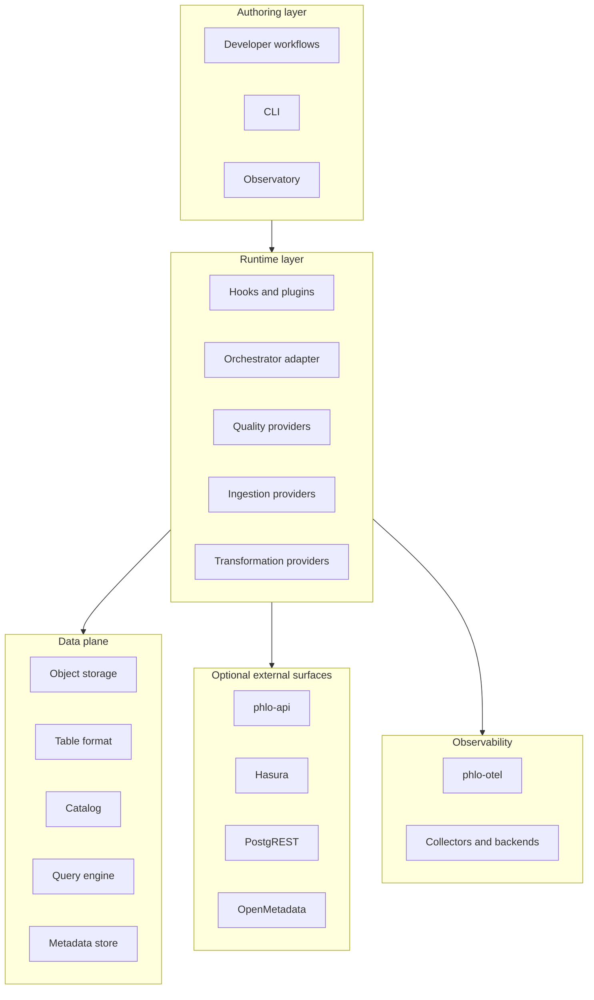

# Public System Design

This page explains the public architecture of Phlo as a platform.

## System View

## Design Principles

- one platform, many optional surfaces
- stable higher-level concepts over direct vendor coupling
- package-level modularity with capability-based composition
- explicit data lifecycle from ingest to serving
- observability and governance as cross-cutting concerns, not add-ons bolted on later

## Main Boundaries

- authoring and workflow definition
- runtime composition and execution
- data storage, catalog, and query
- optional serving and metadata surfaces
- monitoring, tracing, and operational visibility

## Related Pages

- [Choosing Components](../guides/choosing-components.md)
- [Platform Topology](../reference/platform-topology.md)
- [Architecture Overview](../reference/architecture.md)
