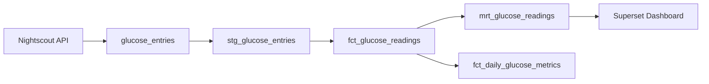

# Part 11: Observability and Monitoring—Knowing Your Pipeline

You've built a data lakehouse with validation and governance. But what happens at 3am when something breaks? This post covers observability: monitoring, alerting, and troubleshooting.

## The Observability Problem

Without proper monitoring, failures hide:

```
Tuesday 3am:
  • DLT fails to fetch from Nightscout API
  • Data stops flowing
  • Nobody notices
  
Wednesday 9am:
  • Users report: "Dashboard shows stale data"
  • Investigation: "Last update was 30 hours ago"
  • Impact: 500+ people using outdated metrics
  • Root cause: API timeout at 3:14am, log buried in Dagster logs
```

Observability solves this with:

```
[Monitoring] → Understand what's happening
[Alerting]   → Get notified of problems
[Tracing]    → Find root causes quickly
[Dashboards] → Visualize pipeline health
```

## Three Pillars of Observability

### 1. Metrics (Numbers)

Track quantitative data:

```
• Pipeline runtime: 5.2 seconds
• Data quality: 99.7% valid rows
• Row throughput: 12,500 rows/minute
• Freshness: 2 hours since last update
• API latency: 150ms average
```

### 2. Logs (Events)

Track what happened and when:

```
[2024-10-15 10:35:42] ✓ dlt_glucose_entries started
[2024-10-15 10:35:45] ✓ Fetched 487 rows from API
[2024-10-15 10:35:47] ✓ Pandera validation: 487/487 rows valid
[2024-10-15 10:35:49] ⚠ 2 rows with invalid device type (logged)
[2024-10-15 10:35:51] ✓ Merged to Iceberg (487 inserts, 2 updates)
[2024-10-15 10:35:53] ✓ dlt_glucose_entries succeeded
```

### 3. Traces (Flows)

Track execution paths:

```
Request: dlt_glucose_entries asset materialization
├─ Fetch from API (45ms)
│  ├─ Auth (5ms)
│  └─ Network (40ms)
├─ Pandera validation (12ms)
│  ├─ Type checking (8ms)
│  └─ Constraint checking (4ms)
├─ Merge to Iceberg (80ms)
│  ├─ Read current snapshot (20ms)
│  ├─ Merge operation (40ms)
│  └─ Write metadata (20ms)
└─ Asset check (15ms)

Total: 152ms
```

## Phlo's Observability Stack

```
┌──────────────────────────────┐
│  Application Layer           │
│  (Dagster, dbt, DLT)         │
└──────────────────────────────┘
            ↓ (emits events)
┌──────────────────────────────┐
│  Collection Layer            │
│  • Dagster Logs              │
│  • Application Metrics       │
│  • System Metrics (Prometheus)
└──────────────────────────────┘
            ↓
┌──────────────────────────────┐
│  Storage Layer               │
│  • Loki (logs)               │
│  • Prometheus (metrics)      │
│  • Jaeger (traces)           │
└──────────────────────────────┘
            ↓
┌──────────────────────────────┐
│  Analysis & Visualization    │
│  • Grafana (dashboards)      │
│  • Alertmanager (alerts)     │
│  • Superset (data quality)   │
└──────────────────────────────┘
```

## Metrics: What to Track

### Asset-Level Metrics

```python
# phlo/defs/monitoring/metrics.py
from dagster import op, Out, DynamicOut, DynamicOutput, resource
from prometheus_client import Counter, Histogram, Gauge
import time


# Define metrics
asset_execution_time = Histogram(
    name="asset_execution_seconds",
    documentation="Asset execution time in seconds",
    labelnames=["asset_name", "status"],
)

asset_rows_processed = Counter(
    name="asset_rows_processed_total",
    documentation="Total rows processed",
    labelnames=["asset_name", "operation"],
)

asset_row_count_gauge = Gauge(
    name="asset_row_count",
    documentation="Current row count in asset",
    labelnames=["asset_name", "schema"],
)

data_freshness_seconds = Gauge(
    name="asset_freshness_seconds",
    documentation="Seconds since last update",
    labelnames=["asset_name"],
)

validation_pass_rate = Gauge(
    name="validation_pass_rate",
    documentation="Percentage of rows passing validation",
    labelnames=["asset_name", "check_name"],
)


@op
def ingest_with_metrics(context) -> int:
    """Ingest glucose data with metrics."""
    
    start_time = time.time()
    
    try:
        # Fetch data
        data = fetch_from_api()
        row_count = len(data)
        
        # Log metrics
        asset_rows_processed.labels(
            asset_name="dlt_glucose_entries",
            operation="fetch",
        ).inc(row_count)
        
        # Validate
        valid_rows = validate(data)
        pass_rate = (len(valid_rows) / row_count) * 100
        
        validation_pass_rate.labels(
            asset_name="dlt_glucose_entries",
            check_name="schema",
        ).set(pass_rate)
        
        # Execution time
        elapsed = time.time() - start_time
        asset_execution_time.labels(
            asset_name="dlt_glucose_entries",
            status="success",
        ).observe(elapsed)
        
        context.log.info(
            f"✓ Ingestion: {row_count} rows in {elapsed:.2f}s "
            f"({pass_rate:.1f}% valid)"
        )
        
        return row_count
        
    except Exception as e:
        elapsed = time.time() - start_time
        asset_execution_time.labels(
            asset_name="dlt_glucose_entries",
            status="failure",
        ).observe(elapsed)
        raise
```

### System-Level Metrics

```python
# phlo/monitoring/system_metrics.py
from prometheus_client import start_http_server, Gauge, Counter
import psutil
import docker

disk_usage_percent = Gauge(
    name="disk_usage_percent",
    documentation="Disk usage percentage",
    labelnames=["mount_point"],
)

memory_usage_percent = Gauge(
    name="memory_usage_percent",
    documentation="Memory usage percentage",
)

container_health = Gauge(
    name="container_health",
    documentation="Container status (1=healthy, 0=unhealthy)",
    labelnames=["container_name"],
)

storage_lake_size_bytes = Gauge(
    name="storage_lake_size_bytes",
    documentation="MinIO lake storage size",
)


def collect_system_metrics():
    """Collect infrastructure metrics."""
    
    # Disk usage
    disk = psutil.disk_usage("/")
    disk_usage_percent.labels(mount_point="/").set(disk.percent)
    
    # Memory usage
    memory = psutil.virtual_memory()
    memory_usage_percent.set(memory.percent)
    
    # Container health
    docker_client = docker.from_env()
    for container in docker_client.containers.list():
        status = container.status
        health = 1 if status == "running" else 0
        container_health.labels(container_name=container.name).set(health)
    
    # Lake storage size
    minio_client = get_minio_client()
    size = get_bucket_size(minio_client, "lake")
    storage_lake_size_bytes.set(size)
```

## Logs: Structured Logging

Use structured logs for easy searching:

```python
# phlo/defs/ingestion/dlt_assets.py
import structlog

logger = structlog.get_logger()


@asset
def dlt_glucose_entries(context) -> None:
    """Ingest glucose entries with structured logging."""
    
    logger.info(
        "asset_started",
        asset_name="dlt_glucose_entries",
        timestamp=datetime.utcnow().isoformat(),
    )
    
    try:
        # Fetch API
        logger.info(
            "api_fetch_started",
            endpoint="https://api.nightscout.info/api/v1/entries",
            timeout_seconds=30,
        )
        
        response = fetch_from_api()
        
        logger.info(
            "api_fetch_success",
            rows_returned=len(response),
            response_time_ms=response.elapsed.total_seconds() * 1000,
        )
        
        # Validate
        logger.info(
            "validation_started",
            validator="pandera",
            schema="glucose_entries_v1",
        )
        
        validated = validate(response)
        invalid_count = len(response) - len(validated)
        
        logger.info(
            "validation_complete",
            total_rows=len(response),
            valid_rows=len(validated),
            invalid_rows=invalid_count,
            pass_rate=100.0 * len(validated) / len(response),
        )
        
        # Merge
        logger.info(
            "merge_started",
            table="raw.glucose_entries",
            rows_to_merge=len(validated),
            unique_key="_id",
        )
        
        result = merge_to_iceberg(validated)
        
        logger.info(
            "merge_complete",
            table="raw.glucose_entries",
            inserts=result["inserts"],
            updates=result["updates"],
            merge_time_ms=result["duration_ms"],
        )
        
        # Success
        logger.info(
            "asset_succeeded",
            asset_name="dlt_glucose_entries",
            total_time_ms=get_total_elapsed(),
        )
        
    except Exception as e:
        logger.exception(
            "asset_failed",
            asset_name="dlt_glucose_entries",
            error_type=type(e).__name__,
            error_message=str(e),
        )
        raise
```

In Grafana, search logs:

```
{job="dagster"} | json | asset_name="dlt_glucose_entries" | status="success"

Last 24 hours:
├─ 10/15 10:35 ✓ Succeeded in 152ms
├─ 10/15 10:30 ✓ Succeeded in 145ms
├─ 10/15 10:25 ✓ Succeeded in 168ms
├─ 10/15 10:20 ⚠ Succeeded in 1,240ms (slow)
└─ 10/15 10:15 ✓ Succeeded in 156ms
```

## Alerting: Detecting Problems

### Freshness Alerts

```yaml
# monitoring/prometheus_rules.yaml
groups:
  - name: data_quality
    rules:
      # Alert if data is stale (>2 hours old)
      - alert: DatasetFreshness
        expr: |
          (time() - asset_last_update_timestamp) / 3600 > 2
        for: 5m
        annotations:
          summary: "Dataset {{ $labels.asset_name }} is stale"
          description: "{{ $labels.asset_name }} not updated for {{ $value }}h"
          
      # Alert if validation fails
      - alert: ValidationFailure
        expr: validation_pass_rate < 95
        for: 1m
        annotations:
          summary: "Data validation failed for {{ $labels.asset_name }}"
          description: "Pass rate: {{ $value }}%"
          
      # Alert on high error rate
      - alert: AssetErrorRate
        expr: |
          (
            rate(asset_execution_failures_total[5m])
            /
            rate(asset_executions_total[5m])
          ) > 0.1
        for: 5m
        annotations:
          summary: "Asset {{ $labels.asset_name }} has high error rate"
          description: "Error rate: {{ humanizePercentage $value }}"
```

### Sending Alerts

```python
# monitoring/alerting.py
from slack_sdk import WebClient
from alertmanager_api_client import AlertmanagerClient
import os


slack_client = WebClient(token=os.environ["SLACK_BOT_TOKEN"])
alertmanager = AlertmanagerClient(url="http://alertmanager:9093")


def send_slack_alert(
    alert_name: str,
    severity: str,
    message: str,
    context: dict,
):
    """Send alert to Slack."""
    
    color_map = {
        "critical": "#FF0000",
        "warning": "#FF9900",
        "info": "#0099FF",
    }
    
    slack_client.chat_postMessage(
        channel="#data-alerts",
        blocks=[
            {
                "type": "header",
                "text": {
                    "type": "plain_text",
                    "text": f"{'🔴' if severity == 'critical' else '⚠️'} {alert_name}",
                },
            },
            {
                "type": "section",
                "text": {
                    "type": "mrkdwn",
                    "text": f"*{message}*\n\n{json.dumps(context, indent=2)}",
                },
            },
            {
                "type": "actions",
                "elements": [
                    {
                        "type": "button",
                        "text": {"type": "plain_text", "text": "View Dashboard"},
                        "url": f"http://grafana:3000/dashboard/{alert_name}",
                    },
                ],
            },
        ],
    )


# Example: Hook from Dagster
def on_asset_failure(context, event):
    """Called when asset fails."""
    send_slack_alert(
        alert_name=event.asset_key.path[-1],
        severity="critical",
        message=f"Asset failed: {event.asset_key}",
        context={
            "Run ID": event.run_id,
            "Error": event.step_key,
            "Time": event.timestamp,
        },
    )
```

## Dashboards: Visualizing Health

### Main Operations Dashboard

```
Phlo Data Pipeline - Operations Dashboard

┌─────────────────┬─────────────────┬─────────────────┐
│ Pipeline Status │  Data Freshness │  Quality Score  │
│      ✓ HEALTHY  │      2.3 hours  │    99.74%       │
└─────────────────┴─────────────────┴─────────────────┘

Asset Execution Times (last 24 hours)
├─ dlt_glucose_entries:    150ms avg ✓
├─ stg_glucose_entries:    45ms avg ✓
├─ fct_glucose_readings:   320ms avg ✓
├─ mrt_glucose_readings:   85ms avg ✓
└─ publish_to_postgres:   1,240ms avg ⚠

Data Quality Checks (pass rate)
├─ glucose_range_check:         100% ✓
├─ glucose_freshness_check:     100% ✓
├─ no_duplicates:               100% ✓
├─ statistical_bounds_check:    99.9% ✓
└─ validation_pass_rate:        99.74% ✓

Active Alerts
├─ ⚠ publish_to_postgres running slow (1240ms vs 500ms avg)
└─ ℹ API latency slightly elevated (180ms vs 150ms avg)

Resource Utilization
├─ Disk: 45% used (180 GB / 400 GB)
├─ Memory: 62% used (10 GB / 16 GB)
└─ MinIO lake bucket: 280 GB
```

### Asset Health Dashboard

```
Asset: fct_glucose_readings

Status:        ✓ HEALTHY
Last Update:   2024-10-15 10:35:42 UTC (2.3 hours ago)
Owner:         data-platform-team
Layer:         Gold (Marts)
Row Count:     487,239

Execution Metrics (24 hours)
├─ Total runs: 288
├─ Success: 285 (98.96%)
├─ Failures: 3 (1.04%)
├─ Avg time: 320ms
├─ P95 time: 580ms
├─ P99 time: 950ms

Quality Checks
├─ glucose_range_check:         ✓ 487,239/487,239 valid
├─ glucose_freshness_check:     ✓ Latest: 2.3h ago
├─ no_duplicates:               ✓ 0 duplicates
└─ statistical_bounds_check:    ⚠ 2 outliers detected

Data Distribution
├─ Mean: 150 mg/dL
├─ Std Dev: 45 mg/dL
├─ Min: 22 mg/dL
├─ Max: 598 mg/dL
└─ Nulls: 0 (0%)

Downstream Usage
├─ mrt_glucose_readings (Gold) → 100K reads/day
├─ Superset Dashboard (Glucose Monitoring) → 450 views/day
└─ Alert: Low Glucose Detection → 12 alerts/day avg
```

## Tracing: Deep Debugging

Use distributed tracing to understand slow operations:

```python
# phlo/monitoring/tracing.py
from jaeger_client import Config
from opentelemetry import trace, metrics
from opentelemetry.exporter.jaeger.thrift import JaegerExporter
from contextlib import contextmanager


jaeger_exporter = JaegerExporter(
    agent_host_name="localhost",
    agent_port=6831,
)

tracer = trace.get_tracer(__name__)


@contextmanager
def trace_operation(operation_name: str, attributes: dict = None):
    """Context manager for tracing operations."""
    with tracer.start_as_current_span(operation_name) as span:
        if attributes:
            for key, value in attributes.items():
                span.set_attribute(key, value)
        yield span


# Usage in code
@asset
def dlt_glucose_entries(context):
    """Ingest with tracing."""
    
    with trace_operation("dlt_glucose_entries") as span:
        # Fetch
        with trace_operation("fetch_from_api") as fetch_span:
            fetch_span.set_attribute("endpoint", "nightscout_api")
            data = fetch_api()
            fetch_span.set_attribute("rows_fetched", len(data))
        
        # Validate
        with trace_operation("pandera_validation") as val_span:
            val_span.set_attribute("schema", "glucose_entries_v1")
            valid = validate(data)
            val_span.set_attribute("rows_valid", len(valid))
        
        # Merge
        with trace_operation("iceberg_merge") as merge_span:
            merge_span.set_attribute("table", "raw.glucose_entries")
            result = merge_to_iceberg(valid)
            merge_span.set_attribute("inserts", result["inserts"])
            merge_span.set_attribute("updates", result["updates"])
```

In Jaeger UI, you see:

```
Trace: dlt_glucose_entries
Duration: 152ms

├─ dlt_glucose_entries [0ms - 152ms] (main)
│  ├─ fetch_from_api [0ms - 45ms]
│  │  └─ http.request GET /api/v1/entries [5ms - 40ms]
│  ├─ pandera_validation [50ms - 62ms]
│  │  ├─ type_checking [50ms - 55ms]
│  │  └─ constraint_checking [55ms - 60ms]
│  └─ iceberg_merge [65ms - 152ms]
│     ├─ read_snapshot [65ms - 85ms]
│     ├─ merge_operation [85ms - 125ms]
│     └─ write_metadata [125ms - 152ms]
```

Click on any span to see:
- Start time and duration
- Attributes (table name, row count, etc.)
- Logs within that span
- Errors or exceptions

## Monitoring as Code

```python
# phlo/monitoring/observability_assets.py
from dagster import asset, schedule


@asset(group_name="monitoring")
def freshness_dashboard(context):
    """Generate freshness dashboard."""
    queries = {
        "dlt_glucose_entries": """
            (time() - asset_last_update_timestamp{'asset'='dlt_glucose_entries'}) / 3600
        """,
        "fct_glucose_readings": """
            (time() - asset_last_update_timestamp{'asset'='fct_glucose_readings'}) / 3600
        """,
    }
    
    dashboard = create_grafana_dashboard(
        name="Data Freshness",
        panels=[
            create_gauge_panel(
                title=f"{asset} Age (hours)",
                query=query,
                thresholds={"warning": 2, "critical": 4},
            )
            for asset, query in queries.items()
        ],
    )
    
    context.log.info(f"✓ Created freshness dashboard: {dashboard.url}")


@asset(group_name="monitoring")
def sla_tracker(context):
    """Track SLA compliance."""
    slas = {
        "dlt_glucose_entries": {
            "freshness": "2 hours",
            "availability": "99.9%",
        },
        "fct_glucose_readings": {
            "freshness": "1 hour",
            "availability": "99.95%",
        },
    }
    
    for asset_name, sla in slas.items():
        record_sla_metric(asset_name, sla)
        context.log.info(f"✓ Updated SLA for {asset_name}")


@schedule(
    name="observability_updates",
    cron_schedule="* * * * *",  # Every minute
)
def update_observability():
    """Update monitoring dashboards and alerts."""
    return {}
```

## Lineage Visualization: Understanding Your Data Flow

One of the hardest questions in data engineering: "If I change this table, what breaks?"

Without lineage, you're guessing. With lineage, you know exactly what depends on what.

### Why Lineage Matters

```
Scenario: You need to rename a column in glucose_entries

Without lineage:
  1. Grep through code looking for references
  2. Miss the dbt model that uses a different alias
  3. Deploy change
  4. Dashboard breaks in production
  5. 2am phone call

With lineage:
  1. Run: phlo lineage impact glucose_entries
  2. See all 6 downstream dependencies
  3. Update them first
  4. Deploy safely
```

### Viewing Lineage from CLI

The `phlo lineage` commands let you explore dependencies without opening a browser:

```bash
$ phlo lineage show glucose_entries

glucose_entries
├── [upstream]
│   └── (external) Nightscout API
│       └── Fetched via DLT rest_api
└── [downstream]
    └── stg_glucose_entries (dbt model)
        └── fct_glucose_readings (dbt model)
            ├── mrt_glucose_readings (dbt model)
            │   └── publish_glucose_marts (Dagster asset)
            │       └── (external) Superset Dashboard
            └── fct_daily_glucose_metrics (dbt model)
                └── mrt_glucose_hourly_patterns (dbt model)
```

This tree shows your entire data flow: from API source through transformations to dashboards.

### Impact Analysis

Before making changes, check what's affected:

```bash
$ phlo lineage impact glucose_entries

Impact Analysis: glucose_entries

Direct Dependencies (depth 1):
  • stg_glucose_entries (dbt) - 12 columns reference source

Transitive Dependencies (depth 2+):
  • fct_glucose_readings - 8 columns derived
  • fct_daily_glucose_metrics - aggregates from fact table

Publishing Impact:
  ⚠ mrt_glucose_readings → PostgreSQL marts (used by Superset)
  ⚠ publish_glucose_marts → External consumers

Total Impact:
  6 assets affected
  2 publishing endpoints
  1 external dashboard

Recommendation: Coordinate change with dashboard owners before deploying
```

### Exporting Lineage

Generate lineage diagrams for documentation:

```bash
# Graphviz DOT format
$ phlo lineage export --format dot --output lineage.dot
$ dot -Tpng lineage.dot -o lineage.png

# Mermaid format (for Markdown docs)
$ phlo lineage export --format mermaid --output lineage.md
```

The Mermaid output can be embedded directly in GitHub READMEs or Notion docs:



---

## Alerting: Getting Notified When Things Break

Dashboards are great, but you can't watch them 24/7. Alerting ensures you know about problems before your users do.

### The AlertManager Architecture

Phlo's `AlertManager` centralizes alert routing:

```
┌──────────────────────────────────────────────────────────┐
│                   Alert Sources                           │
├──────────────────┬───────────────────┬───────────────────┤
│  Dagster Sensor  │  Quality Checks   │  SLA Monitors     │
│  (run failures)  │  (validation)     │  (freshness)      │
└────────┬─────────┴─────────┬─────────┴─────────┬─────────┘
         │                   │                   │
         └───────────────────┼───────────────────┘
                             │
                             ▼
                    ┌─────────────────┐
                    │  AlertManager   │
                    │  • Deduplication│
                    │  • Severity     │
                    │  • Routing      │
                    └────────┬────────┘
                             │
         ┌───────────────────┼───────────────────┐
         │                   │                   │
         ▼                   ▼                   ▼
   ┌───────────┐      ┌───────────┐      ┌───────────┐
   │   Slack   │      │ PagerDuty │      │   Email   │
   │  #alerts  │      │  on-call  │      │   team    │
   └───────────┘      └───────────┘      └───────────┘
```

### Setting Up Alerting

Configure alert destinations via environment variables:

```bash
# .env or docker-compose environment

# Slack Integration
PHLO_ALERT_SLACK_WEBHOOK=https://hooks.slack.com/services/T.../B.../xxx
PHLO_ALERT_SLACK_CHANNEL=#data-alerts

# PagerDuty Integration (for critical alerts)
PHLO_ALERT_PAGERDUTY_KEY=your-integration-key
PHLO_ALERT_PAGERDUTY_SERVICE=data-platform

# Email Integration
PHLO_ALERT_EMAIL_SMTP_HOST=smtp.gmail.com
PHLO_ALERT_EMAIL_SMTP_PORT=587
PHLO_ALERT_EMAIL_FROM=alerts@yourcompany.com
PHLO_ALERT_EMAIL_RECIPIENTS=data-team@yourcompany.com,oncall@yourcompany.com
```

### Alert Severity and Routing

Not every alert needs to wake someone up. Phlo routes alerts based on severity:

| Severity | Description | Default Routing |
|----------|-------------|-----------------|
| **INFO** | FYI notifications | Slack only |
| **WARNING** | Needs attention, not urgent | Slack + Email |
| **ERROR** | Something failed, investigate soon | Slack + Email + PagerDuty (low urgency) |
| **CRITICAL** | Production impact, immediate action | All channels + PagerDuty (high urgency) |

You can customize routing per asset:

```python
# In your Dagster definitions
@asset(
    metadata={
        "alert_severity_override": "CRITICAL",  # This asset is business-critical
        "alert_channels": ["slack", "pagerduty"],  # Skip email for this one
    }
)
def critical_reporting_asset():
    ...
```

### What Gets Alerted

Out of the box, Phlo alerts on:

1. **Run Failures**: Any asset materialization that fails
2. **Quality Violations**: When quality checks fail (from `@phlo.quality`)
3. **SLA Breaches**: When data freshness exceeds thresholds
4. **Resource Issues**: Disk space, memory pressure, connection pool exhaustion

Example Slack alert:

```
🔴 Asset Materialization Failed

Asset: glucose_entries
Partition: 2024-01-15
Run ID: abc123-def456

Error: Connection timeout after 30s
  File: ingestion/nightscout/readings.py
  Line: 45

Downstream Impact:
  • 5 assets will be stale until resolved
  • Dashboard "Glucose Overview" affected

Quick Actions:
  [View Run] [Retry] [Silence 1h]
```

### Deduplication: No Alert Storms

If an asset fails every 5 minutes, you don't want 288 alerts per day. The AlertManager deduplicates:

- Same asset + same error = 1 alert per hour (configurable)
- Aggregates multiple failures into digest
- Escalates if issue persists beyond threshold

```
# After 6 hours of repeated failures:

🔴 Persistent Failure: glucose_entries

This asset has failed 72 times in the last 6 hours.
First failure: 2024-01-15 02:00 UTC
Latest failure: 2024-01-15 08:00 UTC

Error (consistent): Connection timeout after 30s

Escalating to: @oncall-data, pagerduty

This alert will repeat every 2 hours until resolved.
```

---

## Log Access and Filtering

When something goes wrong, you need logs. The `phlo logs` command gives you fast access without diving into Docker or Dagster UI.

### Why CLI Logs?

```
Scenario: Dashboard is showing stale data

Without CLI logs:
  1. Open browser
  2. Navigate to Dagster UI
  3. Find the run
  4. Scroll through logs
  5. Try to filter
  6. Give up and grep Docker logs

With phlo logs:
  $ phlo logs --asset glucose_entries --level ERROR --since 1h
  
  [10:35:42] ERROR glucose_entries: Connection refused to nightscout.api
  [10:35:42] ERROR glucose_entries: Retry 3/3 failed, aborting
  [10:35:43] ERROR glucose_entries: Run failed after 45s
```

### Filtering Options

```bash
# By asset
phlo logs --asset glucose_entries

# By time
phlo logs --since 1h          # Last hour
phlo logs --since 30m         # Last 30 minutes
phlo logs --since 7d          # Last week

# By severity
phlo logs --level ERROR       # Errors only
phlo logs --level WARNING     # Warnings and above

# Combined filters
phlo logs --asset glucose_entries --level ERROR --since 2h

# By specific run
phlo logs --run-id abc123-def456

# By job (for scheduled jobs)
phlo logs --job daily_glucose_pipeline
```

### Real-Time Tailing

Watch logs as they happen:

```bash
$ phlo logs --follow

[10:35:40] INFO  glucose_entries: Starting materialization
[10:35:41] INFO  glucose_entries: Fetching from Nightscout API
[10:35:42] INFO  glucose_entries: Retrieved 487 entries
[10:35:43] INFO  glucose_entries: Validating with Pandera schema
[10:35:44] INFO  glucose_entries: Writing to Iceberg table
[10:35:45] INFO  glucose_entries: Materialization complete (5.2s)
^C  # Ctrl+C to stop
```

### JSON Output for Scripting

Pipe logs to other tools:

```bash
# Find all unique error messages in the last day
phlo logs --level ERROR --since 1d --json | \
  jq -r '.[] | .message' | \
  sort | uniq -c | sort -rn

# Export to file for analysis
phlo logs --asset glucose_entries --since 7d --json > glucose_logs.json

# Grep for specific patterns
phlo logs --json | jq 'select(.message | contains("timeout"))'
```

---

## Metrics: Quantifying Pipeline Health

Logs tell you what happened. Metrics tell you how well things are running over time.

### The Metrics Dashboard

```bash
$ phlo metrics

Pipeline Health Dashboard (Last 24 Hours)
══════════════════════════════════════════

Overall Status: ✓ HEALTHY

Runs:
  Total:     288
  Success:   285 (98.96%)
  Failed:    3 (1.04%)
  
Data Volume:
  Rows Processed:  1.2M
  Bytes Written:   450 MB
  
Latency:
  P50:   320ms
  P95:   850ms
  P99:   1.2s
  
Quality:
  Pass Rate:     99.74%
  Checks Run:    1,440
  Failures:      4

Active Alerts: 1
  ⚠ publish_to_postgres running slow (1.2s avg vs 500ms baseline)
```

### Per-Asset Metrics

Drill into specific assets:

```bash
$ phlo metrics asset glucose_entries --runs 20

Asset: glucose_entries
════════════════════════

Last 20 Runs:
  Run ID          Time      Duration  Rows   Status
  ────────────────────────────────────────────────
  abc123          10:35     5.2s      487    ✓
  def456          10:30     4.8s      512    ✓
  ghi789          10:25     5.1s      495    ✓
  ...
  xyz000          09:05     45.2s     0      ✗ (timeout)

Statistics:
  Success Rate:   95% (19/20)
  Avg Duration:   5.1s
  P95 Duration:   8.2s
  Avg Rows:       498
  
Trend:
  Duration: ━━━━━━━━━━━━━━━━━━━━━━━━━━━━━━ (stable)
  Failures: ━━━━━━━━━━━━━━━━━━━━━━━━━━━━━━ (1 in window)
```

### Exporting for Analysis

Export metrics for external tools (Grafana, spreadsheets, custom analysis):

```bash
# CSV for spreadsheets
$ phlo metrics export --format csv --period 30d --output metrics.csv

# JSON for custom analysis
$ phlo metrics export --format json --period 7d | \
  python analyze_metrics.py
```

---

## Summary

Phlo's observability stack provides:

**Metrics**: Track what's happening (execution time, throughput, quality)  
**Logs**: Understand why (structured logs, searchable via CLI)  
**Traces**: Debug how (distributed tracing of slow ops)  
**Dashboards**: Visualize health (asset, system, quality)  
**Alerts**: Get notified (Slack, PagerDuty, email)  
**Lineage**: Understand impact (CLI visualization and export)  

Combined, you have:
- **Visibility**: Know your pipeline state at any time
- **Reliability**: Detect failures before users do
- **Speed**: Find root causes in minutes, not hours
- **Confidence**: Deploy with safety nets in place

**Next**: [Part 12: Production Deployment and Scaling](12-production-deployment.md)

See you there!
