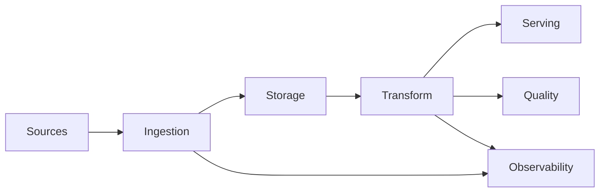

# Part 1: What Data Engineering Really Is

> Prerequisite: None. Start here.

## What You'll Learn

- What data engineering is and what it is not
- The six layers of a modern data platform
- How Phlo maps those layers into concrete components
- How to reason about reliability from day one

## Prerequisites

- Curiosity
- Basic command line comfort
- Optional: skim [Architecture Reference](../../reference/architecture.md)

Data engineering is the work of turning messy, changing data into reliable, reusable datasets.

If analytics answers "what happened," data engineering ensures those answers are trustworthy and repeatable.

## The Core Job

At a high level, a data engineer owns four outcomes:

- Correctness: rows and types are right
- Freshness: data arrives on time
- Reliability: failures are visible and recoverable
- Reusability: models support many use cases

## A Practical Platform Model

Quick diagram of the Phlo-aligned data engineering stack:




## How Phlo Maps to the Stack

| Layer | Goal | Phlo Building Blocks |
| --- | --- | --- |
| Ingestion | Pull source data reliably | `phlo.ingest.dlt`, DLT, staging + merge |
| Storage | Transactional open tables | Apache Iceberg + MinIO |
| Versioning | Isolated change flow | Nessie branches/tags |
| Orchestration | Deterministic execution | Dagster assets via `phlo materialize` |
| Transformation | Business logic in SQL | dbt project in `workflows/transforms/dbt` |
| Quality + Ops | Confidence and response | Pandera, `phlo.quality.pandera`, logs, metrics, lineage |

## First Contact with the CLI

First, make sure the CLI is installed in your environment:

```bash
uv venv
source .venv/bin/activate
uv pip install "phlo[defaults]" phlo-otel phlo-clickstack phlo-lineage pytest
```

The command should return something like this:

```text
Installed packages in 3.2s
```

```bash
phlo --version
```

You should see something like this:

```text
phlo, version 0.10.0
```

```bash
phlo services list --json
```

A typical result looks like this:

```text
[
  {"name": "minio", "category": "core", "default": true},
  {"name": "dagster", "category": "core", "default": true}
]
```

## The Biggest Beginner Mistake

Many teams jump straight into dashboards.

Better order:

1. Ingestion contracts first
2. Storage semantics second
3. Transform logic third
4. Observability from day one

This series follows that order.

## Deep Dive: The Data Engineer's Decision Surface

If you are new to the role, it helps to think in terms of decisions instead of tools.

A data engineer repeatedly answers questions like:

- What level of lateness is acceptable for this dataset?
- Which fields are contractual vs optional?
- How should duplicates be handled?
- What should happen when source systems fail?
- Who is allowed to change schema shape?

These questions exist in every platform, whether or not the team writes them down.
Phlo helps by making those decisions explicit in code and commands.

For example, this is not just syntax:

- `unique_key` in `phlo.ingest.dlt` is a deduplication decision.
- `merge_strategy` is a correctness-vs-throughput decision.
- `blocking` checks in `phlo.quality.pandera` are a risk decision.
- `phlo backfill --parallel N` is a source-pressure decision.

When you treat those as dataset decisions, your data system becomes much easier to operate.

## Deep Dive: Datasets, Not Data Dumps

A healthy data platform does not just produce "tables." It produces governed datasets.

A useful dataset has:

- A clear owner
- A defined refresh cadence
- A contract (schema + semantics)
- Known consumers
- Observable health signals

You can represent that in a tiny spec:

```yaml
dataset: orders_daily
owner: data-platform@company.com
refresh_slo: "hourly within 10 minutes"
source_systems:
  - commerce_api
contract:
  primary_key: order_id
  required_fields:
    - order_id
    - order_timestamp
    - total_amount
quality_policy:
  blocking_checks:
    - primary_key_not_null
    - non_negative_amount
```


In this series, every post pushes you toward that level of clarity.

## Worked Example: Turning a Vague Request into an Engineering Spec

A stakeholder asks: "Can you give me daily revenue by region?"

A weak implementation is:

- Pull data ad hoc
- Transform in a notebook
- Share CSV

A strong implementation is:

1. Define ingestion source and contract.
2. Define transformation model for revenue logic.
3. Define quality checks for negatives, nulls, and duplicate keys.
4. Define SLO and alert path.
5. Define ownership and incident path.

Even in an early-stage team, this structure prevents "hero mode" debugging later.

## Mental Model: Reliability Triangle

Use this triangle when making tradeoffs:

- Speed: how fast you ship
- Correctness: how trustworthy output is
- Operability: how quickly you can debug and recover

In real systems, speed without operability becomes expensive quickly.
The practical target is balanced progress, not maximal speed.

## Practical Vocabulary You Will Use Throughout the Series

- Partition: a bounded slice of data for replay and isolation
- Snapshot: immutable table state at a point in time
- Idempotent run: replaying produces the same result
- Contract drift: source shape changes without coordinated update
- Blast radius: set of downstream assets affected by a failure

If these terms feel abstract now, do not worry. We use each one with concrete commands in later posts.

## Extended Walkthrough: A Full Day in the Life of a Data Pipeline

Let us walk through a realistic day, end to end.

Imagine your team owns order analytics for an ecommerce product. Source events come from a commerce API. Product managers use a dashboard every morning at 9:00 AM.

At 1:00 AM:

- The ingestion workflow pulls yesterday and today partitions.
- Data lands in raw tables with deduplication by `order_id`.
- Basic contract checks run immediately.

At 2:00 AM:

- dbt transformations run bronze then silver then gold.
- dbt tests run for primary keys and not-null constraints.

At 2:10 AM:

- Publishing flow writes curated marts for reporting tools.
- Metrics and logs are recorded for run duration and row counts.

At 2:15 AM:

- `phlo status --services` indicates all critical assets are fresh.
- Alerting stays quiet.

Now the failure case:

At 1:00 AM, source API starts returning `total_amount` as string instead of number.

Without contracts:

- ingestion appears successful,
- transformation fails later,
- business dashboard goes stale,
- investigation starts after stakeholders complain.

With contracts:

- ingestion contract check fails early,
- pipeline status turns red immediately,
- on-call sees exactly which field drifted,
- fix is scoped and fast.

This is why data engineering is an operations discipline, not just a coding task.

## Worked Exercise: Draft Your First Dataset Contract

Choose one dataset you already maintain. Fill this template completely:

```yaml
dataset_name: orders
criticality: high
refresh_cadence: hourly
max_acceptable_lag_minutes: 30
primary_key:
  - order_id
quality_rules:
  - order_id is not null
  - total_amount >= 0
  - order_timestamp parseable to UTC timestamp
consumers:
  - finance_dashboard
  - revenue_forecast_model
failure_policy:
  - block downstream on contract failure
  - alert on-call immediately
```


Then ask:

1. Which fields in this contract are currently unenforced?
2. Which commands in your toolchain can enforce them now?
3. Which gaps need new checks or new ownership?

If you do this once per critical table, your platform quality will improve quickly.

## Reading Map for the Rest of the Series

To make this long track easier to navigate, here is a "why this matters" map:

- Part 2:
  create reliable project boundaries.
- Part 3:
  design ingestion contracts that can replay safely.
- Part 4:
  understand why table and branch semantics matter.
- Part 5:
  run and replay assets intentionally.
- Part 6:
  express business logic in testable SQL.
- Part 7:
  enforce data quality rules continuously.
- Part 8:
  evolve contracts without harming consumers.
- Part 9:
  observe health before users report failures.
- Part 10:
  handle incidents with repeatable steps.
- Part 11:
  tune cost and performance with measurements.
- Part 12:
  extend platform capabilities safely.

If you follow the sequence, each concept has a practical command-level counterpart.

## Hands-On Exercise

1. Create a scratch note called `platform-layers.md`.
2. List one real dataset you own (for example: payments, orders, telemetry).
3. For each layer above, write one risk in your current workflow.
4. Write one measurable SLO, such as "hourly data delivered within 10 minutes."

## Common Issues

1. Teams conflate ETL scripts with a platform and miss reliability boundaries.
2. Ownership is unclear between ingestion, modelling, and analytics.
3. No definition of "done" for freshness or quality.
4. People skip contracts and debug type drift in production.
5. There is no runbook for failed data loads.

If any of these look familiar, use [Troubleshooting](../../operations/troubleshooting.md) as your baseline ops guide.

## Summary

Data engineering is less about writing scripts and more about designing systems that stay trustworthy under change.

Phlo gives you explicit primitives for each layer so you can build that system deliberately.

## Next Steps

1. Move to [Part 2](02-build-your-first-phlo-project.md) and bootstrap your first project.
2. Keep your layer-risk notes; you will reuse them in Part 10 incident response.

## See Also

- [Part 2: Build Your First Phlo Project](02-build-your-first-phlo-project.md)
- [Part 9: Observability: Metrics, Logs, and Lineage](09-observability-metrics-logs-lineage.md)
- [Architecture Reference](../../reference/architecture.md)
