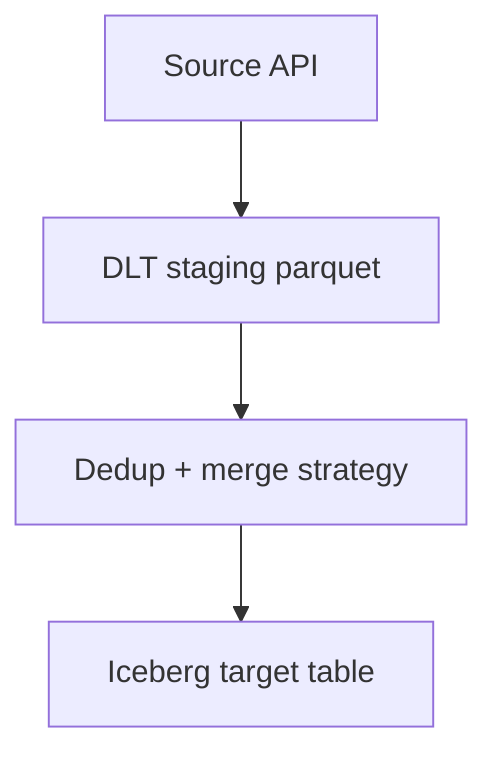

# Part 3: Ingestion Foundations with DLT

> Prerequisite: Complete [Part 2](02-build-your-first-phlo-project.md).

## What You'll Learn

- How `phlo.ingest.dlt` turns a source function into a managed asset
- Why two-step ingestion (stage then merge) improves reliability
- How to choose `merge` vs `append`
- How partition keys affect replay and idempotency

## Prerequisites

- Running Phlo project
- Basic Python function knowledge
- Optional: familiarity with DLT `rest_api` source pattern

## The Ingestion Contract

Phlo ingestion wraps your source function with runtime guarantees:

- Validation of required schema and unique key
- Partition-aware execution
- Table store resource resolution
- Optional contract checks with Pandera

Before the ingestion function, define the schema class you are validating against.
In this post, `RawOrders` is the raw-zone contract for one order record:

```python
import pandera as pa
from pandera.typing import Series
from phlo_pandera.schemas import PhloSchema

class RawOrders(PhloSchema):
    id: Series[int] = pa.Field(nullable=False)
    title: Series[str] = pa.Field(nullable=False)
    price: Series[float] = pa.Field(ge=0, nullable=False)
    category: Series[str] = pa.Field(nullable=False)
```

Put that in `workflows/schemas/orders.py`, then import it into your ingestion module.

A simplified workflow example:

```python
import phlo
from dlt.sources.rest_api import rest_api
from workflows.schemas.orders import RawOrders

@phlo.ingest.dlt(
    table_name="orders",
    unique_key="id",
    group="commerce",
    validation_schema=RawOrders,
    cron="0 * * * *",
    merge_strategy="merge",
    merge_config={"deduplication_method": "last"},
)
def orders(partition_date: str):
    return rest_api(
        client={"base_url": "https://fakestoreapi.com"},
        resources=[
            {
                "name": "products",
                "endpoint": {
                    "path": "/products",
                },
            }
        ],
    )
```


## Why Staging + Merge Is Safer

- Stage first: isolate network and extraction failures
- Merge second: idempotent writes into Iceberg table
- Retry semantics: reruns should not create uncontrolled duplicates

Flow sketch:




## Merge Strategy Choice

Use `merge` when source rows can be resent or corrected.

Use `append` when source rows are immutable events and duplicates are acceptable only if replayed intentionally.

```python
import phlo
@phlo.ingest.dlt(
    table_name="raw_clickstream",
    unique_key="event_id",
    group="events",
    validation_schema=RawClickstream,
    merge_strategy="append",
)
def clickstream(partition_date: str):
    ...
```


## Run Ingestion for a Partition

```bash
phlo materialize dlt_orders --partition 2025-01-15
```

The command should return something like this:

```text
Materializing dlt_orders...

Successfully materialized dlt_orders
```

Backfill date ranges when needed:

```bash
phlo backfill dlt_orders --start-date 2025-01-01 --end-date 2025-01-07 --parallel 2
```


## Deep Dive: Source Reality vs Pipeline Assumptions

Most ingestion bugs come from optimistic assumptions about source systems.

Common assumptions that fail in production:

- "IDs are always unique"
- "Timestamps are always UTC"
- "Nulls only appear in optional fields"
- "Pagination is stable"
- "API response order is deterministic"

Production sources are noisy and evolving. Your ingestion contract should assume drift, not perfection.

Practical protections:

1. Use `unique_key` and a merge strategy explicitly.
2. Validate mandatory fields through schema checks.
3. Keep partition windows explicit and replayable.
4. Track row counts and duplicate rates over time.

When these protections are present, ingestion failures become controlled events instead of platform-wide incidents.

## Deep Dive: Partitioning Strategy for Real Workloads

Partitioning is not only a performance feature. It is an operational safety boundary.

Good partition design gives you:

- Small replay units
- Predictable backfills
- Reduced blast radius for failures

Bad partition design gives you:

- All-or-nothing reruns
- Expensive retry behaviour
- Slow incident recovery

Rule of thumb:

- Use daily partitions when data volume is moderate and SLA is daily/hourly.
- Use finer granularity if the volume or freshness requirement demands it.

Before choosing a partition shape, answer:

1. How often do consumers need updates?
2. How large is each time slice?
3. How often do you need partial replays?
4. What is acceptable rerun cost?

This design step is worth doing early and revisiting quarterly.

## Worked Example: Building a More Robust REST Ingestion Function

A practical ingestion function should include:

- explicit endpoint params
- deterministic pagination strategy
- explicit partition-date usage
- clear return behaviour for empty data

Illustrative pattern:

```python
import phlo
from dlt.sources.rest_api import rest_api
from workflows.schemas.orders import RawOrders

@phlo.ingest.dlt(
    table_name="orders",
    unique_key="id",
    group="commerce",
    validation_schema=RawOrders,
    merge_strategy="merge",
    merge_config={"deduplication_method": "last"},
    cron="0 * * * *",
)
def orders(partition_date: str):
    start = f"{partition_date}T00:00:00Z"
    end = f"{partition_date}T23:59:59Z"

    return rest_api(
        client={"base_url": "https://fakestoreapi.com"},
        resources=[
            {
                "name": "products",
                "endpoint": {
                    "path": "/products",
                },
            }
        ],
    )
```


Even in this simple example, partition boundaries and key semantics are explicit. That makes behaviour predictable.

## Deep Dive: Merge Strategy Tradeoff Matrix

Use this matrix when deciding between append and merge:

| Dimension | append | merge |
| --- | --- | --- |
| Throughput | High | Medium |
| Idempotency | Weak | Strong |
| Correction handling | Poor | Good |
| Replay safety | Low | High |
| Complexity | Lower | Higher |

Decision logic:

- Choose `append` only for immutable event streams with low replay risk.
- Choose `merge` for most business entities where updates and reruns happen.

If uncertain, choose `merge` first and optimise after measuring.

## Failure Injection Exercise: Learn Before Production Learns For You

Run controlled experiments in development:

Experiment A: duplicate payload rows

- Send source rows with duplicate `id`.
- Confirm dedup behaviour matches chosen strategy.

Experiment B: schema drift

- Change one source field type unexpectedly.
- Confirm contract checks fail with clear diagnostics.

Experiment C: empty partition

- Run a date range with known empty data.
- Confirm pipeline returns "no data" cleanly without false failure.

After each experiment, verify results with:

```bash
phlo status --services
phlo logs --limit 20
```

Status confirms services are healthy; logs show whether the pipeline handled the injected fault as expected.

This is one of the best low-cost ways to increase confidence.

## Extended Playbook: Operational Alerts for Ingestion Health

Minimum ingestion SLO set:

- Freshness SLO: partition delivered within X minutes of schedule
- Completeness SLO: row count above baseline threshold
- Validity SLO: contract checks passing rate above threshold

Suggested weekly review:

1. Count ingestion failures by source.
2. Review duplicate rates by table.
3. Review no-data partitions by source.
4. Review median and p95 ingestion duration.

If one source dominates incidents, prioritize hardening that integration first.

## Data Contract Checklist for Ingestion Owners

For each ingestion asset, confirm:

- Clear table ownership
- Clear unique key definition
- Explicit partition key behaviour
- Schema class maintained with source changes
- Merge strategy rationale documented
- Replay process documented
- Backfill boundaries tested

This checklist is especially valuable during handoffs between engineers.

## Design Review Prompts

Use these prompts when reviewing ingestion pull requests:

1. What happens if source returns duplicate records?
2. What happens if source returns no records?
3. What happens if one required field changes type?
4. Is partition range explicit and reproducible?
5. Can this run safely twice for the same partition?
6. Are quality and observability hooks present?

If these questions are answered in code and tests, ingestion quality usually scales well.

## Advanced Pattern: Domain-Specific Ingestion Modules

As assets grow, avoid one giant ingestion file.

Recommended pattern:

- one module per domain
- one file per high-value source
- shared utilities for auth/pagination/retry

Example directory layout:

```text
workflows/ingestion/
  commerce/
    orders.py
    refunds.py
    customers.py
    common.py
```


This keeps review scope tight and ownership clear.

## Learning Reflection

By now, your mental model should be:

- ingestion is a contract, not a script
- partitions are safety boundaries
- merge strategy is a business correctness decision
- replayability is non-negotiable for production trust

If you internalize these four points, you are already avoiding most high-cost ingestion mistakes.

## Extended Guide: Testing Ingestion Beyond Happy Paths

A common gap in ingestion teams is testing only successful runs.

A stronger test strategy includes:

- success case
- duplicate case
- schema drift case
- empty-partition case
- timeout/retry case

You can represent this in a compact test plan:

```text
Case: happy_path
Input: valid rows
Expected: success + rows_loaded > 0

Case: duplicates
Input: repeated unique_key values
Expected: dedup behaviour aligns with merge config

Case: schema_drift
Input: unexpected field type
Expected: validation failure with clear diagnostics

Case: empty_partition
Input: no rows
Expected: no_data status, not hard failure
```


If you automate these cases early, your incident rate drops sharply.

## Extended Guide: Throughput Tuning Without Breaking Correctness

When ingestion gets slow, teams often increase parallelism first. That can help, but do not skip measurement.

Measure:

- rows per minute
- median and p95 run duration
- duplicate rate
- validation failure rate

Then tune one variable at a time.

Example sequence:

1. Baseline with `--parallel 1` on a 7-day backfill.
2. Repeat with `--parallel 2`.
3. Compare runtime and failure profile.
4. Keep the highest safe concurrency, not the highest possible.

Command pattern:

```bash
phlo metrics asset dlt_orders --runs 30
```

You should get output similar to this:

```text
    Metrics for dlt_orders
┏━━━━━━━━━━━━━━━━━━━┳━━━━━━━━┓
┃ Metric            ┃ Value  ┃
┡━━━━━━━━━━━━━━━━━━━╇━━━━━━━━┩
│ Last Run Status   │ -      │
│ Last Run Duration │ -      │
│ Average Duration  │ 0.00s  │
│ Failure Rate      │ 0.0%   │
│ Avg Rows/Run      │ 0      │
│ Data Size         │ 0.00 B │
└───────────────────┴────────┘
```

What to avoid:

- Increasing concurrency and changing schema in the same release
- Tuning without baseline metrics
- Treating source rate-limit errors as random noise

## Extended Guide: Documentation That Actually Helps

For each ingestion asset, keep a short operational card:

- Source endpoint
- Key fields
- Partition logic
- Retry behaviour
- Known failure modes
- Recovery commands

Example:

```text
Asset: dlt_orders
Source: commerce_api /orders
Partition: daily (UTC)
Key: id
Known failure mode: rate limiting at peak hours
Recovery: rerun partition with normal concurrency
```


This document should be short enough to read during an incident.

## Extended Guide: Ingestion Readiness Review

Before marking an ingestion asset "production ready," confirm:

1. Asset runs successfully for a normal partition.
2. Duplicate case tested and observed.
3. Validation failures produce actionable logs.
4. Backfill dry-run reviewed.
5. Ownership and alert routing are defined.

Most teams can do this in one focused review session per asset.

If the review is skipped, hidden risk accumulates quickly.

## Short Q&A

Q: Should every ingestion asset use `merge`?

A: Not always, but many business entities benefit from merge because replays and corrections are common.

Q: How do I know if my partition strategy is wrong?

A: If reruns are expensive, incident recovery is slow, or freshness SLOs are hard to hit, revisit partition boundaries.

Q: What is the fastest way to improve ingestion reliability this week?

A: Add explicit contract validation and run duplicate/empty-partition failure injections.

One final reminder for this chapter:

if you cannot confidently replay a partition, you do not yet own ingestion reliability. Replay confidence is the practical test of whether your contract, merge strategy, and runbook are truly working together.
Make replayability and contract clarity your default standard.
This single discipline will prevent many expensive downstream failures.

## Hands-On Exercise

1. Create one ingestion asset in your own domain.
2. Add `validation_schema` and `unique_key` explicitly.
3. Run one partition twice.
4. Verify your target table does not grow unexpectedly from duplicate rows.

## Common Issues

1. `unique_key` missing from schema causes ingestion config errors.
2. Partition key omitted during materialization for partitioned assets.
3. Wrong merge strategy used for mutable source data.
4. Schema drift is ignored until downstream dbt models break.
5. Ingestion writes succeed but no observability checks are attached.

Debug patterns: [Troubleshooting](../../operations/troubleshooting.md)

## Summary

`phlo.ingest.dlt` is not just syntactic sugar. It encodes a repeatable ingestion contract with partitioning, schema, and merge behaviour built in.

## Next Steps

1. Move to [Part 4](04-iceberg-and-nessie-for-reliable-tables.md) to understand where ingestion lands.
2. Keep your ingestion asset; we will orchestrate and monitor it next.

## See Also

- [Part 4: Iceberg and Nessie for Reliable Tables](04-iceberg-and-nessie-for-reliable-tables.md)
- [Part 7: Quality Checks with Pandera and Phlo Quality](07-quality-checks-with-pandera-and-phlo-pandera.md)
- [Data Modelling Guide](../../guides/data-modeling.md)
