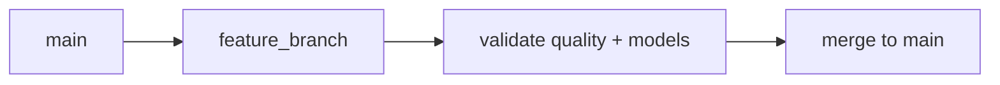

# Part 4: Iceberg and Nessie for Reliable Tables

> Prerequisite: Complete [Part 3](03-ingestion-foundations-with-dlt.md).

## What You'll Learn

- Why Iceberg table metadata is central to correctness
- How Nessie branching enables safe data changes
- How to inspect tables and history from the CLI
- A practical branch workflow for data engineering teams

## Prerequisites

- Existing ingestion asset from Part 3
- Core services running
- Basic SQL mental model

## Why Table Format Matters

Raw object storage is cheap but not enough by itself.

Iceberg adds:

- Snapshot-based ACID semantics
- Schema evolution support
- Partition metadata for efficient reads

Nessie adds:

- Branch-based isolation for data changes
- Merge and diff workflows similar to code collaboration

## Branch-Based Data Workflow




## Inspect Table Inventory

```bash
phlo catalog tables
```

You should see something like this:

```text
      Iceberg Tables (ref: main)
┏━━━━━━━━━━━┳━━━━━━━━━━━━┳━━━━━━━━━━━━┓
┃ Namespace ┃ Table Name ┃ Full Name  ┃
┡━━━━━━━━━━━╇━━━━━━━━━━━━╇━━━━━━━━━━━━┩
│ raw       │ orders     │ raw.orders │
└───────────┴────────────┴────────────┘
Total: 1 tables
```

Inspect one table:

```bash
phlo catalog describe raw.orders
```


Check snapshot history:

```bash
phlo catalog history raw.orders
```

A typical result looks like this:

```text
                    Snapshot History: raw.orders (ref: main)
┏━━━━━━━━━━━━━━━┳━━━━━━━━━━━━━━━━┳━━━━━━━━━━━━━━━┳━━━━━━━━━━━━━┳━━━━━━━━━━━━━━━┓
┃ Snapshot ID   ┃ Timestamp (ms) ┃ Operation     ┃ Added Files ┃ Removed Files ┃
┡━━━━━━━━━━━━━━━╇━━━━━━━━━━━━━━━━╇━━━━━━━━━━━━━━━╇━━━━━━━━━━━━━╇━━━━━━━━━━━━━━━┩
│ 725942914903… │ 1771971249812  │ Operation.AP… │ 1           │ None          │
└───────────────┴────────────────┴───────────────┴─────────────┴───────────────┘
```

## Create and Merge a Data Branch

```bash
phlo branch create feature/add-order-channel
```


After validation steps, merge:

```bash
phlo branch merge feature/add-order-channel main
```

If everything is wired correctly, you should see output along these lines:

```text
Merged feature/add-order-channel into main successfully.
```

## Team Pattern That Scales

1. Create feature branch per contract change.
2. Run ingestion + dbt + quality on branch.
3. Review snapshot/history diff.
4. Merge to main only after checks pass.

This pattern prevents silent production drift.

## Deep Dive: Why Data Versioning Changes Team Behaviour

In teams without data versioning, engineers usually avoid change because rollback is unclear.

That creates slow decision cycles:

- "Let us wait until next sprint."
- "Let us not touch this table."
- "Let us patch in BI instead."

With table + branch semantics, change gets safer:

- Engineers can test data shape changes in isolation.
- Reviewers can inspect concrete history and table metadata.
- Rollback strategy is obvious and rehearsable.

This is not just a technical improvement. It is a collaboration improvement.

## Deep Dive: Iceberg Internals You Should Understand Early

You do not need to memorize every metadata file, but you should know these ideas:

1. Snapshot

- Immutable pointer to a table state.
- Enables reproducibility and time-based investigations.

2. Manifest metadata

- Tracks file-level data layout.
- Supports efficient query planning.

3. Schema and partition metadata

- Tracks field evolution and partition strategy.
- Enables forward progress without full rewrites.

When a run fails or data quality regresses, snapshots and metadata history become your debugging baseline.

## Deep Dive: Branch Strategy Patterns

Recommended patterns for small-to-mid teams:

Pattern A: Change-scoped branches

- One branch per schema or transformation rollout.
- Merge quickly after validation.

Pattern B: Release branches for high-risk promotions

- Feature branches merge into release branch.
- Release branch validated end to end, then merged to main.

Pattern C: Ephemeral test branches

- Short-lived branches for validation experiments.
- Auto-cleaned after result capture.

A practical default is Pattern A until team scale or regulatory constraints require stronger controls.

## Worked Scenario: Safe Contract Change with Nessie

Suppose you need to add `order_channel` to `raw.orders`.

Workflow:

1. Create branch:

```bash
phlo branch create schema/orders-add-channel
```


2. Apply ingestion/schema update in your code branch.
3. Materialize target partitions on feature data branch.
4. Run dbt + quality checks.
5. Inspect history and table metadata:

```bash
phlo catalog history raw.orders --ref schema/orders-add-channel
```

On a healthy setup, you will see something similar:

```text
Snapshot ID          Timestamp                Operation   Records
8a2b…c4d5            2025-01-16T10:15:00Z     append      1320
```

6. Merge when green:

```bash
phlo branch merge schema/orders-add-channel main
```


This sequence gives explicit proof of change safety before production exposure.

## Extended Guide: Naming and Lifecycle Governance for Branches

Use branch names that communicate intent:

- `schema_<domain>_<change>`
- `backfill_<table>_<period>`
- `fix_<incident-id>_<table>`

Lifecycle rules:

- Open branch with clear owner.
- Document validation scope.
- Merge or archive quickly.
- Avoid long-lived "misc" branches.

A branch policy can be simple:

```text
All non-trivial table or contract changes require:
  1) named data branch
  2) validation evidence
  3) explicit merge decision
```


Simple policy beats ad hoc behaviour.

## Extended Guide: Reading Table History as an Engineer

History review questions:

1. Did snapshot frequency match expected run cadence?
2. Do row count changes align with source expectations?
3. Did schema evolve as intended?
4. Is there evidence of repeated replay loops?

When history appears noisy or irregular, investigate pipeline behaviour before performance tuning or model rewrites.

## Anti-Patterns to Avoid

Anti-pattern 1: Treating `main` as test environment

- Result: production drift and hard-to-debug breakages.

Anti-pattern 2: Merging without evidence

- Result: "green by assumption" failures.

Anti-pattern 3: Ignoring table history except during incidents

- Result: weak situational awareness and delayed detection.

Anti-pattern 4: Unbounded branch sprawl

- Result: operational clutter and ownership confusion.

Anti-pattern 5: Schema changes without consumer verification

- Result: downstream breakage hidden until user-facing layers fail.

## Data Promotion Checklist

Before merging to main:

- Ingestion checks pass on branch.
- dbt models compile and tests pass.
- Quality checks meet policy.
- Impact analysis reviewed.
- Snapshot/history evidence captured.
- Owner approves merge.

This checklist keeps high-signal promotions fast and low-risk.

## Extended Practical Exercise: Recovering from a Bad Merge

Practice this in a sandbox:

1. Create a feature branch.
2. Introduce an intentional bad schema change.
3. Materialize and observe failures.
4. Roll forward with corrected change on branch.
5. Merge only after validation.

Goal:

- Build confidence in recovery path before real incidents.

## Coaching Tip for Teams

If your team is new to table branching, do live review sessions:

- one engineer performs branch flow
- one reviewer checks evidence
- one observer documents improvements

Two or three sessions usually establish a durable team habit.

## Quick Q&A

Q: Do we need branches for every tiny model tweak?

A: Not always. Use branch rigor proportionate to risk and blast radius.

Q: What if branch tooling feels heavy?

A: Start with high-risk changes only. Expand once the habit is comfortable.

Q: Is history review worth the time?

A: Yes. It is often the fastest path to understanding what changed and when.

## Learning Reflection

Data versioning is not a niche feature. It is foundational for safe iteration.

If ingestion is your "write" boundary and transformations are your "compute" boundary, table + branch semantics are your "trust" boundary.

That trust boundary is what allows teams to move quickly without breaking confidence.

## Extended Guide: Operational Signals to Watch in Iceberg + Nessie Workflows

To manage this layer well, monitor:

- snapshot creation rate by table
- schema change frequency
- branch merge frequency and failure rate
- stale branches older than policy threshold
- repeated materialization retries against same partitions

Why this matters:

- too many snapshots with little data may indicate noisy retries
- frequent schema churn may indicate weak source contract alignment
- stale branches usually indicate workflow friction or unclear ownership

Use monthly review rituals for these signals.

## Extended Guide: Designing a Data Branch Policy for a Small Team

Example policy:

1. High-risk changes require branch:
   schema changes, key changes, merge strategy changes.
2. Low-risk changes optional branch:
   non-breaking descriptive metadata.
3. Every branch requires:
   owner, purpose, validation checklist.
4. Branches older than 7 days require review.

Represent policy in concise text:

```text
Policy: Data branch required for any change that can alter row meaning, schema compatibility, or freshness behaviour.
```


This is enough governance for most early-stage teams.

## Extended Scenario: Investigating a Historical Revenue Discrepancy

Suppose revenue dashboard for February 15 looks wrong.

Investigation path:

1. Check recent table history around that date.
2. Inspect branch merges near the discrepancy window.
3. Compare snapshot metadata before and after suspected change.
4. Validate upstream ingestion partition behaviour.

Useful commands:

```bash
phlo catalog history raw.orders
```

The command should return something like this:

```text
                    Snapshot History: raw.orders (ref: main)
┏━━━━━━━━━━━━━━━┳━━━━━━━━━━━━━━━━┳━━━━━━━━━━━━━━━┳━━━━━━━━━━━━━┳━━━━━━━━━━━━━━━┓
┃ Snapshot ID   ┃ Timestamp (ms) ┃ Operation     ┃ Added Files ┃ Removed Files ┃
┡━━━━━━━━━━━━━━━╇━━━━━━━━━━━━━━━━╇━━━━━━━━━━━━━━━╇━━━━━━━━━━━━━╇━━━━━━━━━━━━━━━┩
│ 725942914903… │ 1771971249812  │ Operation.AP… │ 1           │ None          │
└───────────────┴────────────────┴───────────────┴─────────────┴───────────────┘
```

This approach turns a vague analytics complaint into a precise technical investigation.

## Extended Guide: Communicating Risk During Data Changes

When proposing changes, include:

- what changes
- who is affected
- how validated
- rollback path

Example change announcement:

```text
Change: add order_channel to raw.orders
Risk: low (nullable add)
Validation: ingestion + dbt + quality checks passed on branch
Merge window: 14:00 UTC
Rollback: revert merge and replay partition range if needed
```


Clear communication reduces merge anxiety and incident confusion.

## Extended Guide: Growth Path for This Layer

As your platform matures:

- automate stale branch reporting
- automate merge checklist enforcement
- track schema compatibility trends over time
- integrate table history evidence into incident runbooks

You do not need all of this now. But knowing the trajectory helps you make good incremental choices.

## Final Teaching Notes for This Chapter

If you only adopt three habits from this post, choose:

1. Do risky changes on branches, not main.
2. Review snapshot history as part of normal engineering practice.
3. Capture merge evidence, not just merge intent.

These habits create durable safety and speed together.

In real teams, confidence grows when engineers can answer:

- What changed?
- When did it change?
- Why did it change?
- Can we recover quickly if needed?

Iceberg and Nessie provide the technical mechanics for those answers.
Your process provides the discipline.

You can think of this layer as your data-time machine plus collaboration protocol.
The time-machine part is snapshot history.
The collaboration part is branch and merge workflow.

Together, they let teams iterate with less fear.
Fear reduction is a real engineering outcome: fewer risky shortcuts, clearer reviews, and faster recovery when something unexpected happens.
That is why this chapter is central to operational maturity, not an optional advanced topic.

## Hands-On Exercise

1. Create a new Nessie branch.
2. Materialize one partition on that branch context.
3. Run `phlo catalog history` and note new snapshot.
4. Merge branch back into main.

## Common Issues

1. Engineers test directly on `main` and lose rollback safety.
2. Branches accumulate with no ownership or cleanup policy.
3. Table history is ignored, making regressions hard to trace.
4. Namespace naming is inconsistent across teams.
5. Snapshot growth is unmanaged over time.

Operational guidance: [Troubleshooting](../../operations/troubleshooting.md)

## Summary

Iceberg gives transactionally safe tables. Nessie gives safe collaboration around those tables. Together they form the backbone of reliable data delivery.

## Next Steps

1. Continue to [Part 5](05-orchestration-with-dagster-assets.md) to operationalize execution.
2. Add branch conventions to your team runbook now.

## See Also

- [Part 5: Orchestration with Dagster Assets](05-orchestration-with-dagster-assets.md)
- [Part 8: Schema Evolution and Data Contracts](08-schema-evolution-and-data-contracts.md)
- [Architecture Reference](../../reference/architecture.md)
