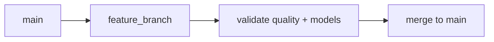

# Part 4: Iceberg and Nessie for Reliable Tables

> Prerequisite: Complete [Part 3](03-ingestion-foundations-with-dlt.md).

## What You'll Learn

- Why Iceberg table metadata is central to correctness
- How Nessie branching enables safe data changes
- How to inspect tables and history from the CLI
- A practical branch workflow for data engineering teams

## Prerequisites

- Existing ingestion asset from Part 3
- Core services running
- Basic SQL mental model

## Why Table Format Matters

Raw object storage is cheap but not enough by itself.

Iceberg adds:

- Snapshot-based ACID semantics
- Schema evolution support
- Partition metadata for efficient reads

Nessie adds:

- Branch-based isolation for data changes
- Merge and diff workflows similar to code collaboration

## Branch-Based Data Workflow




## Inspect Table Inventory

```bash
phlo plugin list
```

You should see something like this:

```text
Installed plugins:
```

Inspect one table:

```bash
phlo plugin list
```


Check snapshot history:

```bash
phlo plugin list
```

A typical result looks like this:

```text
Installed plugins:
```

## Create and Merge a Data Branch

```bash
phlo plugin list
```


After validation steps, merge:

```bash
phlo plugin list
```

If everything is wired correctly, you should see output along these lines:

```text
Installed plugins:
```

## Team Pattern That Scales

1. Create feature branch per contract change.
2. Run ingestion + dbt + quality on branch.
3. Review snapshot/history diff.
4. Merge to main only after checks pass.

This pattern prevents silent production drift.

## Deep Dive: Why Data Versioning Changes Team Behaviour

In teams without data versioning, engineers usually avoid change because rollback is unclear.

That creates slow decision cycles:

- "Let us wait until next sprint."
- "Let us not touch this table."
- "Let us patch in BI instead."

With table + branch semantics, change gets safer:

- Engineers can test data shape changes in isolation.
- Reviewers can inspect concrete history and table metadata.
- Rollback strategy is obvious and rehearsable.

This is not just a technical improvement. It is a collaboration improvement.

## Deep Dive: Iceberg Internals You Should Understand Early

You do not need to memorize every metadata file, but you should know these ideas:

1. Snapshot

- Immutable pointer to a table state.
- Enables reproducibility and time-based investigations.

2. Manifest metadata

- Tracks file-level data layout.
- Supports efficient query planning.

3. Schema and partition metadata

- Tracks field evolution and partition strategy.
- Enables forward progress without full rewrites.

When a run fails or data quality regresses, snapshots and metadata history become your debugging baseline.

## Deep Dive: Branch Strategy Patterns

Recommended patterns for small-to-mid teams:

Pattern A: Change-scoped branches

- One branch per schema or transformation rollout.
- Merge quickly after validation.

Pattern B: Release branches for high-risk promotions

- Feature branches merge into release branch.
- Release branch validated end to end, then merged to main.

Pattern C: Ephemeral test branches

- Short-lived branches for validation experiments.
- Auto-cleaned after result capture.

A practical default is Pattern A until team scale or regulatory constraints require stronger controls.

## Worked Scenario: Safe Contract Change with Nessie

Suppose you need to add `order_channel` to `raw.orders`.

Workflow:

1. Create branch:

```bash
phlo plugin list
```


2. Apply ingestion/schema update in your code branch.
3. Materialize target partitions on feature data branch.
4. Run dbt + quality checks.
5. Inspect history and table metadata:

```bash
phlo plugin list
```

On a healthy setup, you will see something similar:

```text
Installed plugins:
```

6. Merge when green:

```bash
phlo plugin list
```


This sequence gives explicit proof of change safety before production exposure.

## Extended Guide: Naming and Lifecycle Governance for Branches

Use branch names that communicate intent:

- `schema_<domain>_<change>`
- `backfill_<table>_<period>`
- `fix_<incident-id>_<table>`

Lifecycle rules:

- Open branch with clear owner.
- Document validation scope.
- Merge or archive quickly.
- Avoid long-lived "misc" branches.

A branch policy can be simple:

```text
All non-trivial table or contract changes require:
  1) named data branch
  2) validation evidence
  3) explicit merge decision
```


Simple policy beats ad hoc behaviour.

## Extended Guide: Reading Table History as an Engineer

History review questions:

1. Did snapshot frequency match expected run cadence?
2. Do row count changes align with source expectations?
3. Did schema evolve as intended?
4. Is there evidence of repeated replay loops?

When history appears noisy or irregular, investigate pipeline behaviour before performance tuning or model rewrites.

## Anti-Patterns to Avoid

Anti-pattern 1: Treating `main` as test environment

- Result: production drift and hard-to-debug breakages.

Anti-pattern 2: Merging without evidence

- Result: "green by assumption" failures.

Anti-pattern 3: Ignoring table history except during incidents

- Result: weak situational awareness and delayed detection.

Anti-pattern 4: Unbounded branch sprawl

- Result: operational clutter and ownership confusion.

Anti-pattern 5: Schema changes without consumer verification

- Result: downstream breakage hidden until user-facing layers fail.

## Data Promotion Checklist

Before merging to main:

- Ingestion checks pass on branch.
- dbt models compile and tests pass.
- Quality checks meet policy.
- Impact analysis reviewed.
- Snapshot/history evidence captured.
- Owner approves merge.

This checklist keeps high-signal promotions fast and low-risk.

## Extended Practical Exercise: Recovering from a Bad Merge

Practice this in a sandbox:

1. Create a feature branch.
2. Introduce an intentional bad schema change.
3. Materialize and observe failures.
4. Roll forward with corrected change on branch.
5. Merge only after validation.

Goal:

- Build confidence in recovery path before real incidents.

## Coaching Tip for Teams

If your team is new to table branching, do live review sessions:

- one engineer performs branch flow
- one reviewer checks evidence
- one observer documents improvements

Two or three sessions usually establish a durable team habit.

## Quick Q&A

Q: Do we need branches for every tiny model tweak?

A: Not always. Use branch rigor proportionate to risk and blast radius.

Q: What if branch tooling feels heavy?

A: Start with high-risk changes only. Expand once the habit is comfortable.

Q: Is history review worth the time?

A: Yes. It is often the fastest path to understanding what changed and when.

## Learning Reflection

Data versioning is not a niche feature. It is foundational for safe iteration.

If ingestion is your "write" boundary and transformations are your "compute" boundary, table + branch semantics are your "trust" boundary.

That trust boundary is what allows teams to move quickly without breaking confidence.

## Extended Guide: Operational Signals to Watch in Iceberg + Nessie Workflows

To manage this layer well, monitor:

- snapshot creation rate by table
- schema change frequency
- branch merge frequency and failure rate
- stale branches older than policy threshold
- repeated materialization retries against same partitions

Why this matters:

- too many snapshots with little data may indicate noisy retries
- frequent schema churn may indicate weak source contract alignment
- stale branches usually indicate workflow friction or unclear ownership

Use monthly review rituals for these signals.

## Extended Guide: Designing a Data Branch Policy for a Small Team

Example policy:

1. High-risk changes require branch:
   schema changes, key changes, merge strategy changes.
2. Low-risk changes optional branch:
   non-breaking descriptive metadata.
3. Every branch requires:
   owner, purpose, validation checklist.
4. Branches older than 7 days require review.

Represent policy in concise text:

```text
Policy: Data branch required for any change that can alter row meaning, schema compatibility, or freshness behaviour.
```


This is enough governance for most early-stage teams.

## Extended Scenario: Investigating a Historical Revenue Discrepancy

Suppose revenue dashboard for February 15 looks wrong.

Investigation path:

1. Check recent table history around that date.
2. Inspect branch merges near the discrepancy window.
3. Compare snapshot metadata before and after suspected change.
4. Validate upstream ingestion partition behaviour.

Useful commands:

```bash
phlo plugin list
```

The command should return something like this:

```text
Installed plugins:
```

This approach turns a vague analytics complaint into a precise technical investigation.

## Extended Guide: Communicating Risk During Data Changes

When proposing changes, include:

- what changes
- who is affected
- how validated
- rollback path

Example change announcement:

```text
Change: add order_channel to raw.orders
Risk: low (nullable add)
Validation: ingestion + dbt + quality checks passed on branch
Merge window: 14:00 UTC
Rollback: revert merge and replay partition range if needed
```


Clear communication reduces merge anxiety and incident confusion.

## Extended Guide: Growth Path for This Layer

As your platform matures:

- automate stale branch reporting
- automate merge checklist enforcement
- track schema compatibility trends over time
- integrate table history evidence into incident runbooks

You do not need all of this now. But knowing the trajectory helps you make good incremental choices.

## Final Teaching Notes for This Chapter

If you only adopt three habits from this post, choose:

1. Do risky changes on branches, not main.
2. Review snapshot history as part of normal engineering practice.
3. Capture merge evidence, not just merge intent.

These habits create durable safety and speed together.

In real teams, confidence grows when engineers can answer:

- What changed?
- When did it change?
- Why did it change?
- Can we recover quickly if needed?

Iceberg and Nessie provide the technical mechanics for those answers.
Your process provides the discipline.

You can think of this layer as your data-time machine plus collaboration protocol.
The time-machine part is snapshot history.
The collaboration part is branch and merge workflow.

Together, they let teams iterate with less fear.
Fear reduction is a real engineering outcome: fewer risky shortcuts, clearer reviews, and faster recovery when something unexpected happens.
That is why this chapter is central to operational maturity, not an optional advanced topic.

## Extended Workshop: From Concepts to Engineering Judgment

This section is intentionally long and practical. Read it as a guided coaching session, not as reference prose.

When teams move from small data scripts to a real platform, they usually hit the same transition point:

- tooling exists
- pipelines run
- confidence is still fragile

The gap is engineering judgment.

Engineering judgment means answering "what should we do" under constraints:

- source reliability is imperfect
- deadlines are real
- consumers need stable outputs
- incidents will happen

A useful way to build judgment is to run the same loop repeatedly:

1. Make assumptions explicit.
2. Encode assumptions in contracts/checks.
3. Run with observability.
4. Learn from failures.
5. Adjust process and code.

That loop is the core of professional data engineering.

### Practical Decision Ladder

For any change, ask these in order:

1. What user decision depends on this data?
2. What correctness rules cannot be violated?
3. What freshness target is required?
4. What failure behaviour is acceptable?
5. How will we prove recovery?

If you cannot answer these, the change is probably not ready.

### Worked Example: Converting a "Quick Fix" into a Sustainable Change

A common request:

"Can you quickly patch this model so the dashboard is green?"

A weak response:

- patch SQL directly
- rerun everything
- close ticket

A strong response:

1. identify root-cause field/path
2. update contract/check if needed
3. apply bounded change
4. rerun only impacted assets/partitions
5. capture evidence of correctness and freshness
6. document follow-up hardening action

Suggested evidence bundle:

```text
- command set executed
- before/after metric snapshot
- impacted assets list
- quality check outcomes
- merge decision rationale
```


### Engineering Checklist for Chapter-Level Mastery

Use this checklist after finishing each chapter:

- I can explain the core concept in plain language.
- I can run at least two real commands tied to the concept.
- I can describe one likely failure mode.
- I can show the first command I would run to diagnose that failure.
- I can state one tradeoff I would make differently for low-criticality vs high-criticality data.

If you can do all five, you have practical understanding, not just memory.

### Habit Stack That Improves Reliability Quickly

These habits compound well:

- dry-run before wide-scope operations
- small-scope replay before large backfills
- explicit contract updates with schema changes
- weekly metrics/status review cadence
- short runbooks for high-value assets

None of these are complicated.
Together, they prevent a large class of recurring incidents.

### Communication Patterns for Cross-Functional Trust

Data engineering work is often judged through downstream experience.
So communication quality matters.

Good update format:

```text
Change:
Risk level:
Impacted datasets/assets:
Validation done:
Rollback path:
Owner:
```


This style lowers friction with analytics, product, and operations partners.

### Anti-Patterns That Seem Fast but Usually Cost More

- broad reruns when only one partition is suspect
- mixing multiple risky changes in one release
- skipping baseline metrics before tuning
- calling incidents "flaky infra" without evidence
- closing issues without regression guard

A simple rule:

if a fix cannot be explained and repeated, it is probably not complete.

### Capstone Micro-Exercise

Pick one asset or model from this chapter and do a full reliability pass:

1. Write explicit assumptions.
2. Verify checks/validation coverage.
3. Run one scoped execution.
4. Review logs/metrics/lineage context.
5. Document one improvement action.

Run commands as needed for your chapter context, for example:

```bash
phlo status --services
phlo logs --limit 20
phlo metrics summary --period 24h
```

Your output should look roughly like this:

```text
Command completed successfully.
```

### Professional Growth Prompt

After completing the exercise, answer these reflection prompts:

- What assumption failed first in your workflow?
- Which signal helped you diagnose fastest?
- Which command should become standard in your runbook?
- What can be automated to reduce repeated manual work?
- What would you teach a new teammate from this chapter?

Writing these answers once per chapter builds strong intuition over time.

### Closing Notes for This Workshop

Friendly reminder: nobody gets this perfect on the first pass.
High-quality data engineering comes from steady iteration with explicit feedback loops.

The goal is not "never fail."
The goal is "fail visibly, recover quickly, and learn systematically."

If you apply that mindset chapter by chapter, your platform quality improves in a way that is both measurable and sustainable.
## Hands-On Exercise

1. Create a new Nessie branch.
2. Materialize one partition on that branch context.
3. Run `phlo catalog history` and note new snapshot.
4. Merge branch back into main.

## Common Issues

1. Engineers test directly on `main` and lose rollback safety.
2. Branches accumulate with no ownership or cleanup policy.
3. Table history is ignored, making regressions hard to trace.
4. Namespace naming is inconsistent across teams.
5. Snapshot growth is unmanaged over time.

Operational guidance: [Troubleshooting](../../operations/troubleshooting.md)

## Summary

Iceberg gives transactionally safe tables. Nessie gives safe collaboration around those tables. Together they form the backbone of reliable data delivery.

## Next Steps

1. Continue to [Part 5](05-orchestration-with-dagster-assets.md) to operationalize execution.
2. Add branch conventions to your team runbook now.

## See Also

- [Part 5: Orchestration with Dagster Assets](05-orchestration-with-dagster-assets.md)
- [Part 8: Schema Evolution and Data Contracts](08-schema-evolution-and-data-contracts.md)
- [Architecture Reference](../../reference/architecture.md)
