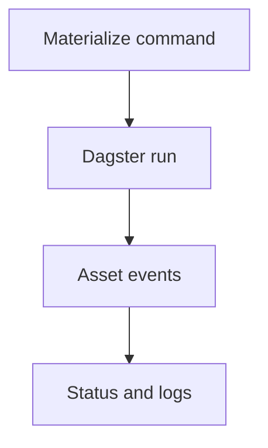

# Part 5: Orchestration with Dagster Assets

> Prerequisite: Complete [Part 4](04-iceberg-and-nessie-for-reliable-tables.md).

## What You'll Learn

- How Phlo turns workflows into Dagster-managed assets
- How to run targeted materializations and backfills
- How to use status and logs for operational feedback
- How to design deterministic orchestration boundaries

## Prerequisites

- Ingestion asset available (`dlt_<table>`)
- Services running (`phlo services start`)
- Basic comfort with partition dates

## Asset-Centric Orchestration Mindset

In Phlo, you run data products as assets, not ad-hoc scripts.

That gives:

- Explicit dependencies
- Partition-aware execution
- Reproducible operational commands

Short orchestration flow:



Expected output:

```text
A rendered run lifecycle diagram from command to observability output.
```

## Targeted Materialization

```bash
phlo materialize dlt_orders --partition 2026-02-20
```

Expected output:

```text
Dagster execution stream for one partition of dlt_orders.
```

Selector-based execution:

```bash
phlo materialize dlt_orders --select "tag:commerce"
```

Expected output:

```text
Materializes all assets matching selector expression instead of the placeholder name.
```

## Backfill with Control

```bash
phlo backfill dlt_orders --start-date 2026-02-01 --end-date 2026-02-05 --parallel 2
```

Expected output:

```text
Displays partition plan, concurrent execution progress, and final success/failure counts.
```

Dry-run before expensive ranges:

```bash
phlo backfill dlt_orders --start-date 2026-01-01 --end-date 2026-01-31 --dry-run
```

Expected output:

```text
Shows generated materialize commands without executing partitions.
```

## Runtime Visibility Commands

```bash
phlo status --assets
phlo logs --asset dlt_orders --since 1h --limit 50
```

Expected output:

```text
Status report for assets, then filtered Dagster log stream.
```

## Design Rules That Prevent Pain

1. Partition everything that can be replayed.
2. Keep asset names stable and domain-specific.
3. Use dry-runs before large backfills.
4. Treat logs and status as part of the feature, not afterthought.

## Deep Dive: Orchestration Is a Reliability Product

It is tempting to think orchestration is just \"running jobs on time.\" In practice, orchestration is your reliability control plane.

Good orchestration provides:

- deterministic execution boundaries
- clear dependency management
- replay controls
- failure visibility

Weak orchestration produces:

- hidden ordering bugs
- one-off manual reruns
- unknown failure impact

In Phlo, asset-centric orchestration gives you an explicit unit of execution and ownership. That alone removes a large class of ambiguity.

## Deep Dive: Asset Keys, Selectors, and Operational Scope

Operationally, the most important question is often:

\"What exactly am I running right now?\"

Asset keys and selectors answer this.

Use narrow scope by default:

- target a single asset or small selector set
- verify outcomes
- expand only when safe

Example scoped execution:

```bash
phlo materialize dlt_orders --partition 2026-02-20
phlo materialize dlt_orders --select \"tag:commerce\"
```

Expected output:

```text
A targeted Dagster run for the specified partition or selected asset set.
```

This style prevents accidental wide reruns in production windows.

## Deep Dive: Backfill Strategy that Balances Risk and Throughput

Backfills are where orchestration quality is tested.

A safe backfill process:

1. Dry-run first.
2. Start with low parallelism.
3. Watch source/API behaviour.
4. Track failures by partition.
5. Resume where needed.

Use staged scaling:

- wave 1: 3-day range
- wave 2: 14-day range
- wave 3: full range once stable

Command sequence:

```bash
phlo backfill dlt_orders --start-date 2026-02-01 --end-date 2026-02-03 --dry-run
phlo backfill dlt_orders --start-date 2026-02-01 --end-date 2026-02-03 --parallel 1
phlo backfill dlt_orders --start-date 2026-02-01 --end-date 2026-02-14 --parallel 2
```

Expected output:

```text
Backfill plans, execution progress, and partition-level success/failure reporting.
```

Backfill safety is less about raw speed and more about controlled confidence.

## Worked Scenario: Recovering from Partial Backfill Failure

Scenario:

- 30-day backfill in progress
- source API rate limits after day 12
- remaining partitions fail

Good response:

1. Stop escalating parallelism.
2. Inspect logs for failure type.
3. Reduce concurrency or add delay.
4. Resume remaining partitions.

Supporting commands:

```bash
phlo logs --asset dlt_orders --since 2h --level ERROR --limit 200
phlo backfill --resume
```

Expected output:

```text
Error log evidence for failure cause and resumed backfill using saved state.
```

This is a clear example of why orchestration metadata and stateful resume support matter.

## Extended Guide: Choosing Between Freshness and Batch Efficiency

There is always tension between:

- smaller frequent runs for freshness
- larger less frequent runs for compute efficiency

Use business need to guide tradeoff:

- operational monitoring use cases often require tighter freshness
- monthly reporting may tolerate wider windows

Ask product stakeholders:

1. What is the maximum acceptable data lag?
2. What decisions break if data is late?
3. Is partial freshness acceptable?

Then encode that in schedule and backfill policy.

## Extended Guide: Observability Hooks for Orchestration Owners

At minimum, orchestration owners should monitor:

- run success rate
- median and p95 run duration
- stale assets count
- repeated partition failures

Suggested weekly review:

```bash
phlo status --assets
phlo metrics summary --period 7d
phlo metrics asset dlt_orders --runs 30
```

Expected output:

```text
Asset freshness view plus recent run-quality and performance trends.
```

Without this review, orchestration reliability regresses quietly.

## Anti-Patterns in Orchestration

Anti-pattern 1: giant selector runs without dry-run

- Result: accidental broad execution

Anti-pattern 2: no partition discipline

- Result: costly reruns and unclear recovery

Anti-pattern 3: manual reruns with no audit trail

- Result: hard-to-explain state divergence

Anti-pattern 4: treating logs as optional

- Result: long MTTR during incidents

Anti-pattern 5: no ownership per asset group

- Result: failures bounce between teams

Avoiding these five patterns eliminates many recurring operational issues.

## Extended Design Review Questions

When reviewing orchestration PRs, ask:

1. What is the execution boundary?
2. Is failure scope clear?
3. How is replay performed?
4. Is backfill strategy documented?
5. Are observability signals complete?
6. Is there a defined owner for the asset group?

This keeps orchestration changes from becoming hidden risk multipliers.

## Engineering Playbook: First Production Rollout

For your first production-grade asset group:

1. Run three consecutive successful scheduled runs.
2. Run a controlled replay of one partition.
3. Run a 3-day backfill at low concurrency.
4. Capture logs/status/metrics baseline.
5. Review with another engineer.

This practice creates shared confidence before higher-volume rollout.

## Teaching Notes: How to Learn Orchestration Faster

Many engineers learn orchestration by reading docs only.
A better method:

- run commands
- force controlled failures
- practice recovery
- document what happened

Orchestration expertise grows from operational reps, not just conceptual knowledge.

## Quick Q&A

Q: Should I always use high parallel backfills for speed?

A: No. Use the highest safe parallelism your source and platform can support without destabilizing runs.

Q: Why not just rerun everything when one partition fails?

A: Because bounded replay is safer, cheaper, and easier to reason about.

Q: What is the best first orchestration metric?

A: Failure rate by asset group, then p95 run duration.

## Reflection

Orchestration is where architecture meets operations.
If ingestion and transformation define what should happen, orchestration defines whether it happens reliably under real-world conditions.

Treat it as a core product surface.

## Extended Guide: Building an Orchestration Runbook

A strong runbook should answer:

- How to detect failure
- How to scope impact
- How to rerun safely
- How to verify recovery

Suggested runbook skeleton:

```text
Runbook: dlt_orders
Detection:
  phlo status --assets
Diagnosis:
  phlo logs --asset dlt_orders --since 1h --limit 200
Recovery:
  phlo materialize dlt_orders --partition <date>
Validation:
  phlo status --assets
Escalation:
  #data-incidents
```

Expected output:

```text
Operational procedure card ready for on-call usage.
```

This is simple and immediately useful during real incidents.

## Extended Guide: Scheduling and Human Factors

Technical quality is necessary but not sufficient. Human response dynamics matter.

Good practice:

- schedule high-risk backfills during staffed windows
- avoid major changes near handoff times
- define escalation path before rollout

If nobody is clearly responsible for a failure window, response quality degrades fast.

## Extended Guide: Measuring Orchestration Maturity

Use a practical scorecard:

- Replay confidence (can rerun single partition safely?)
- Backfill confidence (can run and resume range jobs?)
- Observability confidence (can identify failure cause in <15 minutes?)
- Ownership confidence (is response ownership clear?)

Score each 0-2:

- 0: fragile
- 1: inconsistent
- 2: reliable

Total score:

- 0-3 needs immediate hardening
- 4-6 usable with risk
- 7-8 strong baseline

This helps teams discuss reliability in concrete terms.

## Final Chapter Reminder

Most data incidents are orchestration incidents with downstream symptoms.
If runs are deterministic, replayable, and observable, incident complexity drops dramatically.

## Extended Scenario Lab: Asset Group Migration

Suppose you need to migrate from one ingestion group naming convention to another.

Risks:

- Selector behaviour may change.
- Alerts and dashboards may break.
- Operators may run old commands by habit.

Migration approach:

1. Introduce new group names in code.
2. Run parallel status checks for old and new selectors.
3. Update runbooks and alert filters.
4. Freeze old naming after validation window.

Validation commands:

```bash
phlo status --assets --group commerce
phlo logs --since 1h --limit 100
```

Expected output:

```text
Asset-group status view and supporting logs confirming expected execution paths.
```

The point is not naming itself; it is controlled operational change.

## Extended Team Exercise: On-Call Drill

Run a monthly drill:

1. Inject a synthetic failure.
2. Assign one engineer as responder.
3. Require command evidence for diagnosis.
4. Measure time to detection, diagnosis, and recovery.
5. Record improvement actions.

This keeps your orchestration layer practiced and resilient.

## Extra Q&A

Q: Is orchestration overkill for small pipelines?

A: Not if the data is important. Even one critical pipeline benefits from deterministic replay and run visibility.

Q: What is the easiest first orchestration improvement?

A: Add a short runbook plus a weekly status/metrics review.

Q: How often should I revisit backfill settings?

A: After major source/API changes, infrastructure changes, or observed run instability.

Orchestration maturity is built through repetition.
Every dry-run, replay, and drill improves team reflexes.
That muscle memory is what protects users when unexpected failures happen under pressure.

If you only take one action this week, run one controlled replay and document it clearly.
That simple practice often reveals hidden assumptions in partitioning, ownership, and observability.
Fixing those assumptions early has outsized impact on reliability.
Then run the same drill with another teammate so knowledge is shared and not person-dependent.
Shared operational confidence is a major indicator that your orchestration layer is maturing well.

As you continue this series, keep revisiting your orchestration choices.
The right settings for five assets may not be right for fifty.
Regular review keeps your system intentional as complexity grows.
Intentional orchestration is one of the clearest signs of a healthy data platform.
It reduces surprises, shortens incident duration, and helps teams deliver dependable data at a sustainable pace.
Keep refining it as your asset graph and team responsibilities expand.
That steady refinement is how orchestration evolves from \"job runner\" to true reliability platform.
Done well, it becomes a major advantage for delivery speed and user trust.
Use it deliberately, and your platform will stay manageable under growth.
That is the long game.
Build the habit now and it will compound.
Your future self will thank you.
So will your on-call teammates.
Seriously.

## Hands-On Exercise

1. Run one successful materialization.
2. Run one small backfill range (3-5 days).
3. Use `phlo status --assets` to inspect freshness.
4. Capture the exact command set in your project runbook.

## Common Issues

1. Wrong asset key passed to `phlo materialize`.
2. Backfill ranges too large without dry-run validation.
3. Parallel backfills overwhelm source APIs.
4. Teams treat failures as one-off instead of codifying retries.
5. Logs are checked only after downstream dashboards fail.

For run failures and service health checks, use [Troubleshooting](../../operations/troubleshooting.md).

## Summary

Dagster orchestration in Phlo gives repeatable execution primitives that are easy to automate and audit.

## Next Steps

1. Continue to [Part 6](06-transformations-with-dbt.md) for model-layer transformation patterns.
2. Keep your backfill command history; it becomes part of incident response.

## See Also

- [Part 6: Transformations with dbt](06-transformations-with-dbt.md)
- [Part 10: Incident Response and Debugging](10-incident-response-and-debugging.md)
- [Dagster Assets Guide](../../guides/dagster-assets.md)
