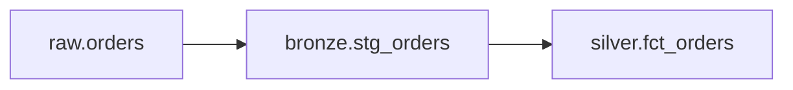

# Part 6: Transformations with dbt

> Prerequisite: Complete [Part 5](05-orchestration-with-dagster-assets.md).

## What You'll Learn

- Why dbt belongs between raw ingestion and serving layers
- How Phlo discovers dbt projects in `workflows/transforms/dbt`
- How to structure bronze and silver models
- How to scaffold publishing config for marts

## Prerequisites

- Ingestion assets landing data in Iceberg
- Trino service running

The examples below continue from the Fake Store ingestion in Part 2. That source lands product-like fields in `raw.orders`: `id`, `title`, `price`, and `category`.

## Where dbt Fits

- Bronze: type cleanup and source normalisation
- Silver: business rules and entity logic
- Gold: reporting-ready metrics and dimensions

Model flow:




## Create the dbt Project

Phlo looks for dbt projects under `workflows/transforms/dbt`.

```bash
mkdir -p workflows/transforms/dbt/models/bronze workflows/transforms/dbt/models/silver workflows/transforms/dbt/profiles
```

Create `workflows/transforms/dbt/dbt_project.yml`:

```yaml
name: phlo_fundamentals
version: "1.0"
config-version: 2
profile: phlo

model-paths: ["models"]

models:
  phlo_fundamentals:
    +materialized: table
```

Create `workflows/transforms/dbt/profiles/profiles.yml`:

```yaml
phlo:
  target: dev
  outputs:
    dev:
      type: trino
      host: trino
      port: 8080
      user: phlo
      catalog: iceberg
      schema: raw
      method: none
      threads: 4
```

Create `workflows/transforms/dbt/models/sources.yml`:

```yaml
version: 2

sources:
  - name: raw
    schema: raw
    tables:
      - name: orders
```

## Example dbt Models

Bronze model (type cleanup and source normalisation):

```sql
-- workflows/transforms/dbt/models/bronze/stg_orders.sql
select
  cast(id as integer) as order_id,
  cast(title as varchar) as title,
  cast(price as double) as price,
  cast(category as varchar) as category
from {{ source('raw', 'orders') }}
where id is not null
```

Silver model (business rules and entity logic):

```sql
-- workflows/transforms/dbt/models/silver/fct_orders.sql
select
  order_id,
  title,
  price,
  category,
  case
    when price >= 100 then 'premium'
    when price >= 25 then 'standard'
    else 'entry'
  end as price_band
from {{ ref('stg_orders') }}
```

Add tests in `workflows/transforms/dbt/models/silver/schema.yml`:

```yaml
version: 2

models:
  - name: stg_orders
    columns:
      - name: order_id
        tests:
          - not_null
          - unique
  - name: fct_orders
    columns:
      - name: order_id
        tests:
          - not_null
          - unique
      - name: price_band
        tests:
          - accepted_values:
              arguments:
                values: ["premium", "standard", "entry"]
```


## Run dbt through Phlo

```bash
phlo dbt compile
phlo dbt run --select stg_orders --select fct_orders
phlo dbt test --select stg_orders --select fct_orders
```

Expected output from `dbt compile`:

```text
Found 2 models, 5 tests, 1 source
Compiled successfully.
```

## Phlo Publishing Scaffolding

The dbt plugin contributes a `publishing` command group.

```bash
phlo dbt run --select tag:publish
```


## Engineering Guidelines

1. Keep raw data assumptions out of gold models.
2. Push type and null handling into bronze models.
3. Keep business logic centralized in silver.
4. Use explicit tests for keys, nullability, and relationships.

## Deep Dive: Incremental Models for Production Scale

Full-refresh models work early but become expensive. Incremental models process only new or changed data.

Example incremental pattern:

```sql
-- workflows/transforms/dbt/models/silver/fct_orders.sql
{{
  config(
    materialized='incremental',
    unique_key='order_id',
    incremental_strategy='merge'
  )
}}

select
  order_id,
  title,
  price,
  category,
  price_band
from {{ ref('stg_orders') }}

where order_id > (select max(order_id) from {{ this }})

```

The `order_id > max(order_id)` predicate is only safe when `order_id` is strictly
increasing. For most production sources, replace this with a timestamp watermark
such as `updated_at > (select max(updated_at) from {{ this }})`.

When to use incremental:

- Source volume grows daily and full scans are slow
- Upstream data is append-only or has a reliable timestamp
- Reprocessing cost exceeds SLA margin

When to stay full-refresh:

- Small dimension tables
- Logic that requires full dataset context
- Early development when schema is still changing

## Deep Dive: dbt Testing Strategy

dbt tests are your transformation contract layer. Use them deliberately:

```yaml
# workflows/transforms/dbt/models/silver/schema.yml
models:
  - name: fct_orders
    columns:
      - name: order_id
        tests:
          - not_null
          - unique
      - name: price
        tests:
          - not_null
      - name: price_band
        tests:
          - accepted_values:
              arguments:
                values: ['premium', 'standard', 'entry']
```

Test tiers:

- **Always run**: primary key uniqueness, not-null on critical fields
- **Run on merge**: accepted values, referential integrity
- **Run weekly**: row count trends, freshness assertions

A practical pattern: run `dbt test` as part of every materialization. If tests fail, downstream assets should not proceed.

## Field Notes: Model Review Conversations That Save You Later

If you work with a team, most dbt pain shows up in review, not runtime.

A familiar example:

- one person prefers "quick model, ship now"
- another wants extra staging models for clarity
- both are trying to help

The easiest way to get stuck is arguing style. The better move is to ask:

1. Can someone new trace this model lineage in five minutes?
2. If this metric is wrong, can we isolate the layer quickly?
3. Would we trust this logic during an incident at 7 AM?

Those three questions usually settle debates fast.

Another practical tip: avoid hiding business logic in macros too early. Macros are powerful, but overuse makes debugging harder for analysts who are strongest in SQL, not Jinja internals.

I usually recommend this progression:

- Start explicit and readable.
- Extract repetition after patterns are stable.
- Keep critical business definitions visible in model SQL.

When teams follow this, handoffs get easier and production defects drop.

One more pattern that works well:

- every gold model PR includes one sentence on "what business question this model answers."

That sentence keeps modelling grounded in user value instead of internal style preferences.

## Hands-On Exercise

1. Create one bronze model and one silver model.
2. Add at least two dbt tests.
3. Run compile, run, and test commands.
4. Record test failures and fix root causes.

## Common Issues

1. dbt project placed outside `workflows/transforms/dbt` and not discovered.
2. Model names drift from downstream expectations.
3. Teams skip dbt tests and debug in dashboards.
4. Publishing configs become stale after model rename.

For failed commands and environment drift, use [Troubleshooting](../../operations/troubleshooting.md).

## Summary

dbt gives a clean SQL boundary for transformation logic, while Phlo keeps discovery and operational wiring predictable.

## Next Steps

1. Continue to [Part 7](07-quality-checks-with-pandera-and-phlo-pandera.md) to enforce contracts and checks.
2. Add model test coverage for every output used by stakeholders.

## See Also

- [Part 7: Quality Checks with Pandera and Phlo Quality](07-quality-checks-with-pandera-and-phlo-pandera.md)
- [Part 11: Performance and Cost Optimisation](11-performance-and-cost-optimization.md)
- [dbt Development Guide](../../guides/dbt-development.md)
