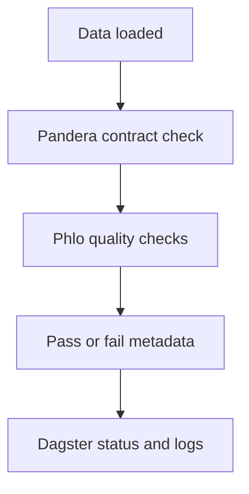

# Part 7: Quality Checks with Pandera and Phlo Quality

> Prerequisite: Complete [Part 6](06-transformations-with-dbt.md).

## What You'll Learn

- How Pandera schemas define enforceable contracts
- How `@phlo_quality` generates asset checks
- When to block downstream runs vs warn
- How to validate schemas and workflow files from CLI

## Prerequisites

- One ingestion asset and one dbt model from prior posts
- Familiarity with basic Pandera schema patterns

## Contract-First Mindset

A schema is not documentation only. It is executable policy.

Example Pandera model:

```python
import pandera.pandas as pa

class RawOrders(pa.DataFrameModel):
    order_id: str
    customer_id: str
    total_amount: float
    order_timestamp: str
```

Expected output:

```text
Template snippet prepared for direct use in your project.
```

## Add Declarative Quality Checks

```python
from phlo_quality.decorator import phlo_quality
from phlo_quality.checks import CustomSQLCheck, NullCheck

@phlo_quality(
    table="silver.fct_orders",
    checks=[
        NullCheck(column="order_id", threshold=0.0),
        CustomSQLCheck(
            name_="positive_revenue",
            expected=0,
            sql="SELECT COUNT(*) FROM data WHERE total_amount < 0",
        ),
    ],
    blocking=True,
    partition_aware=True,
)
def orders_quality_gate() -> None:
    pass
```

Expected output:

```text
Template snippet prepared for direct use in your project.
```

## Validate Before You Deploy

```bash
phlo schema list --format table
phlo schema show RawOrders --iceberg
phlo validate-schema workflows/schemas/orders.py
phlo validate-workflow workflows/ingestion/orders.py
```

Expected output:

```text
Schema inventory, schema details, and validation reports with pass/fail diagnostics.
```

## Quality Severity Strategy

Use this policy in early production:

- `blocking=True` for identity, key integrity, and contract checks
- warning-only for soft quality metrics during stabilisation
- explicit threshold tuning per domain

## Signal Flow



Expected output:

```text
A rendered quality signal path from data load to orchestration feedback.
```

## Field Notes: The 6 AM Quality Alert Moment

Quality strategy sounds abstract until the first early-morning failure.

Picture this:

- ingestion succeeded
- transformation succeeded
- then one contract check failed on a field your dashboard depends on

At that point, your policy matters more than your code style.

If the check was blocking, downstream consumers see delayed data but not wrong data.
If it was warning-only, consumers may see numbers that look normal but are now untrustworthy.

There is no universal correct answer. It depends on business risk.

What works in practice is assigning check tiers:

- Tier 1 (always blocking): keys, timestamp parseability, core measure validity
- Tier 2 (warning first, then promote): soft null thresholds, optional enrichments
- Tier 3 (monitoring only): exploratory signals

This gives teams room to improve quality without freezing delivery.

One mistake I see a lot is setting every check to blocking on day one. It looks strict, but it often leads teams to disable checks under pressure. A tiered rollout is more durable.

If you want one strong habit from this chapter, use this:

- every time a quality failure surprises the team, decide whether a new check, a stricter threshold, or better ownership would have caught it earlier.

That feedback loop turns quality from gatekeeping into learning.

## Hands-On Exercise

1. Add one Pandera schema for your ingestion table.
2. Add one `NullCheck` and one `CustomSQLCheck`.
3. Force a failure with bad test data.
4. Confirm run is blocked and diagnostics are visible.

## Common Issues

1. Schema fields and ingestion output diverge after source API changes.
2. Quality checks query wrong table namespace.
3. Teams define checks but ignore severity strategy.
4. Warnings accumulate and become hidden production debt.
5. Contract checks are run manually, not in normal orchestration flow.

Recovery patterns: [Troubleshooting](../../operations/troubleshooting.md)

## Summary

Quality is strongest when contracts and checks are first-class runtime behaviour, not post-hoc reporting.

## Next Steps

1. Continue to [Part 8](08-schema-evolution-and-data-contracts.md) for safe schema change workflows.
2. Add quality ownership to each domain table.

## See Also

- [Part 8: Schema Evolution and Data Contracts](08-schema-evolution-and-data-contracts.md)
- [Part 9: Observability: Metrics, Logs, and Lineage](09-observability-metrics-logs-lineage.md)
- [Quality Checks Catalog](../../reference/quality-checks-catalog.md)
