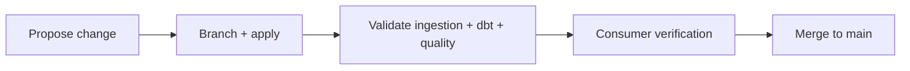

# Part 8: Schema Evolution and Data Contracts

> Prerequisite: Complete [Part 7](07-quality-checks-with-pandera-and-phlo-pandera.md).

## What You'll Learn

- How to evolve schemas without breaking consumers
- How to classify safe vs breaking changes
- A branch-first rollout pattern with Nessie
- How to validate contract changes before merge

## Prerequisites

- Existing schema and quality checks
- Nessie branch workflow from Part 4
- Basic understanding of downstream dependencies

## Types of Schema Change

Safe changes usually include:

- Adding nullable columns
- Adding derived columns not required by existing consumers

Breaking changes usually include:

- Renaming columns used downstream
- Changing numeric types to incompatible precision
- Tightening nullability without cleanup

## Inspect and Diff Contracts

```bash
phlo schema list --format table
```

You should get output similar to this:

```text
Schema         Fields    Module
RawOrders      4         workflows.schemas.orders
```

## Branch-First Rollout Pattern

```bash
phlo branch create schema/contract-update
```


Then run in branch context:

1. Materialize affected ingestion assets
2. Run dbt compile + tests
3. Run quality checks
4. Review table history
5. Merge only when all gates pass

## Contract Migration Checklist

```text
1. Add field with backward-compatible type.
2. Backfill or default where needed.
3. Update dbt models and tests.
4. Update quality checks.
5. Verify dashboards/API consumers.
```


## Contract Lifecycle Diagram




## Deep Dive: Compatibility Classification in Practice

When reviewing a schema change, classify it explicitly:

| Change type | Example | Classification |
| --- | --- | --- |
| Add nullable column | `order_channel VARCHAR NULL` | Safe |
| Add required column | `region VARCHAR NOT NULL` | Breaking |
| Widen type | `INTEGER → BIGINT` | Usually safe |
| Narrow type | `DOUBLE → INTEGER` | Breaking |
| Rename column | `order_ts → order_timestamp` | Breaking |
| Drop column | Remove `legacy_status` | Breaking |

For breaking changes, use a staged rollout:

1. Add new column alongside old (both populated).
2. Migrate consumers to new column with a documented deadline.
3. Remove old column after all consumers confirm.

Use `phlo schema diff RawOrders` to compare current vs previous schema versions and flag breaking fields automatically.

## Field Notes: How to Make Breaking Changes Predictable

Most teams do not fear schema changes because they are hard.
They fear them because failures feel unpredictable.

The fix is process clarity, not heroics.

When a change might be breaking, use a staged communication pattern:

1. Announce proposed change with date and owner.
2. Mark it as "safe" or "breaking" in plain language.
3. Share exactly what consumers need to update.
4. Run a short validation window on branch data.
5. Merge only with explicit sign-off.

This sounds formal, but it prevents a lot of cross-team friction.

A small wording choice helps too. Instead of saying "schema update," say:

- "we are renaming `order_ts` to `order_timestamp` and keeping both fields for one release cycle."

Specific phrasing removes ambiguity.

Another real-world pattern:

- keep temporary compatibility columns with a clear sunset date.

Without a sunset date, compatibility layers become permanent clutter.

If your team is new to contract work, start with a monthly "schema review hour" for critical tables. The meeting is short, but it creates shared ownership and catches drift early.

Breaking changes become much less stressful once everyone knows the playbook.

## Hands-On Exercise

1. Add one nullable column to your schema.
2. Update ingestion and one downstream dbt model.
3. Run schema diff and quality checks.
4. Record whether change is safe or breaking and why.

## Common Issues

1. Contracts change without updating downstream model tests.
2. Teams use broad "text" types instead of intentional types.
3. Change ownership is unclear across ingestion and analytics.
4. Rollouts skip branch validation and break production readers.
5. Contract docs drift from actual schema classes.

Incident and recovery references: [Troubleshooting](../../operations/troubleshooting.md)

## Summary

Schema evolution is a product change. Treat it with code-like review, branch validation, and explicit compatibility rules.

## Next Steps

1. Continue to [Part 9](09-observability-metrics-logs-lineage.md) to monitor these changes in production.
2. Add a schema change checklist to your engineering standards.

## See Also

- [Part 4: Iceberg and Nessie for Reliable Tables](04-iceberg-and-nessie-for-reliable-tables.md)
- [Part 9: Observability: Metrics, Logs, and Lineage](09-observability-metrics-logs-lineage.md)
- [Configuration Reference](../../reference/configuration-reference.md)
