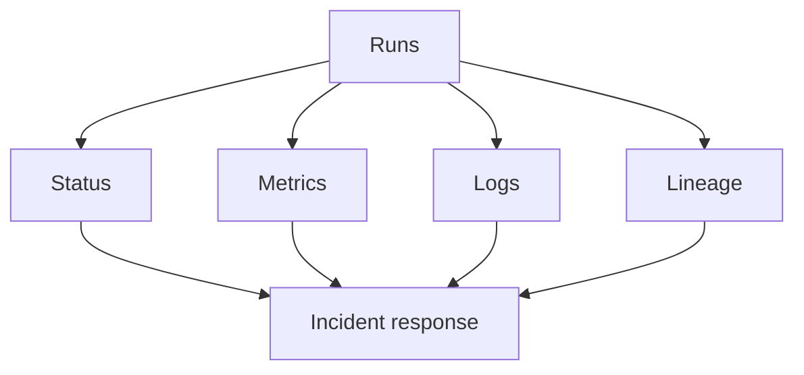

# Part 9: Observability: Metrics, Logs, and Lineage

> Prerequisite: Complete [Part 8](08-schema-evolution-and-data-contracts.md).

## What You'll Learn

- How to monitor health with status and metrics
- How to debug quickly with filtered logs
- How to understand blast radius with lineage
- How alerting fits into response loops

## Prerequisites

- Running project with at least one successful materialization
- Optional plugin for alerting CLI examples: `phlo plugin install alerting`

## The Four Signals You Need

1. Status: current state and freshness
2. Metrics: trends and SLO tracking
3. Logs: event-level execution detail
4. Lineage: dependency and impact map

Signal map:




## Status and Logs

```bash
phlo status --services
phlo logs --limit 20
```

In most setups, the output will look similar to this:

```text
Service    Status    Port
dagster    Up        3000
minio      Up        9000
nessie     Up        19120
trino      Up        8080
```

## Metrics for Trends

```bash
phlo metrics summary --period 24h
phlo metrics asset dlt_orders --runs 20
phlo metrics export --format json --output .phlo/metrics-24h.json --period 24h
```

You should see something like this:

```text
╭─── 📊 Metrics Summary ───╮
│                          │
│ Platform Metrics Summary │
│                          │
│ Runs (last 24h)          │
│   Total:     0           │
│   Success:   0 (0.0%)    │
│   Failure:   0 (0.0%)    │
│                          │
│ Data Volume              │
│   Rows:      0           │
│   Bytes:     0.00 B      │
│                          │
│ Latency (seconds)        │
│   p50:       0.00s       │
│   p95:       0.00s       │
│   p99:       0.00s       │
│                          │
│ Assets                   │
│   Active:    0           │
│   Success:   0           │
│   Warning:   0           │
│   Failure:   0           │
│                          │
╰──────────────────────────╯

✓ Metrics exported to .phlo/metrics-24h.json
```


## Lineage for Impact Analysis

```bash
phlo lineage status
phlo lineage show dlt_orders --direction both --depth 2
```

A typical result looks like this:

```text
dlt_orders → stg_orders → fct_orders → mrt_revenue_daily
```

## Alerting Loop

Confirm the alerting plugin is available, then configure alert rules:

```bash
phlo plugin list
```


## Deep Dive: Building a Weekly SLO Review

A weekly review cadence turns metrics into decisions. Use this template:

```bash
phlo metrics summary --period 7d
phlo metrics asset dlt_orders --runs 30
phlo lineage status
```

Review checklist:

1. Are any critical assets stale beyond SLO?
2. Did failure rate increase week-over-week?
3. Are p95 run durations drifting upward?
4. Did any new assets appear without quality checks?
5. Are lineage gaps blocking incident scoping?

Record findings in a short log:

```text
Week: 2025-01-20
Critical stale assets: 0
Failure rate: 2.1% (down from 3.4%)
Action: add FreshnessCheck to dlt_invoices
Owner: platform-data
```

Teams that run this review consistently detect problems days before users report them.

## Field Notes: Turning Observability into Better Team Decisions

A lot of teams collect logs and metrics but still feel blind during incidents.
Usually the issue is not missing tools. It is missing operating habits.

A simple habit that works:

- every week, spend 20 minutes reviewing one failed run and one slow run.

Ask:

1. Did we detect it quickly?
2. Did logs make the cause obvious?
3. Did metrics show early warning signs?
4. Could lineage have scoped impact faster?

This turns observability from dashboard decoration into operational learning.

Another practical tip: avoid vanity metrics. "total runs" is fine, but it does not drive action by itself. Pair it with decision metrics like:

- failure rate by critical asset
- stale critical assets count
- p95 runtime drift week-over-week

Those tell you where to invest.

For stakeholder updates, keep the language grounded:

- "We had three failed runs in billing yesterday; no downstream impact because retries succeeded within SLA."

That is clearer than generic "system health looks good."

If you want observability to stick culturally, rotate who leads the weekly review. People trust systems more when they have used the evidence themselves.

## Hands-On Exercise

1. Define one freshness SLO and one failure-rate SLO.
2. Run `phlo metrics summary --period 7d` and capture baseline.
3. Trigger a controlled failure in a non-production asset.
4. Use status + logs + lineage to identify cause and impact.

## Common Issues

1. Teams collect metrics but do not define SLO thresholds.
2. Logs are unstructured and hard to search during incidents.
3. Lineage graph is stale because no regular materializations occur.
4. Alerts are configured but never tested.
5. Response ownership is unclear during off-hours failures.

Operations runbook: [Troubleshooting](../../operations/troubleshooting.md)

## Summary

Observability is a design discipline. The right command set makes failures explainable, not mysterious.

## Next Steps

1. Continue to [Part 10](10-incident-response-and-debugging.md) for a concrete incident playbook.
2. Add weekly SLO review using your exported metrics.

## See Also

- [Part 10: Incident Response and Debugging](10-incident-response-and-debugging.md)
- [Part 12: Extending Phlo with Plugins and Observatory](12-extending-phlo-with-plugins-and-observatory.md)
- [Operations Guide](../../operations/operations-guide.md)
