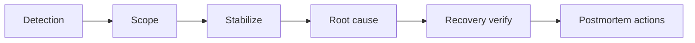

# Part 10: Incident Response and Debugging

> Prerequisite: Complete [Part 9](09-observability-metrics-logs-lineage.md).

## What You'll Learn

- A practical incident response flow for data platforms
- How to triage failures with Phlo commands
- How to separate symptom from root cause
- How to write useful post-incident actions

## Prerequisites

- Familiarity with status, logs, metrics, and lineage commands
- One reproducible failing scenario in a sandbox environment

## Incident Flow

Use this exact order to reduce noise:

1. Detect
2. Scope impact
3. Stabilize
4. Fix root cause
5. Verify recovery
6. Add regression guard

Process diagram:




## Triage Command Bundle

```bash
phlo services list --json
phlo status --services
phlo logs --limit 20
phlo metrics summary --period 24h
phlo lineage status
```

Run these in order. Together they give you service health, asset freshness, recent errors, metric trends, and downstream blast radius within minutes.

```text
Service    Status    Port
dagster    Up        3000
minio      Up        9000
nessie     Up        19120
trino      Up        8080
```

## Common Failure Classes

- Source/API failures: timeouts, auth errors, rate limits
- Contract failures: schema drift, null spikes, key violations
- Transform failures: model SQL errors, upstream missing columns
- Infrastructure failures: containers down, resource exhaustion

## Stabilisation Tactics

- Pause noisy backfills
- Reduce parallelism
- Materialize a known-safe small partition
- Route consumers to last known good snapshot if necessary

Example targeted replay:

```bash
phlo materialize dlt_orders --partition 2025-01-15
```


## Deep Dive: The First Five Minutes

Most incident time is wasted in the first five minutes on wrong assumptions. Use this strict sequence:

Minute 0-1: Confirm scope
```bash
phlo status --services
phlo lineage show dlt_orders --direction downstream --depth 3
```

Minute 1-3: Read recent logs
```bash
phlo logs --limit 50
```

Minute 3-5: Check metrics context
```bash
phlo metrics asset dlt_orders --runs 10
```

Common first-five-minute mistakes:

- Rerunning before understanding what failed
- Checking dashboards instead of pipeline status
- Assuming infrastructure when the cause is data
- Escalating before scoping impact

If you can answer "what failed, when, and what is affected" in five minutes, recovery usually follows quickly.

## Root Cause Template

```text
Incident ID:
Start time:
Detection signal:
User impact:
Primary failure mode:
Contributing factors:
Fix applied:
Verification evidence:
Regression test/check added:
```


## Field Notes: Debriefs That Actually Improve the System

Plenty of teams run post-incident meetings that feel thorough but change very little.

The pattern usually looks like this:

- long recap
- lots of agreement
- vague action items
- same class of issue repeats a month later

A stronger debrief is short and specific.

Ask only:

1. What failed first?
2. What signal should have caught it earlier?
3. What concrete guard will we add now?
4. Who owns it and by when?

If an action does not have an owner and date, treat it as a note, not a fix.

Another useful rule:

- at least one action item should reduce detection time, not only prevention.

Prevention is great, but failures still happen. Faster detection often gives the largest immediate reliability win.

I also recommend tagging incident notes by failure class (contract, source, transform, infra). After a few months, this gives you a clear map of where to invest engineering effort.

The goal of incident work is not writing perfect reports.
It is changing future system behaviour in measurable ways.

## Hands-On Exercise

1. Trigger a controlled schema mismatch in sandbox.
2. Run the triage bundle above.
3. Document root cause using the template.
4. Add one regression check that would have prevented it.

## Common Issues

1. Teams jump to fixes before scoping impact.
2. Logs are reviewed without time filters, causing confusion.
3. Postmortems end with vague actions and no owner.
4. Recovery is assumed without validation evidence.
5. Same class of incident repeats because no regression test was added.

Runbook baseline: [Troubleshooting](../../operations/troubleshooting.md)

## Summary

Good incident response is repeatable and evidence-driven. Fast recovery matters, but root-cause prevention matters more.

## Next Steps

1. Move to [Part 11](11-performance-and-cost-optimization.md) and optimise for steady-state operations.
2. Add this incident template to your team docs.

## See Also

- [Part 9: Observability: Metrics, Logs, and Lineage](09-observability-metrics-logs-lineage.md)
- [Part 11: Performance and Cost Optimisation](11-performance-and-cost-optimization.md)
- [Operations Troubleshooting](../../operations/troubleshooting.md)
