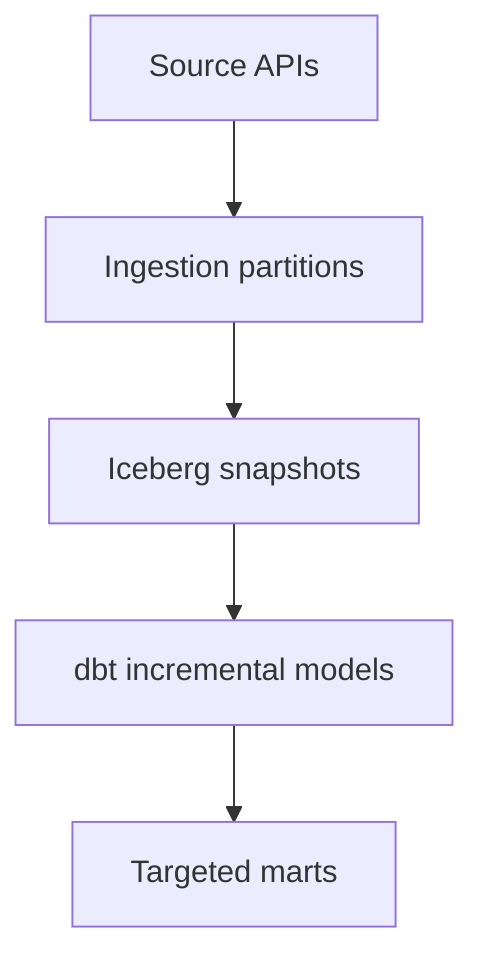

# Part 11: Performance and Cost Optimization

> Prerequisite: Complete [Part 10](10-incident-response-and-debugging.md).

## What You'll Learn

- Where performance bottlenecks usually appear in data platforms
- How partitioning and run strategy affect cost
- How to tune execution safely in Phlo workflows
- How to track optimization impact with metrics

## Prerequisites

- Running ingestion + transform pipeline
- Baseline metrics from Part 9

## Optimization Priority Order

1. Correctness first
2. Reliability second
3. Performance third
4. Cost fourth

If you reverse this order, you optimize the wrong thing.

## High-Leverage Levers

- Partition strategy: avoid over-wide daily scans where hourly partitioning is needed
- Backfill concurrency: match source and infra limits
- Model design: prevent repeated expensive joins
- Data movement: publish only what consumers need

## Example: Controlled Backfill Tuning

```bash
phlo backfill dlt_orders --start-date 2026-01-01 --end-date 2026-01-07 --parallel 1 --dry-run
phlo backfill dlt_orders --start-date 2026-01-01 --end-date 2026-01-07 --parallel 3
```

Expected output:

```text
First command previews workload; second command executes with controlled parallelism.
```

## Track Performance Before and After

```bash
phlo metrics asset dlt_orders --runs 30
phlo metrics summary --period 7d
```

Expected output:

```text
Run duration, failure rate, and throughput changes visible across the sampled window.
```

## Query-Layer Considerations

Keep transformation SQL intentional:

- Select only required columns
- Filter early in bronze/silver layers
- Push heavy joins to well-scoped models
- Reuse tested intermediate models

Example model snippet:

```sql
select
  order_date,
  sum(total_amount) as revenue
from {{ ref('fct_orders') }}
where order_date >= current_date - interval '30' day
group by 1
```

Expected output:

```text
Template snippet prepared for direct use in your project.
```

## Cost-Aware Architecture Sketch



Expected output:

```text
A rendered optimization-oriented flow showing bounded compute at each layer.
```

## Field Notes: Avoiding "Fast but Wrong" Optimization

Performance work can feel addictive. You change one thing, runtime drops, and it feels like progress.

But in data systems, speed wins are only real if correctness stays intact.

A disciplined tuning loop:

1. Capture baseline metrics.
2. Change one variable.
3. Re-run the same workload.
4. Compare runtime, failure rate, and data quality outcomes.
5. Keep or revert.

The "change one variable" step is where most teams slip. They adjust partitioning, concurrency, and SQL in one batch, then cannot explain which change actually helped.

Cost tuning has the same trap. Lower compute cost is good, unless it increases late data or incident frequency. The invoice might improve while user trust gets worse.

A practical compromise:

- pick one monthly cost target and one reliability guardrail.

Example:

- cost target: reduce p95 compute minutes by 10%
- guardrail: no increase in failed critical runs

That keeps optimization honest.

One more tip: share before/after metrics in pull requests. It forces clarity and builds a knowledge base for future tuning decisions.

## Hands-On Exercise

1. Pick one slow pipeline path.
2. Capture baseline metrics (duration, row counts, failure rate).
3. Apply one change only (for example: backfill parallelism or model filter pushdown).
4. Re-measure and document impact.

## Common Issues

1. Teams tune parallelism without measuring source/API limits.
2. Full-refresh behavior is triggered accidentally in daily operations.
3. Cost spikes are discovered from bills, not metrics.
4. Teams optimize gold models while bronze quality remains unstable.
5. Performance changes are made with no rollback plan.

Reference for failures during tuning: [Troubleshooting](../../operations/troubleshooting.md)

## Summary

Performance work should be measured, incremental, and reversible. Good optimization keeps correctness and reliability intact.

## Next Steps

1. Move to [Part 12](12-extending-phlo-with-plugins-and-observatory.md) for platform extension patterns.
2. Add a monthly performance review cadence using exported metrics.

## See Also

- [Part 9: Observability: Metrics, Logs, and Lineage](09-observability-metrics-logs-lineage.md)
- [Part 12: Extending Phlo with Plugins and Observatory](12-extending-phlo-with-plugins-and-observatory.md)
- [Operations Best Practices](../../operations/best-practices.md)
