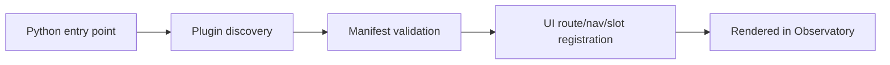

# Part 12: Extending Phlo with Plugins and Observatory

> Prerequisite: Complete [Part 11](11-performance-and-cost-optimization.md).

## What You'll Learn

- How Phlo plugin discovery works conceptually
- How CLI, service, and observatory plugins extend platform behaviour
- How Observatory extension manifests are structured
- A practical path to your first extension package

## Prerequisites

- Working Phlo installation
- Basic Python packaging knowledge
- Optional: TypeScript familiarity for Observatory UI modules

## Plugin Surfaces in Phlo

Phlo supports extension points for:

- CLI commands
- Services
- Sources, quality, transforms, hooks
- Observatory UI extensions

You can inspect installed plugins from CLI:

```bash
phlo plugin list
phlo plugin info dagster
```

The command should return something like this:

```text
Installed:
┏━━━━━━━━━━━━━━━━━━━┳━━━━━━━━━━━━━━━┳━━━━━━━━━┳━━━━━━━━━━━┳━━━━━━━┓
┃ Name              ┃ Type          ┃ Version ┃ Author    ┃ Ready ┃
┡━━━━━━━━━━━━━━━━━━━╇━━━━━━━━━━━━━━━╇━━━━━━━━━╇━━━━━━━━━━━╇━━━━━━━┩
│ minio             │ service       │ 0.1.0   │ Phlo Team │ yes   │
│ trino             │ service       │ 0.1.0   │ Phlo Team │ yes   │
│ postgres          │ service       │ 0.1.0   │ Phlo Team │ yes   │
│ dagster           │ service       │ 0.1.0   │ Phlo Team │ yes   │
│ nessie            │ service       │ 0.1.0   │ Phlo Team │ yes   │
│ dbt               │ cli_commands  │ 0.1.0   │ unknown   │ yes   │
│ lineage           │ cli_commands  │ 0.1.0   │ unknown   │ yes   │
│ quality           │ cli_commands  │ 0.1.0   │ unknown   │ yes   │
│ dagster           │ cli_commands  │ 0.1.0   │ unknown   │ yes   │
│ metrics           │ cli_commands  │ 0.1.0   │ unknown   │ yes   │
│ nessie            │ cli_commands  │ 0.1.0   │ unknown   │ yes   │
│ dlt               │ cli_commands  │ 0.1.0   │ unknown   │ yes   │
└───────────────────┴───────────────┴─────────┴───────────┴───────┘

dagster
Type: services
Version: 0.1.0
Author: Phlo Team
Description: Data orchestration platform for workflows and pipelines
```

## Observatory Extension Manifest Basics

Phlo Observatory defines extension manifest models for compatibility, navigation, slots, and settings.

Example structure:

```python
from phlo.plugins.observatory import (
    ObservatoryExtensionCompatibility,
    ObservatoryExtensionManifest,
    ObservatoryExtensionNavItem,
    ObservatoryExtensionUI,
)

manifest = ObservatoryExtensionManifest(
    name="lineage",
    version="0.1.0",
    compat=ObservatoryExtensionCompatibility(observatory_min="0.1.0"),
    ui=ObservatoryExtensionUI(
        nav=[ObservatoryExtensionNavItem(title="Lineage Graph", to="/graph")]
    ),
)
```


## Example Extension Class

```python
from importlib import resources
from phlo.plugins import PluginMetadata
from phlo.plugins.observatory import ObservatoryExtensionPlugin

class ExampleObservatoryExtension(ObservatoryExtensionPlugin):
    @property
    def metadata(self) -> PluginMetadata:
        return PluginMetadata(name="example", version="0.1.0", description="Example extension")

    @property
    def manifest(self):
        ...

    @property
    def asset_root(self):
        return resources.files("phlo_observatory_example").joinpath("observatory_assets")
```


## Extension Runtime Model




## Build Path for Your Team

1. Start with one small CLI or Observatory extension.
2. Keep manifest minimal and explicit.
3. Add compatibility bounds (`observatory_min`).
4. Ship with integration tests.

## Deep Dive: Anatomy of a CLI Plugin

A CLI plugin adds commands to `phlo`. The minimum structure:

```python
# packages/phlo-mytools/src/phlo_mytools/cli_plugin.py
import click
from phlo.plugins import CLIPlugin, PluginMetadata

class MyToolsCLI(CLIPlugin):
    @property
    def metadata(self) -> PluginMetadata:
        return PluginMetadata(
            name="mytools",
            version="0.1.0",
            description="Custom diagnostics commands",
        )

    def register_commands(self, cli: click.Group) -> None:
        @cli.command()
        def diagnose():
            """Run standard diagnostic checks."""
            click.echo("Running diagnostics...")
```

Register via entry point in `pyproject.toml`:

```toml
[project.entry-points."phlo.cli"]
mytools = "phlo_mytools.cli_plugin:MyToolsCLI"
```

After installing, verify:

```bash
phlo plugin list
```

Expected output:

```text
Installed:
┏━━━━━━━━━━━━━━━━━━━┳━━━━━━━━━━━━━━━┳━━━━━━━━━┳━━━━━━━━━━━┳━━━━━━━┓
┃ Name              ┃ Type          ┃ Version ┃ Author    ┃ Ready ┃
┡━━━━━━━━━━━━━━━━━━━╇━━━━━━━━━━━━━━━╇━━━━━━━━━╇━━━━━━━━━━━╇━━━━━━━┩
│ mytools           │ cli_commands  │ 0.1.0   │ unknown   │ yes   │
│ dbt               │ cli_commands  │ 0.1.0   │ unknown   │ yes   │
│ dagster           │ cli_commands  │ 0.1.0   │ unknown   │ yes   │
│ dlt               │ cli_commands  │ 0.1.0   │ unknown   │ yes   │
│ metrics           │ cli_commands  │ 0.1.0   │ unknown   │ yes   │
│ lineage           │ cli_commands  │ 0.1.0   │ unknown   │ yes   │
└───────────────────┴───────────────┴─────────┴───────────┴───────┘
```

Keep first plugins small. One command that solves a real daily pain point is more valuable than a comprehensive toolkit nobody uses.

## Field Notes: First Plugin, Small Scope, Real Value

The first plugin a team builds often tries to solve too much at once.
That is understandable, but it usually leads to long build cycles and unclear ownership.

A better first plugin is almost boring:

- one clear pain point
- one clear user
- one small interface surface

For example:

- a CLI helper that standardizes a repeated diagnostics command set
- a tiny Observatory nav panel for one high-value signal

Ship that first. Learn from it. Then expand.

Another practical point: extension projects need product thinking too. Ask:

1. Who uses this extension weekly?
2. What workflow becomes faster?
3. How will we know it is useful after release?

Without those answers, plugins become side projects instead of platform improvements.

I also strongly recommend writing a "removal plan" for extensions. If usage is low or maintenance cost is high, retire cleanly. Healthy plugin ecosystems include deletion, not only addition.

When teams treat extensions as small products with owners, release notes, and success criteria, the platform stays flexible without turning chaotic.

## Hands-On Exercise

1. Scaffold a small plugin package in `packages/`.
2. Add one CLI command via a CLI plugin class.
3. Add one simple Observatory nav item and route.
4. Validate plugin appears in `phlo plugin list`.

## Common Issues

1. Entry point group names are misconfigured in package metadata.
2. Extension manifests omit compatibility constraints.
3. UI assets are not bundled into package distributions.
4. Plugin load failures are silent without proper logs.
5. Teams overbuild first extension instead of shipping a minimal slice.

Debug loading failures with [Troubleshooting](../../operations/troubleshooting.md).

## Summary

Extension points let you evolve Phlo into your platform, not just consume defaults. Start narrow, ship reliably, then expand.

## Next Steps

1. Revisit [Part 3](03-ingestion-foundations-with-dlt.md) through [Part 10](10-incident-response-and-debugging.md) and identify extension opportunities.
2. Create a team backlog item for one plugin that removes repeated manual work.

## See Also

- [Part 9: Observability: Metrics, Logs, and Lineage](09-observability-metrics-logs-lineage.md)
- [Part 10: Incident Response and Debugging](10-incident-response-and-debugging.md)
- [Plugin Development Guide](../../guides/plugin-development.md)
