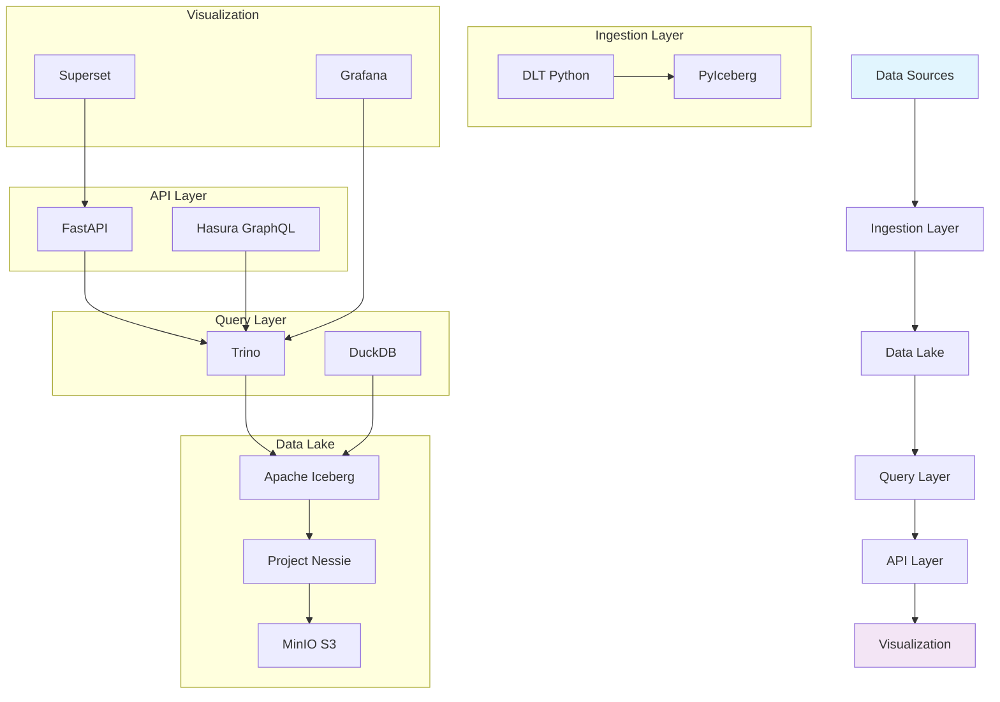

# Welcome to Cascade

Cascade is a modern data lakehouse platform built on open-source technologies. It provides a complete analytics infrastructure with data ingestion, transformation, querying, and visualization capabilities.

## Features

- **Data Lakehouse Architecture**: Combines the best of data lakes and data warehouses
- **Multi-Engine Analytics**: Support for SQL queries via Trino, DuckDB, and PostgreSQL
- **Data Catalog**: Nessie for Git-like versioning of datasets
- **Orchestration**: Dagster for reliable data pipelines
- **Visualization**: Superset for business intelligence dashboards
- **API Layer**: FastAPI and Hasura GraphQL for programmatic access
- **Observability**: Prometheus, Grafana, and Loki for monitoring and logging

## Quick Start

To get started with Cascade, see the [Quick Start Guide](quick-start.md).

## Architecture

Learn about the system architecture in the [Architecture Overview](architecture.md).

### High-Level Architecture

## Configuration

Configure your Cascade environment using the [Configuration Guide](configuration.md).
