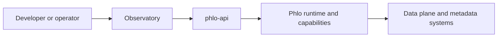

# Observatory

Observatory is the developer-facing UI layer for Phlo.

## Role

Observatory is not the whole platform. It is one UI surface sitting on top of `phlo-api` and the wider runtime.

## In The Bigger Picture

## Current Docs

- [Extensions](extensions.md): how to extend the UI surface

## Related Pages

- [API Surfaces](../reference/api-surfaces.md)
- [phlo-observatory package](../packages/phlo-observatory.md)
- [phlo-api](../reference/phlo-api.md)
