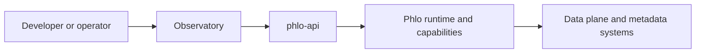

# Observatory

Observatory is the developer- and operator-facing UI layer for Phlo.

## Role

Observatory is not the whole platform. It is one UI surface sitting on top of `phlo-api` and the wider runtime.

Observatory v2 is capability-driven. The UI should decide which pages and actions to show from `phlo-api` read models such as `/api/observatory/v2/capability-inventory`, not from hardcoded package assumptions.

## In The Bigger Picture

## Current Docs

- [Extensions](extensions.md): how to extend the UI surface
- [Observatory v2 Contracts](../reference/observatory-v2-contracts.md): provider-neutral surfaces, read models, and guarded actions

## Related Pages

- [API Surfaces](../reference/api-surfaces.md)
- [phlo-observatory package](../packages/phlo-observatory.md)
- [phlo-api](../reference/phlo-api.md)
