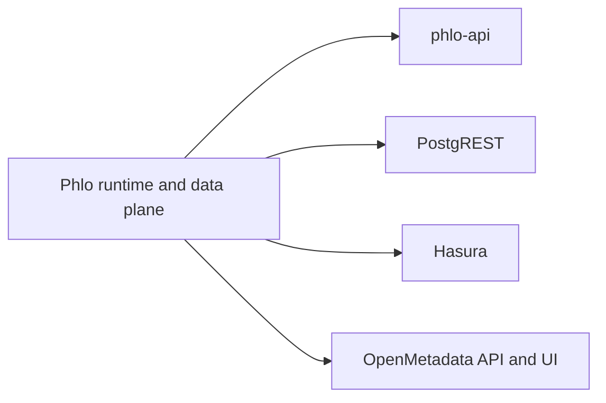

# API Surfaces

Phlo exposes more than one API surface. They solve different problems.

## Surface Map

## Surface Roles

### `phlo-api`

- Phlo-native service
- capability-aware
- best fit for Observatory and Phlo-specific operational endpoints
- **Regulated surface**: fully integrated with Phlo canonical RBAC

### `PostgREST`

- database-native REST
- best fit for exposing relational read/write surfaces with minimal app code
- **Ingress-gated optional surface** in regulated mode
- Uses PostgreSQL GRANT-based permissions, not Phlo canonical RBAC
- Must be protected at ingress; Phlo validates deployment configuration only

### `Hasura`

- metadata-driven GraphQL
- best fit for GraphQL clients, subscriptions, and schema-driven exposure
- **Ingress-gated optional surface** in regulated mode
- Uses Hasura role-based permissions, not Phlo canonical RBAC
- Must be protected at ingress; Phlo validates deployment configuration only

### `OpenMetadata`

- metadata and governance surface
- not a serving API for marts, but a catalog and discovery surface for data users
- **Blocked** in regulated mode (no Phlo adapter or ingress-gating story)

## Regulated Mode Classification

Surfaces are classified into four categories for regulated deployments:

| Category | Surfaces | Behavior in Regulated Mode |
|----------|----------|---------------------------|
| Direct regulated | `phlo-api` | Full Phlo RBAC enforcement |
| Ingress-gated optional | `postgrest`, `hasura` | Allowed with ingress protection; own auth layer |
| Pending adapter | `dagster-*`, `cli` | Blocked until adapter approved |
| Blocked | `pgweb`, `superset`, `openmetadata` | Blocked; no adapter or ingress story |

### What "ingress-gated optional" means

Ingress-gated optional surfaces are allowed in regulated deployments but **must be protected at ingress** (e.g., by an API gateway or reverse proxy that enforces authentication). Phlo does not enforce request-level policy on these surfaces. They rely on their own permission models:

- **PostgREST**: PostgreSQL GRANT statements and JWT claims
- **Hasura**: Hasura role permissions synced from config

If you expose either surface in a regulated deployment, you must ensure:
1. Ingress proxy requires authentication before forwarding requests
2. The surface's own permission model is configured correctly
3. Audit logs from the surface are collected separately

## Selection Guidance

- Phlo-native control-plane behavior: start with `phlo-api`
- self-service relational REST: add `PostgREST` (with ingress auth)
- GraphQL and subscriptions: add `Hasura` (with ingress auth)
- discovery, lineage, and governance: add `OpenMetadata` (non-regulated only)

## Related Pages

- [Choosing Components](../guides/choosing-components.md)
- [Hasura Setup](../setup/hasura.md)
- [PostgREST Setup](../setup/postgrest.md)
- [OpenMetadata Setup](../setup/openmetadata.md)
- [phlo-api](phlo-api.md)
- [Regulated Access Mode](../setup/regulated-access.md)
