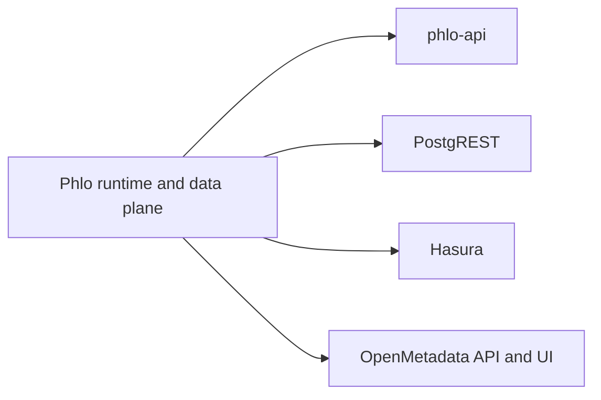

# API Surfaces

Phlo exposes more than one API surface. They solve different problems.

## Surface Map

## Surface Roles

### `phlo-api`

- Phlo-native service
- capability-aware
- best fit for Observatory and Phlo-specific operational endpoints

### `PostgREST`

- database-native REST
- best fit for exposing relational read/write surfaces with minimal app code

### `Hasura`

- metadata-driven GraphQL
- best fit for GraphQL clients, subscriptions, and schema-driven exposure

### `OpenMetadata`

- metadata and governance surface
- not a serving API for marts, but a catalog and discovery surface for data users

## Selection Guidance

- Phlo-native control-plane behavior: start with `phlo-api`
- self-service relational REST: add `PostgREST`
- GraphQL and subscriptions: add `Hasura`
- discovery, lineage, and governance: add `OpenMetadata`

## Related Pages

- [Choosing Components](../guides/choosing-components.md)
- [Hasura Setup](../setup/hasura.md)
- [PostgREST Setup](../setup/postgrest.md)
- [OpenMetadata Setup](../setup/openmetadata.md)
- [phlo-api](phlo-api.md)
