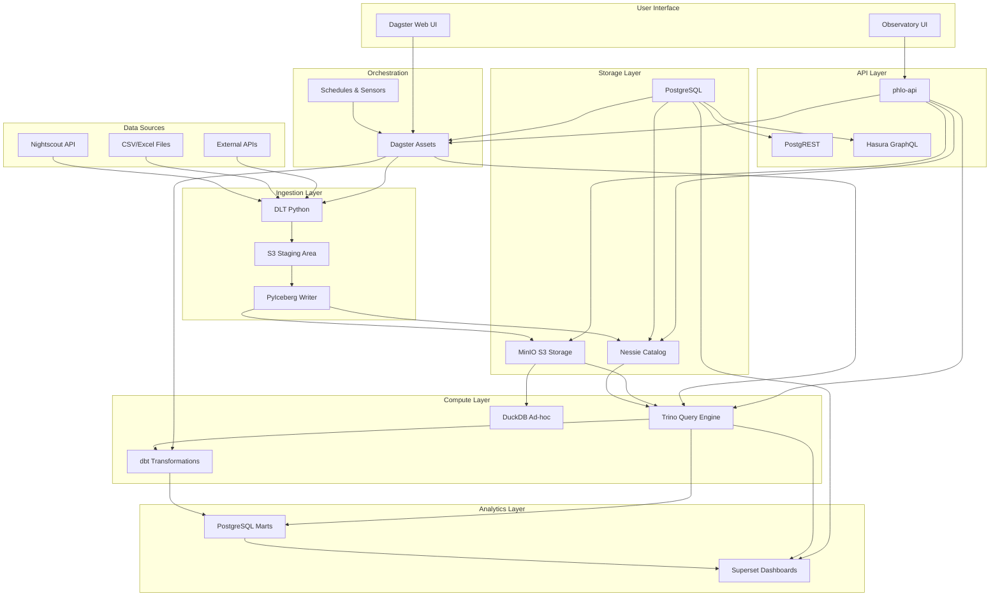

# Architecture Overview

Phlo is built on modern lakehouse principles using Apache Iceberg as the table format and Project Nessie as a Git-like catalog. This architecture provides ACID transactions, schema evolution, time travel, and branch isolation for data engineering workflows.

## Design Principles

### 1. Open Standards

- Apache Iceberg for table format (open spec, multi-engine support)
- S3-compatible storage (portable across cloud providers)
- Standard SQL via Trino
- Open-source components throughout

### 2. Stateless Services

- All state stored in volumes (MinIO, PostgreSQL)
- Services can be restarted without data loss
- Configuration via environment variables
- 12-factor app compliance

### 3. Git-Like Workflows

- Branch isolation (dev/staging/prod)
- Atomic multi-table commits
- Time travel to any point in history
- Tag releases for reproducibility

### 4. Asset-Based Orchestration

- Declarative data assets in Dagster
- Automatic lineage tracking
- Partition-aware dependencies
- Freshness policies for monitoring

## System Architecture

### High-Level Component Diagram



## Key Components

### User Interface Layer

- **Observatory**: Web-based UI for exploring data, viewing lineage, managing branches, and monitoring data quality. Provides a unified interface for all Phlo operations.
- **Dagster Web UI**: Native Dagster interface for asset materialization, run monitoring, and workflow debugging.

### API Layer

- **phlo-api**: Python FastAPI service exposing Phlo internals (plugins, services, configs) and providing data access endpoints for Observatory.
- **PostgREST** (optional): Auto-generated REST API from PostgreSQL schemas.
- **Hasura** (optional): GraphQL API with real-time subscriptions.

### Storage Layer

- **MinIO**: S3-compatible object storage for data files and Iceberg metadata
- **Nessie**: Git-like catalog for table metadata and branching
- **PostgreSQL**: Relational database for operational metadata and analytics marts

### Compute Layer

- **Trino**: Distributed SQL query engine for analytics
- **dbt**: Data transformation framework with SQL
- **DuckDB**: Embedded analytical database for ad-hoc queries

### Orchestration

- **Dagster**: Asset-based data orchestration platform
- **Schedules & Sensors**: Automated pipeline triggers

### Analytics Layer

- **PostgreSQL Marts**: Curated datasets for BI tools
- **Superset** (optional): Business intelligence and visualization

## Data Flow

1. **Ingestion**: Data sources → DLT → S3 staging → PyIceberg → Iceberg tables
2. **Transformation**: Iceberg tables → dbt → PostgreSQL marts
3. **Querying**: Multiple engines can query Iceberg tables directly
4. **Visualization**: BI tools connect to PostgreSQL marts or query engines

## Plugin System Architecture

Phlo uses a unified plugin system for extending functionality:

### Plugin Types

1. **Service Plugins**: Infrastructure services (Dagster, Postgres, Trino, etc.)
   - Distributed as Python packages (e.g., `phlo-dagster`, `phlo-trino`)
   - Contain Docker service definitions via `service.yaml`
   - Auto-discovered via `phlo.plugins.services` entry points

2. **Data Plugins**: Data processing extensions
   - **Source Connectors**: Fetch data from external systems
   - **Quality Checks**: Custom validation rules
   - **Transformations**: Reusable transformation logic

3. **Dagster Extension Plugins**: Extend Dagster functionality
   - Custom resources, sensors, schedules
   - Integration with external systems

4. **CLI Plugins**: Add custom CLI commands

### Plugin Discovery

Plugins are automatically discovered using Python entry points:

```
┌──────────────────────────────────────┐
│     Python Environment               │
│  - phlo (core framework)             │
│  - phlo-dagster (service plugin)     │
│  - phlo-custom-source (data plugin)  │
└──────────────────────────────────────┘
              │
              ▼
┌──────────────────────────────────────┐
│   Entry Point Discovery              │
│   (importlib.metadata)               │
└──────────────────────────────────────┘
              │
              ▼
┌──────────────────────────────────────┐
│   Plugin Registry                    │
│   - Installed plugins                │
│   - Available plugins (remote)       │
└──────────────────────────────────────┘
```

### Plugin Registry

- **registry/plugins.json**: Authoritative catalog of available plugins
- **Remote + Bundled**: Fetches from remote, falls back to bundled version offline
- **CLI Management**: `phlo plugin search/install/list` commands

For more details, see:
- [Plugin System Blog Post](../blog/13-plugin-system.md)
- [ADR 0030: Unified Plugin System](../architecture/decisions/0030-unified-plugin-system-with-registry.md)

## Branching Strategy

Phlo uses a Git-like branching model for data:

- **main**: Production data (read-only for most users)
- **dev**: Development workspace (read-write)
- **feature branches**: Isolated development environments

See [NESSIE_WORKFLOW.md](../../NESSIE_WORKFLOW.md) for detailed branching workflows.

## For More Details

Read the full [Architecture Guide](../../ARCHITECTURE.md) for complete technical specifications.
