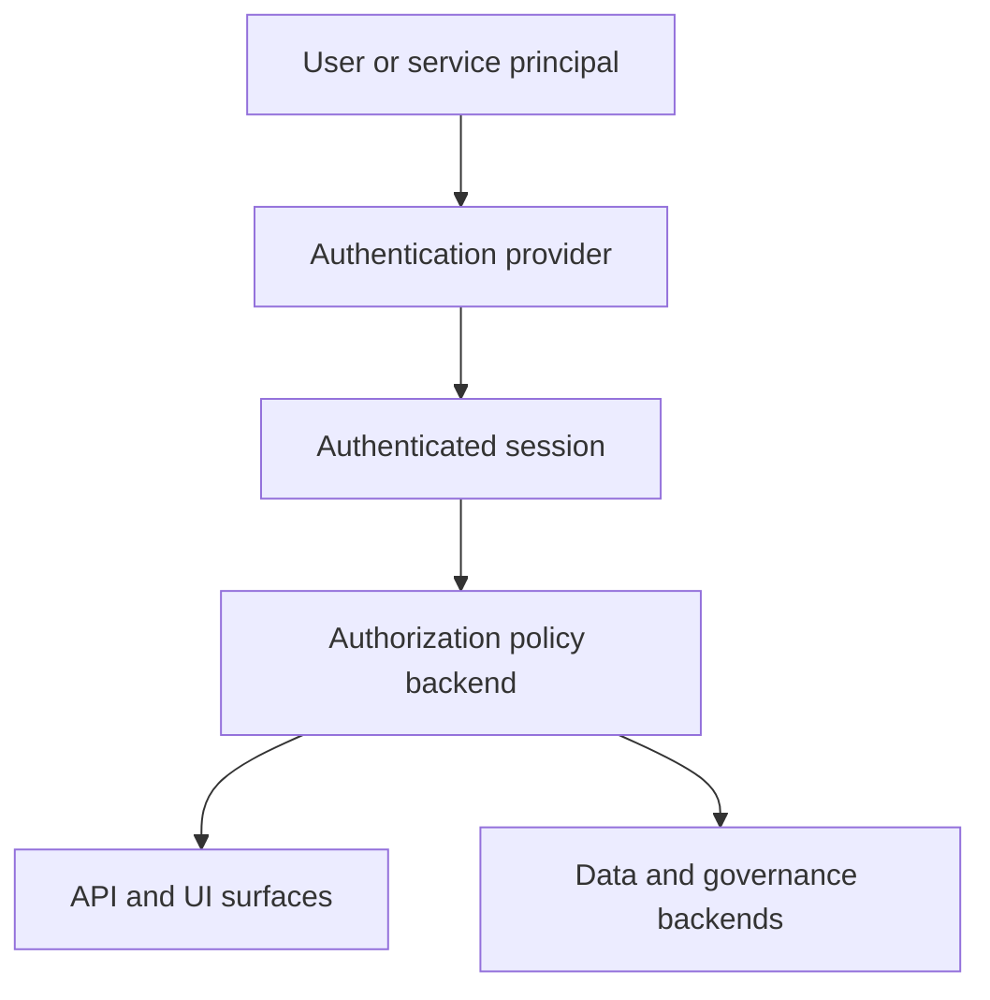
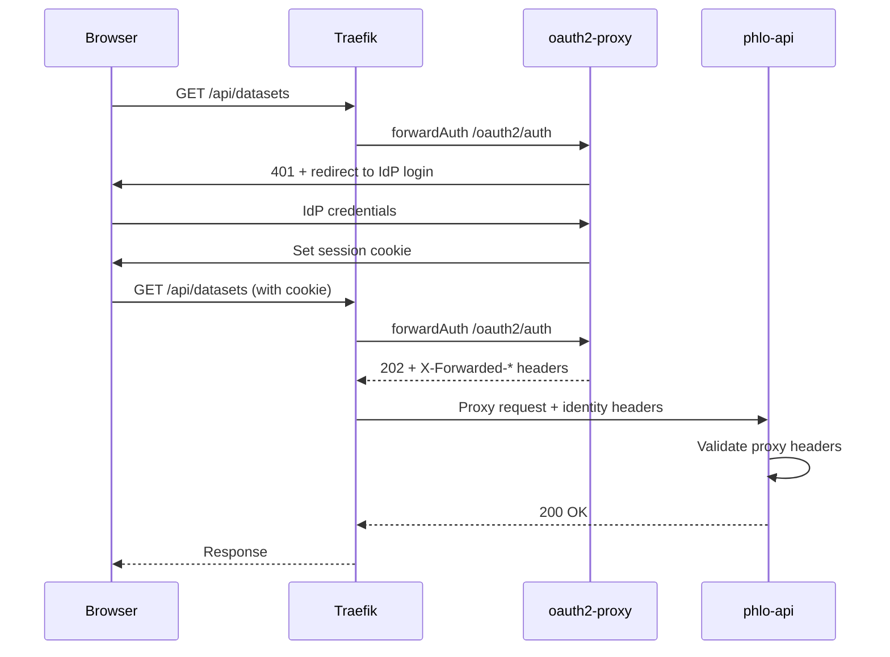

# Auth And Access Model

Authentication and authorization in Phlo are layered.

## Model



## Responsibilities

- authentication decides who the caller is
- authorization decides what that caller may do
- serving layers like `phlo-api`, `Hasura`, and `PostgREST` enforce those decisions in different ways
- governance and backend systems may apply their own secondary controls

## phlo-api Route Guard Semantics

- `phlo-api` route guards only enforce authorization when an authorization backend is configured
- with the default `PHLO_AUTHORIZATION_MODE=optional`, guarded routes remain reachable when `PHLO_AUTHORIZATION_BACKEND` is unset
- set `PHLO_AUTHORIZATION_MODE=required` to fail closed with HTTP `503` on guarded routes when no authorization backend is configured
- once a backend is configured, route guards evaluate the caller normally and still return `401` or `403` based on authentication and policy decisions
- regulated mode itself can be enabled with `PHLO_REGULATED=true` or `regulated: true` at the root of `phlo.yaml`

Example:

```yaml
regulated: true

authentication:
  provider: proxy

api:
  authorization:
    backend: opa
    mode: required
```

Built-in authentication provider names include `static`, `proxy`, and `service_token`.
Their built-in config blocks live under the same root `authentication` section in `phlo.yaml`.

You can declare these settings in `phlo.yaml` as either:

```yaml
api:
  authorization:
    backend: opa
    mode: required
```

or, for a service-scoped override:

```yaml
services:
  phlo-api:
    authorization:
      backend: opa
      mode: required
```

Precedence is `env vars` -> `services.phlo-api.authorization` -> `api.authorization`.

## Proxy Authentication Flow

For production deployments, Traefik + oauth2-proxy provides browser SSO:



Identity headers passed to phlo-api:

- `X-Forwarded-User` - authenticated user identifier
- `X-Forwarded-Email` - authenticated user email
- `X-Forwarded-Groups` - comma-separated group list

Configure trusted proxies in `phlo.yaml`:

```yaml
authentication:
  provider: proxy
  proxy:
    trusted_proxies:
      - 172.16.0.0/12
```

## Canonical RBAC

Phlo's canonical RBAC control plane lives under `.phlo/authorization/` and
provides a single model for roles, subject assignment, policy validation,
backend planning, sync, and drift verification.

- source-of-truth files: `.phlo/authorization/roles.yaml` and
  `.phlo/authorization/policies.yaml`
- control commands: `phlo authz validate`, `phlo authz plan`, `phlo authz sync`,
  and `phlo authz verify`
- canonical RBAC currently supports `allow` policies only
- canonical `deny` rules are rejected by validation and backend compilation

Use [Canonical RBAC](canonical-rbac.md) for the file format, workflow, command
behavior, and backend support matrix.

## Where To Look

- [Security](../setup/security.md) for operator setup and posture
- [Canonical RBAC](canonical-rbac.md) for the control-plane model and workflow
- [Python Reference](../python-reference/index.mdx) for capability-level auth interfaces
- [API Surfaces](api-surfaces.md) for how access shows up across external entry points
