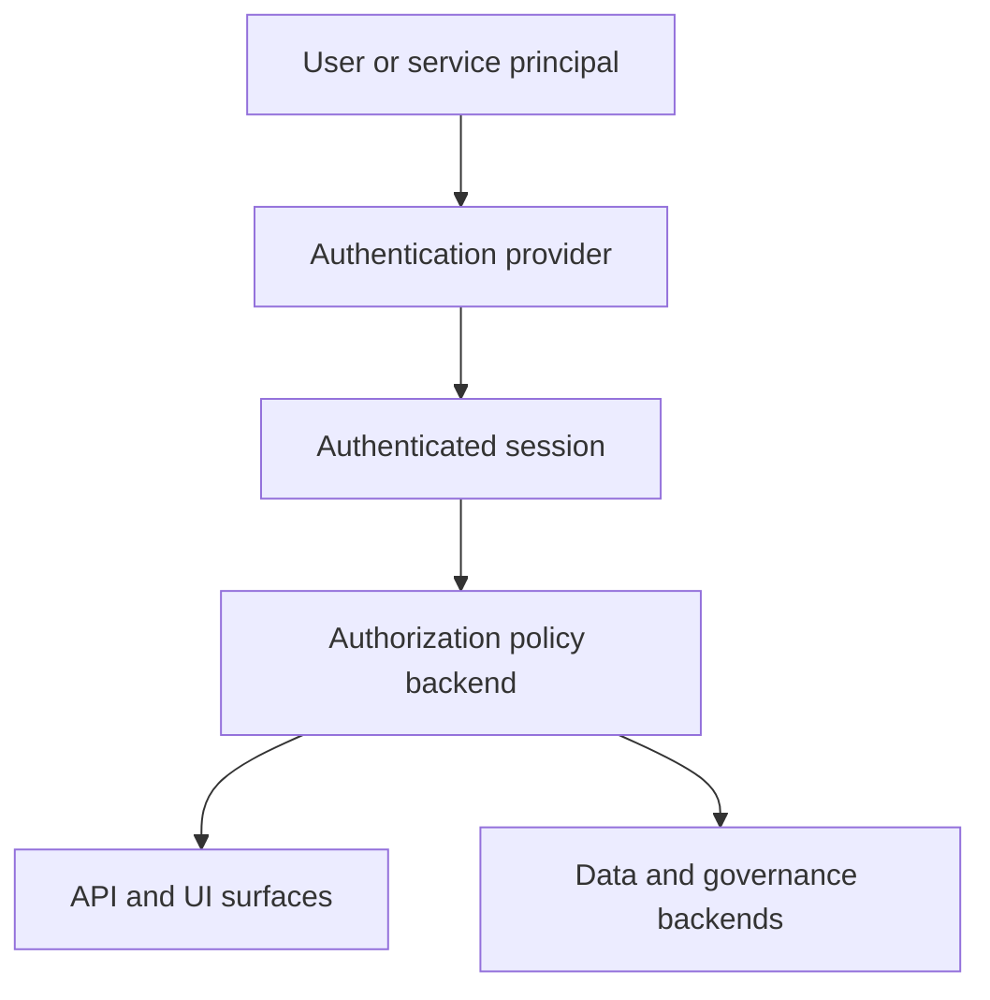

# Auth And Access Model

Authentication and authorization in Phlo are layered.

## Model

## Responsibilities

- authentication decides who the caller is
- authorization decides what that caller may do
- serving layers like `phlo-api`, `Hasura`, and `PostgREST` enforce those decisions in different ways
- governance and backend systems may apply their own secondary controls

## Canonical RBAC

Phlo's canonical RBAC control plane lives under `.phlo/authorization/` and
provides a single model for roles, subject assignment, policy validation,
backend planning, sync, and drift verification.

- source-of-truth files: `.phlo/authorization/roles.yaml` and
  `.phlo/authorization/policies.yaml`
- control commands: `phlo authz validate`, `phlo authz plan`, `phlo authz sync`,
  and `phlo authz verify`
- canonical RBAC currently supports `allow` policies only
- canonical `deny` rules are rejected by validation and backend compilation

Use [Canonical RBAC](canonical-rbac.md) for the file format, workflow, command
behavior, and backend support matrix.

## Where To Look

- [Security](../setup/security.md) for operator setup and posture
- [Canonical RBAC](canonical-rbac.md) for the control-plane model and workflow
- [Python Reference](../python-reference/index.mdx) for capability-level auth interfaces
- [API Surfaces](api-surfaces.md) for how access shows up across external entry points
