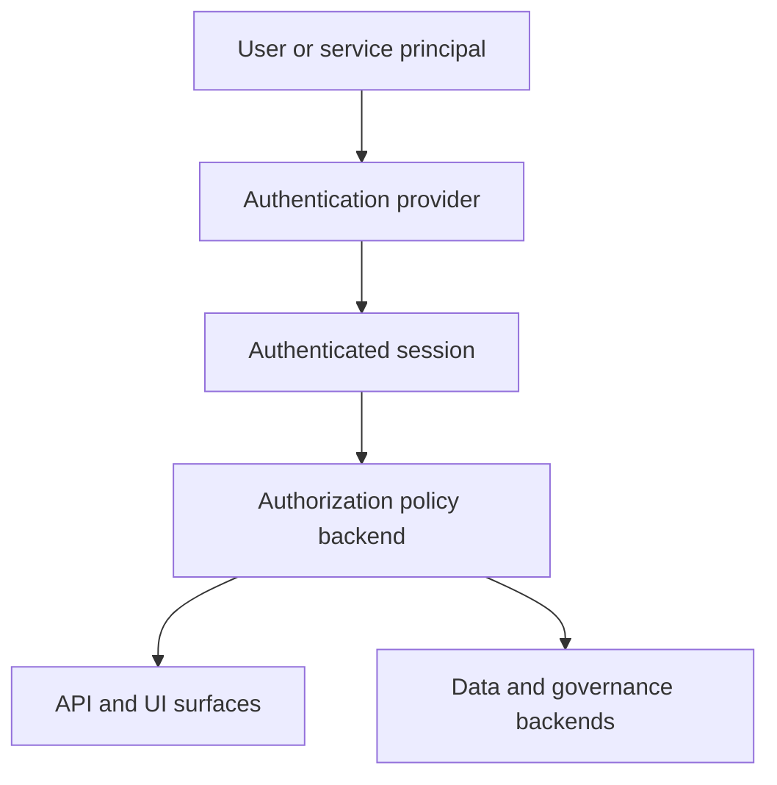

# Auth And Access Model

Authentication and authorization in Phlo are layered.

## Model

## Responsibilities

- authentication decides who the caller is
- authorization decides what that caller may do
- serving layers like `phlo-api`, `Hasura`, and `PostgREST` enforce those decisions in different ways
- governance and backend systems may apply their own secondary controls

## Canonical RBAC

- canonical RBAC currently supports `allow` policies only
- canonical `deny` rules are rejected by `phlo authz validate` and backend planning
- do not model deny semantics in `.phlo/authorization/policies.yaml` until backend compilation support exists

## Where To Look

- [Security](../setup/security.md) for operator setup and posture
- [Python Reference](../python-reference/index.mdx) for capability-level auth interfaces
- [API Surfaces](api-surfaces.md) for how access shows up across external entry points
