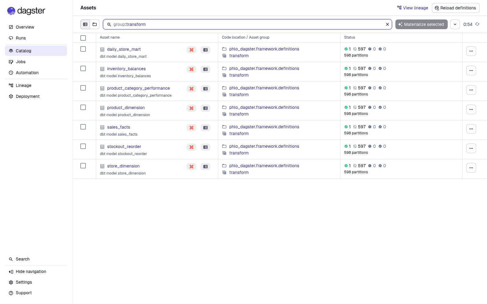
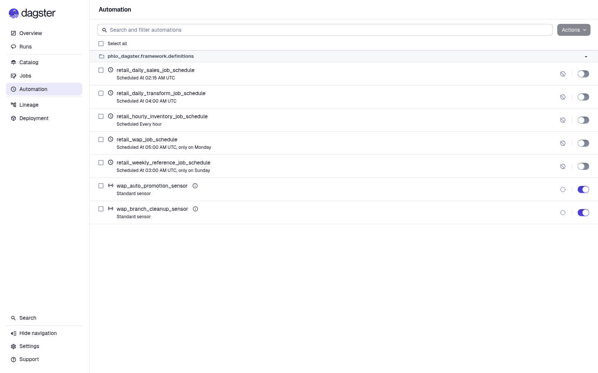

# From retail files to promoted Iceberg tables

_A worked end-to-end Phlo lakehouse, verified against GitHub `main` on
2026-08-22._

The Retail Files example started with a deliberately ordinary question: what
happens when a real batch lakehouse—not a hello-world pipeline—meets Phlo's
public interfaces?

The answer is a standalone project that turns deterministic retail files into
12 Iceberg tables. DLT ingests five assets, dbt builds seven transformations,
Dagster orchestrates daily partitions and native quality checks, and Phlo's
write-audit-publish (WAP) lifecycle isolates every write on its own Nessie
branch before promotion. Building it also exposed product gaps that smaller
examples had missed.

This is an end-to-end result, not a direct provider demo. Every write described
below was launched with `phlo materialize` or `phlo backfill`.

## A consumer, not a monorepo fixture

The example is intentionally self-contained. Its own uv environment installs
released `phlo[defaults]==0.14.0` from the package index and the capability
packages from the public Phlo repository's `main` branch. It does not import
the surrounding checkout or use Phlo's development virtual environment.

The final run resolved `phlo-dagster`, `phlo-dbt`, and `phlo-pandera` to GitHub
commit `d1ae216193312a851db2cb3a97e6b71a99a2bf42`. The generated runtime used
uv 0.12.5 and installed the mounted consumer from `/app`, so the consumer's own
uv overrides remained in effect.

That packaging boundary matters. It tests the experience a real downstream
project gets, including image bootstrapping and direct Git dependencies, rather
than accidentally succeeding because source files are nearby.

## The scenario

The default deterministic generator produces:

- 25 stores and 500 products;
- 30 daily partitions;
- 750 per-store/day CSV files containing 60,000 sales lines;
- 375,000 NDJSON inventory snapshots;
- JSON product, store, and promotion reference data; and
- a Parquet sales archive.

Five independently configured DLT assets ingest those files. Seven dbt assets
then build product and store dimensions, sales facts, a deduplicated inventory
balance, daily store metrics, category performance, and stockout/reorder
outputs.

```text
┌──────────────────────────────┐
│ CSV · JSON · NDJSON · Parquet│
└──────────────┬───────────────┘
               ▼
┌──────────────────────────────┐
│ 5 DLT ingestion assets       │
│ Pandera + business contracts │
└──────────────┬───────────────┘
               ▼
┌──────────────────────────────┐
│ WAP branch · Iceberg · Nessie│
└──────────────┬───────────────┘
               ▼
┌──────────────────────────────┐
│ 7 dbt transformation assets  │
│ native Dagster asset checks  │
└──────────────┬───────────────┘
               ▼
┌──────────────────────────────┐
│ Promote to main · query Trino│
└──────────────────────────────┘
```

Dagster discovers all seven transformation assets as daily-partitioned assets:



The source behaviors are intentionally different. Sales lines and reference
records use stable merge keys, while inventory is an append ledger. Replaying
inventory can therefore add raw rows; `inventory_balances` ranks ingestion
metadata and keeps the newest stable snapshot ID. That distinction exercises
idempotency where it belongs instead of pretending every source has the same
contract.

## What a successful publish looks like

The merged-main confirmation materialized `product_dimension` and then
`sales_facts` for partition `2025-01-01`.

| Asset | Logical run | Dagster run | WAP result |
|---|---|---|---|
| `product_dimension` | `5efaf429993744b0ba8b06368028a2f7` | `552d28d7-056a-49bd-a5fc-03d71dbed540` | `promoted` |
| `sales_facts` | `0469bfe6904247a6bec372bd88cdc4bd` | `3ea5062b-2ce1-4caf-86e6-3e5faac515f3` | `promoted` |

The first report advanced `main` from `d02515…` to `76c98d…`; the second began
at that exact hash and advanced it to `9d282a…`. Both reports recorded
`source_deleted: true`, proving their temporary branches were removed only
after promotion.

This sequence is the important WAP guarantee: Dagster success is necessary but
not sufficient. Phlo validates the immutable launch manifest and native asset
check evidence, promotes the branch, persists the durable report, and only then
considers the lifecycle complete.

## Native quality evidence

The final `sales_facts` run emitted five successful Dagster
`AssetCheckEvaluation` events owned by that asset:

- not-null checks for `line_id` and `net_amount`;
- uniqueness for `line_id`; and
- relationships from `store_id` and `product_id` to their dimensions.

The checks are dbt tests, but they are not hidden in dbt's artifact directory.
They appear as native Dagster checks with query, failed-row count, partition,
and reproduction metadata. The screenshot shows all five succeeded and the
selected execution passed with zero failed rows.


This required a subtle ownership rule: materializing one asset must not emit or
fail on a relationship test owned by another selected model. The runtime takes
a snapshot of `run_results.json` immediately after `dbt build`, uses dbt's
empty indirect selection, and filters extracted results to the executing asset.

## The resulting lakehouse

The catalog contained 12 tables on Nessie `main`:

| Table | Rows |
|---|---:|
| `retail_products` | 500 |
| `retail_stores` | 25 |
| `retail_promotions` | 2 |
| `retail_inventory` | 12,560 |
| `retail_sales_lines` | 4,000 |
| `product_dimension` | 500 |
| `store_dimension` | 25 |
| `sales_facts` | 4,000 |
| `inventory_balances` | 12,500 |
| `daily_store_mart` | 50 |
| `product_category_performance` | 120 |
| `stockout_reorder` | 12,500 |

The 60 extra raw inventory rows are intentional replay history; the curated
balance remains deduplicated at 12,500 rows. For store `S001` on `2025-01-01`,
the deterministic daily mart returned 80 lines, 40 transactions, gross
6,100.80, discount 62.84, tax 483.03, and net 6,520.99.

Those assertions cross the whole stack: generated files, DLT loading, Iceberg
commits, Nessie promotion, dbt SQL, and Trino queries.

## Backfill means lifecycle completion

A two-day sales backfill ran sequentially with `--parallel 1`. Its reports were
`backfill-04a306fd28f54b2e9958ef493ed13b69` and
`backfill-b1559739ab2d4c0eb9f4897306078e4a`. Both promoted, both deleted their
source branches, and the second report's `target_hash_before` exactly matched
the first report's `target_hash_after`.

That ordering prevents the second partition from branching from stale `main`.
If the process times out after Dagster accepts a run, resume state binds the
partition to that exact Dagster run instead of launching a duplicate.

The opposite path was exercised on merged `main` too. Missing partition
`2026-01-02` launched logical run `c7fa62fa63ec40868f4327cf12e6f660`
(Dagster run `baf6980e-4b37-4462-b0e4-24c6e2edea4c`) and exhausted its configured
retries. The durable WAP report terminalized as `failed` with
`failure_reason: dagster_run_failed`. Nessie `main` remained at `9d282a…`, no
`target_hash_after` was recorded, and the source ref remained at that base hash
for the configured audit-retention period.

## Operational shape

The example registers five stopped-by-default schedules instead of one generic
cron: hourly inventory, nightly sales, daily transforms, weekly reference data,
and weekly full WAP reconciliation. The promotion and retention-cleanup sensors
run independently.



Different assets also carry different retry, timeout, freshness, owner,
consumer, SLA, validation, and write-mode settings. Those differences are part
of the example's contract, not decorative metadata.

## What the example found

Building the lakehouse exposed issues that focused tests had not connected:

- the public `@phlo.ingest.dlt(...)` facade was not recognized by workflow
  validation ([#752](https://github.com/phlohouse/phlo/pull/752));
- Alpine runtime installs needed a C++ compiler, and current uv needed to honor
  consumer-owned source configuration ([#753](https://github.com/phlohouse/phlo/pull/753),
  [#756](https://github.com/phlohouse/phlo/pull/756));
- local WAP defaults, immutable project/attempt tags, GraphQL diagnostics, and
  sequential backfill completion needed tightening
  ([#754](https://github.com/phlohouse/phlo/pull/754),
  [#755](https://github.com/phlohouse/phlo/pull/755),
  [#757](https://github.com/phlohouse/phlo/pull/757));
- dbt needed to provision a WAP-scoped query catalog before connecting
  ([#759](https://github.com/phlohouse/phlo/pull/759)); and
- dbt tests needed stable native check identities, preserved build artifacts,
  selected-asset ownership, and terminal failed-run reports
  ([#760](https://github.com/phlohouse/phlo/pull/760),
  [#761](https://github.com/phlohouse/phlo/pull/761),
  [#762](https://github.com/phlohouse/phlo/pull/762)).

That is the value of a production-shaped example: it is documentation, a
consumer contract, and an integration probe at the same time.

## Reproduce it

From `examples/lakehouses/retail-files`:

```bash
uv sync --locked --group dev
uv run python scripts/generate_fixtures.py --scale default
uv run pytest -q tests
uv run phlo services init --force --no-dev
uv run phlo services start --build
uv run phlo doctor

uv run phlo materialize product_dimension --partition 2025-01-01
uv run phlo materialize sales_facts --partition 2025-01-01
uv run phlo catalog tables
```

See the [example README](../README.md) for the full ingestion order, backfill,
queries, expected failures, and shutdown command.

## Result

Example 1 is complete. It is deterministic, network-independent after package
installation, runnable as a real consumer, and green through Phlo's public
orchestration path. More importantly, it now demonstrates both halves of WAP:
good data reaches `main` atomically, and bad runs terminate with durable evidence
without publishing.
