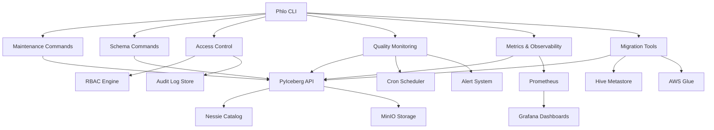
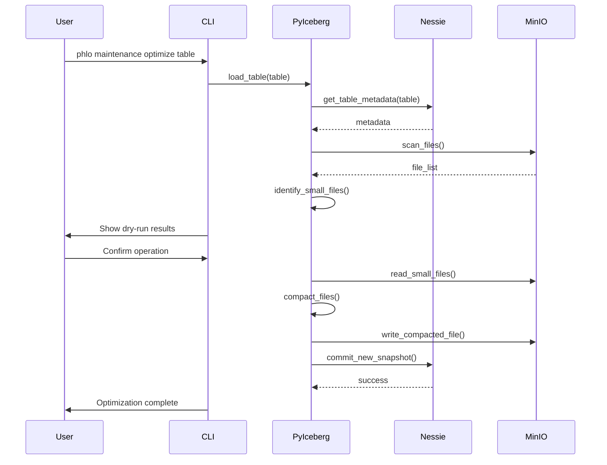
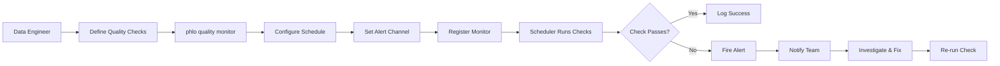

# Feature Plan: Transform Phlo Core into a Fully-Fledged Lakehouse Management CLI

## Overview

Transform Phlo Core from a data lakehouse platform with CLI capabilities into a comprehensive, production-ready CLI tool for managing lakehouses, comparable to industry-standard tools like Apache Iceberg CLI, Delta Lake utilities, and cloud-native lakehouse platforms.

**Current State**: Phlo Core has strong foundations with branch management, catalog operations, and basic lakehouse features, but lacks critical production operations like table maintenance, schema migrations, access control, and comprehensive observability.

**Target State**: A complete lakehouse management CLI that handles the full lifecycle of tables, data, security, and operations - enabling data engineers, platform engineers, and analysts to manage production lakehouses entirely from the command line.

---

## Problem Statement / Motivation

### Current Gaps

Based on comprehensive research comparing Phlo Core against Apache Iceberg, Delta Lake, Hudi, and modern lakehouse platforms in 2025:

**Critical Missing Features**:
1. **Table Maintenance Operations**: No OPTIMIZE, VACUUM, compaction, or snapshot expiration
2. **Schema Management**: No migration tools, evolution tracking, or validation utilities
3. **Access Control**: No RBAC/ABAC, permission management, or audit logging
4. **Data Quality**: Limited quality monitoring, no freshness checks, no automated alerts
5. **Observability**: Minimal metrics, no distributed tracing, limited operational insights

**Why This Matters**:
- **Production Operations**: Teams cannot safely manage production lakehouses without maintenance tools
- **Performance**: Small file problems accumulate without compaction, degrading query performance
- **Compliance**: Lack of access control and audit logging prevents regulated industries from adopting Phlo
- **Reliability**: Without comprehensive monitoring, teams operate blind to data quality issues
- **Adoption**: Missing features create barrier to entry for teams migrating from mature platforms

### User Impact

**Data Engineers** need:
- Table optimization and compaction workflows
- Schema migration and evolution tools
- Data quality validation and monitoring
- Performance tuning capabilities

**Platform Engineers** need:
- Access control and security management
- Multi-tenancy and resource isolation
- Cost monitoring and optimization
- Disaster recovery and backup tools

**Analytics Engineers** need:
- Schema discovery and documentation
- Lineage and impact analysis
- Quality gates and validation
- Safe rollback mechanisms

---

## Research Findings

### Repository Analysis

**Current CLI Structure** (`/home/ubuntu/phlo/phlo/src/phlo/cli/main.py:18-528`):
- Click-based framework with plugin architecture
- Main commands: `init`, `dev`, `test`, `create-workflow`, `services`, `plugin`, `config`
- Plugin commands: `branch`, `catalog`, `materialize`, `backfill`, `status`, `logs`

**Existing Lakehouse Features**:
- **Branch Management** (`/home/ubuntu/phlo/phlo/packages/phlo-nessie/src/phlo_nessie/cli_branch.py`):
  - Create, list, delete branches (lines 45-214)
  - Merge with conflict detection (lines 216-294)
  - Diff operations (lines 297-361)
- **Catalog Operations** (`/home/ubuntu/phlo/phlo/packages/phlo-nessie/src/phlo_nessie/cli_catalog.py`):
  - List tables, describe schemas (lines 41-148)
  - Snapshot history (lines 150-204)

**Architecture Patterns** (`/home/ubuntu/phlo/phlo/docs/getting-started/core-concepts.md`):
- Write-Audit-Publish (WAP) workflow (lines 52-91)
- Decorator-driven development (lines 93-154)
- Bronze/Silver/Gold medallion architecture (lines 302-359)
- Schema-first development with Pandera (lines 176-230)

### Industry Best Practices (2025)

**Apache Iceberg**:
- Schema evolution, partition evolution, hidden partitioning
- Snapshot management, time-travel queries
- Table maintenance: compact files, rewrite manifests, optimize layouts
- Migration tools for Avro/Parquet/ORC tables

**Delta Lake**:
- VACUUM (7-day retention, configurable)
- OPTIMIZE (100MB-1GB file sizes)
- Z-ORDER for data co-location
- RESTORE for version rollback
- Predictive optimization (automated maintenance)

**Apache Hudi**:
- Major/minor compaction operations
- File-slice viewing for diagnostics
- Cleaner operations with retention policies
- Repair commands for inconsistent states

**Common Patterns**:
- Hierarchical configuration (CLI flags → env vars → config files)
- Kubernetes-native execution (Jobs, CronJobs, resource limits)
- OAuth 2.1 authentication, mTLS for service-to-service
- Three pillars of observability (metrics, logs, traces)
- Declarative pipeline integration (dbt, SQLMesh)

### Technology Stack

**Current Dependencies** (`/home/ubuntu/phlo/phlo/pyproject.toml:18-33`):
- Python 3.11+
- Click 8.0+ for CLI
- PyIceberg 0.10.0 for table format
- Dagster for orchestration
- Pandera for validation
- Rich for terminal UI

**External Services**:
- Nessie (catalog, port 10003)
- Trino (query engine, port 10005)
- MinIO (S3-compatible storage)
- PostgreSQL (metadata, port 10000)

---

## Proposed Solution

### High-Level Approach

Extend Phlo's plugin architecture with new CLI command groups covering the full lakehouse management lifecycle:

1. **Table Lifecycle**: Create, alter, migrate, clone, drop operations
2. **Data Maintenance**: OPTIMIZE, VACUUM, compaction, snapshot expiration
3. **Schema Management**: Evolution tracking, migration tools, validation
4. **Access Control**: RBAC/ABAC policies, user/group management, audit logging
5. **Quality & Monitoring**: Data quality checks, freshness monitoring, alerts
6. **Observability**: Metrics collection, tracing, cost analysis
7. **Migration Tools**: Import from Hive/Glue, export utilities, format conversion

### Design Principles

- **KISS**: Keep operations simple and focused (Unix philosophy)
- **Discoverability**: Built-in help, meaningful errors, consistent structure
- **Safety**: Dry-run modes, confirmation prompts, rollback capabilities
- **Performance**: Parallel execution where possible, progress indicators
- **Extensibility**: Plugin-based architecture for custom operations

---

## Technical Approach

### Architecture

#### New CLI Command Groups

**1. Table Maintenance Commands** (`packages/phlo-iceberg/src/phlo_iceberg/cli_maintenance.py`):

```python
# phlo/cli_maintenance.py

@click.group()
def maintenance():
    """Table maintenance operations"""
    pass

@maintenance.command()
@click.argument('table')
@click.option('--target-file-size', default='100MB', help='Target file size after compaction')
@click.option('--dry-run', is_flag=True, help='Show what would be done without executing')
@click.option('--ref', default='main', help='Branch reference')
def optimize(table, target_file_size, dry_run, ref):
    """Compact small files and optimize table layout"""
    catalog = get_catalog(ref=ref)
    tbl = catalog.load_table(table)

    if dry_run:
        # Show files that would be compacted
        files = tbl.scan().plan_files()
        small_files = [f for f in files if f.file_size_in_bytes < parse_size(target_file_size)]
        click.echo(f"Would compact {len(small_files)} small files")
        return

    # Execute compaction
    with progress_bar() as progress:
        task = progress.add_task(f"Optimizing {table}", total=100)
        result = tbl.rewrite_data_files(
            target_file_size_bytes=parse_size(target_file_size)
        )
        click.echo(f"Compacted {result.rewritten_data_files_count} files")

@maintenance.command()
@click.argument('table')
@click.option('--older-than', default='7d', help='Retention period (e.g., 7d, 24h)')
@click.option('--dry-run', is_flag=True)
@click.option('--ref', default='main')
def vacuum(table, older_than, dry_run, ref):
    """Remove orphaned files and old snapshots"""
    catalog = get_catalog(ref=ref)
    tbl = catalog.load_table(table)

    retention_ms = parse_duration(older_than)

    if dry_run:
        snapshots = [s for s in tbl.snapshots()
                     if s.timestamp_ms < (now_ms() - retention_ms)]
        click.echo(f"Would remove {len(snapshots)} old snapshots")
        return

    # Execute cleanup
    tbl.expire_snapshots(older_than_ms=retention_ms)
    click.echo(f"Expired snapshots older than {older_than}")

@maintenance.command()
@click.argument('table')
@click.option('--columns', multiple=True, help='Columns to Z-order by')
@click.option('--ref', default='main')
def zorder(table, columns, ref):
    """Co-locate data by specified columns for better query performance"""
    catalog = get_catalog(ref=ref)
    tbl = catalog.load_table(table)

    # Sort data by specified columns
    tbl.rewrite_data_files(
        sort_order=SortOrder(*[SortField(col) for col in columns])
    )
    click.echo(f"Applied Z-ordering on {', '.join(columns)}")
```

**2. Schema Management Commands** (`packages/phlo-iceberg/src/phlo_iceberg/cli_schema.py`):

```python
# phlo/cli_schema.py

@click.group()
def schema():
    """Schema management and evolution"""
    pass

@schema.command()
@click.argument('table')
@click.option('--add-column', type=(str, str), multiple=True, help='Column name and type')
@click.option('--drop-column', multiple=True, help='Column name to drop')
@click.option('--rename-column', type=(str, str), multiple=True, help='Old and new column names')
@click.option('--ref', default='main')
def evolve(table, add_column, drop_column, rename_column, ref):
    """Evolve table schema (add, drop, rename columns)"""
    catalog = get_catalog(ref=ref)
    tbl = catalog.load_table(table)

    with tbl.update_schema() as update:
        for col_name, col_type in add_column:
            update.add_column(col_name, parse_type(col_type))

        for col_name in drop_column:
            update.delete_column(col_name)

        for old_name, new_name in rename_column:
            update.rename_column(old_name, new_name)

    click.echo(f"Schema evolution completed for {table}")

@schema.command()
@click.argument('table')
@click.option('--output', type=click.Choice(['text', 'json', 'pandera']), default='text')
def show(table, output):
    """Display table schema"""
    catalog = get_catalog(ref='main')
    tbl = catalog.load_table(table)

    if output == 'json':
        click.echo(json.dumps(tbl.schema().model_dump(), indent=2))
    elif output == 'pandera':
        # Generate Pandera schema code
        click.echo(generate_pandera_schema(tbl.schema()))
    else:
        # Rich table display
        display_schema_table(tbl.schema())

@schema.command()
@click.argument('table')
@click.option('--format', type=click.Choice(['markdown', 'sql', 'python']), default='markdown')
@click.option('--output', type=click.Path(), help='Output file path')
def export(table, format, output):
    """Export schema in various formats for documentation"""
    catalog = get_catalog(ref='main')
    tbl = catalog.load_table(table)

    if format == 'markdown':
        content = generate_markdown_schema(tbl.schema())
    elif format == 'sql':
        content = generate_ddl(tbl.schema())
    elif format == 'python':
        content = generate_python_dataclass(tbl.schema())

    if output:
        Path(output).write_text(content)
    else:
        click.echo(content)

@schema.command()
@click.argument('source_table')
@click.argument('target_table')
@click.option('--ref', default='main')
def diff(source_table, target_table, ref):
    """Compare schemas between two tables"""
    catalog = get_catalog(ref=ref)
    source = catalog.load_table(source_table).schema()
    target = catalog.load_table(target_table).schema()

    added = set(target.fields) - set(source.fields)
    removed = set(source.fields) - set(target.fields)

    display_schema_diff(added, removed, source, target)
```

**3. Access Control Commands** (`packages/phlo-security/src/phlo_security/cli_access.py`):

```python
# phlo/cli_access.py

@click.group()
def access():
    """Access control and security management"""
    pass

@access.command()
@click.option('--user', help='Username or email')
@click.option('--group', help='Group name')
@click.option('--role', type=click.Choice(['read', 'write', 'admin']), required=True)
@click.argument('resource')  # catalog, schema, or table
def grant(user, group, role, resource):
    """Grant access to catalog resources"""
    if not user and not group:
        raise click.BadParameter("Either --user or --group must be specified")

    # Create policy in catalog backend
    policy = {
        'principal': user or f"group:{group}",
        'resource': resource,
        'permissions': get_permissions_for_role(role)
    }

    catalog_backend.create_policy(policy)
    click.echo(f"Granted {role} access to {resource}")

@access.command()
@click.option('--user', help='Username')
@click.option('--group', help='Group name')
@click.argument('resource')
def revoke(user, group, resource):
    """Revoke access to catalog resources"""
    principal = user or f"group:{group}"
    catalog_backend.delete_policy(principal, resource)
    click.echo(f"Revoked access for {principal}")

@access.command()
@click.option('--resource', help='Filter by resource')
@click.option('--principal', help='Filter by user/group')
@click.option('--output', type=click.Choice(['table', 'json']), default='table')
def list_policies(resource, principal, output):
    """List all access policies"""
    policies = catalog_backend.list_policies(
        resource=resource,
        principal=principal
    )

    if output == 'json':
        click.echo(json.dumps(policies, indent=2))
    else:
        display_policies_table(policies)

@access.command()
@click.option('--user', help='Filter by user')
@click.option('--resource', help='Filter by resource')
@click.option('--start-time', help='Start of time range')
@click.option('--end-time', help='End of time range')
@click.option('--output', type=click.Path(), help='Export to file')
def audit_log(user, resource, start_time, end_time, output):
    """View audit logs for access events"""
    logs = catalog_backend.query_audit_log(
        user=user,
        resource=resource,
        start_time=parse_time(start_time),
        end_time=parse_time(end_time)
    )

    if output:
        write_csv(output, logs)
    else:
        display_audit_log_table(logs)
```

**4. Quality Monitoring Commands** (`packages/phlo-quality/src/phlo_quality/cli_monitor.py`):

```python
# phlo/cli_monitor.py

@click.group()
def quality():
    """Data quality monitoring and validation"""
    pass

@quality.command()
@click.argument('table')
@click.option('--freshness', help='Maximum age (e.g., 24h, 7d)')
@click.option('--completeness', type=float, help='Minimum completeness (0.0-1.0)')
@click.option('--row-count', type=int, help='Minimum row count')
@click.option('--ref', default='main')
def check(table, freshness, completeness, row_count, ref):
    """Run quality checks on a table"""
    catalog = get_catalog(ref=ref)
    tbl = catalog.load_table(table)

    results = {}

    # Freshness check
    if freshness:
        last_snapshot = tbl.current_snapshot()
        age = now_ms() - last_snapshot.timestamp_ms
        max_age = parse_duration(freshness)
        results['freshness'] = {
            'passed': age < max_age,
            'age_hours': age / 3600000,
            'max_age_hours': max_age / 3600000
        }

    # Completeness check
    if completeness:
        df = tbl.scan().to_pandas()
        null_pct = df.isnull().mean().mean()
        results['completeness'] = {
            'passed': (1 - null_pct) >= completeness,
            'actual': 1 - null_pct,
            'threshold': completeness
        }

    # Row count check
    if row_count:
        actual_count = len(tbl.scan().to_arrow())
        results['row_count'] = {
            'passed': actual_count >= row_count,
            'actual': actual_count,
            'threshold': row_count
        }

    display_quality_results(results)

    # Exit with error if any check failed
    if any(not r['passed'] for r in results.values()):
        sys.exit(1)

@quality.command()
@click.argument('table')
@click.option('--check', multiple=True, help='Quality check to enable')
@click.option('--schedule', help='Cron schedule (e.g., "0 */6 * * *")')
@click.option('--alert-channel', help='Slack webhook or email for alerts')
def monitor(table, check, schedule, alert_channel):
    """Set up continuous quality monitoring for a table"""
    monitoring_config = {
        'table': table,
        'checks': list(check),
        'schedule': schedule,
        'alert_channel': alert_channel
    }

    # Register with monitoring system
    register_quality_monitor(monitoring_config)
    click.echo(f"Quality monitoring enabled for {table}")

@quality.command()
@click.option('--table', help='Filter by table')
@click.option('--status', type=click.Choice(['passed', 'failed', 'all']), default='all')
@click.option('--last', type=int, default=10, help='Number of recent checks to show')
def history(table, status, last):
    """View quality check history"""
    history_records = get_quality_history(
        table=table,
        status=status,
        limit=last
    )

    display_quality_history_table(history_records)
```

**5. Observability Commands** (`packages/phlo-metrics/src/phlo_metrics/cli_metrics.py`):

```python
# phlo/cli_metrics.py

@click.group()
def metrics():
    """Metrics, monitoring, and cost analysis"""
    pass

@metrics.command()
@click.argument('table')
@click.option('--metric', type=click.Choice(['size', 'rows', 'files', 'partitions', 'all']),
              default='all')
@click.option('--ref', default='main')
def stats(table, metric, ref):
    """Display table statistics and metrics"""
    catalog = get_catalog(ref=ref)
    tbl = catalog.load_table(table)

    stats = {}

    if metric in ['size', 'all']:
        total_size = sum(f.file_size_in_bytes for f in tbl.scan().plan_files())
        stats['size'] = format_bytes(total_size)

    if metric in ['rows', 'all']:
        stats['rows'] = tbl.scan().to_arrow().num_rows

    if metric in ['files', 'all']:
        files = list(tbl.scan().plan_files())
        stats['files'] = {
            'count': len(files),
            'avg_size': format_bytes(sum(f.file_size_in_bytes for f in files) / len(files)),
            'min_size': format_bytes(min(f.file_size_in_bytes for f in files)),
            'max_size': format_bytes(max(f.file_size_in_bytes for f in files))
        }

    if metric in ['partitions', 'all']:
        partitions = set(f.partition for f in tbl.scan().plan_files())
        stats['partitions'] = len(partitions)

    display_stats_table(stats)

@metrics.command()
@click.argument('table')
@click.option('--storage-cost', type=float, default=0.023,
              help='Storage cost per GB per month (default: AWS S3 $0.023)')
@click.option('--ref', default='main')
def cost(table, storage_cost, ref):
    """Estimate storage costs for a table"""
    catalog = get_catalog(ref=ref)
    tbl = catalog.load_table(table)

    total_bytes = sum(f.file_size_in_bytes for f in tbl.scan().plan_files())
    total_gb = total_bytes / (1024**3)

    monthly_cost = total_gb * storage_cost
    annual_cost = monthly_cost * 12

    click.echo(f"Storage: {format_bytes(total_bytes)} ({total_gb:.2f} GB)")
    click.echo(f"Monthly cost: ${monthly_cost:.2f}")
    click.echo(f"Annual cost: ${annual_cost:.2f}")

@metrics.command()
@click.option('--namespace', help='Filter by namespace')
@click.option('--sort-by', type=click.Choice(['size', 'rows', 'files']), default='size')
@click.option('--limit', type=int, default=20)
def top_tables(namespace, sort_by, limit):
    """List largest/most active tables"""
    catalog = get_catalog(ref='main')

    tables_stats = []
    for table_id in catalog.list_tables(namespace):
        tbl = catalog.load_table(table_id)
        stats = {
            'name': str(table_id),
            'size': sum(f.file_size_in_bytes for f in tbl.scan().plan_files()),
            'rows': tbl.scan().to_arrow().num_rows,
            'files': len(list(tbl.scan().plan_files()))
        }
        tables_stats.append(stats)

    # Sort and display
    sorted_tables = sorted(tables_stats, key=lambda x: x[sort_by], reverse=True)
    display_top_tables(sorted_tables[:limit])
```

**6. Migration Tools** (`packages/phlo-migration/src/phlo_migration/cli_migrate.py`):

```python
# phlo/cli_migrate.py

@click.group()
def migrate():
    """Migration tools for external catalogs and formats"""
    pass

@migrate.command()
@click.option('--hive-uri', required=True, help='Hive metastore URI')
@click.option('--database', required=True, help='Hive database name')
@click.option('--table', help='Specific table (or all if not specified)')
@click.option('--target-namespace', required=True, help='Target Nessie namespace')
@click.option('--dry-run', is_flag=True)
def from_hive(hive_uri, database, table, target_namespace, dry_run):
    """Migrate tables from Hive metastore to Iceberg"""
    # Connect to Hive
    hive_client = HiveMetastoreClient(hive_uri)

    tables = [table] if table else hive_client.list_tables(database)

    for tbl_name in tables:
        hive_table = hive_client.get_table(database, tbl_name)

        if dry_run:
            click.echo(f"Would migrate {database}.{tbl_name} to {target_namespace}.{tbl_name}")
            continue

        # Convert to Iceberg
        iceberg_schema = convert_hive_schema(hive_table.schema)
        iceberg_table = create_iceberg_table(
            namespace=target_namespace,
            table_name=tbl_name,
            schema=iceberg_schema
        )

        # Migrate data
        migrate_table_data(hive_table, iceberg_table)
        click.echo(f"Migrated {database}.{tbl_name}")

@migrate.command()
@click.option('--glue-database', required=True, help='AWS Glue database')
@click.option('--table', help='Specific table (or all if not specified)')
@click.option('--target-namespace', required=True)
@click.option('--region', default='us-east-1')
def from_glue(glue_database, table, target_namespace, region):
    """Migrate tables from AWS Glue catalog to Nessie"""
    glue_client = boto3.client('glue', region_name=region)

    if table:
        tables = [glue_client.get_table(DatabaseName=glue_database, Name=table)]
    else:
        tables = glue_client.get_tables(DatabaseName=glue_database)['TableList']

    for glue_table in tables:
        # Convert and migrate
        migrate_glue_to_iceberg(glue_table, target_namespace)
        click.echo(f"Migrated {glue_table['Name']}")

@migrate.command()
@click.argument('table')
@click.option('--source-format', type=click.Choice(['parquet', 'avro', 'orc']), required=True)
@click.option('--location', required=True, help='Source data location')
@click.option('--partition-spec', help='Partition specification (e.g., year,month)')
def convert(table, source_format, location, partition_spec):
    """Convert Parquet/Avro/ORC data to Iceberg format"""
    # Infer schema from source
    if source_format == 'parquet':
        schema = infer_schema_from_parquet(location)
    elif source_format == 'avro':
        schema = infer_schema_from_avro(location)
    elif source_format == 'orc':
        schema = infer_schema_from_orc(location)

    # Create Iceberg table
    partition_fields = parse_partition_spec(partition_spec) if partition_spec else []
    iceberg_table = create_iceberg_table(
        table_name=table,
        schema=schema,
        partition_spec=partition_fields
    )

    # Convert and append data
    convert_and_append_data(location, source_format, iceberg_table)
    click.echo(f"Converted {location} to Iceberg table {table}")
```

### Implementation Phases

#### Phase 1: Table Maintenance Operations (Week 1-2)
**Priority**: Critical
**Dependencies**: None

- [ ] Implement `phlo maintenance optimize` command
  - File: `/home/ubuntu/phlo/phlo/packages/phlo-iceberg/src/phlo_iceberg/cli_maintenance.py`
  - Target file size configuration
  - Dry-run mode
  - Progress indicators
- [ ] Implement `phlo maintenance vacuum` command
  - Snapshot expiration logic
  - Retention period parsing
  - Orphaned file detection and removal
- [ ] Implement `phlo maintenance zorder` command
  - Z-order clustering algorithm
  - Multi-column support
- [ ] Add tests in `/home/ubuntu/phlo/phlo/packages/phlo-iceberg/tests/test_cli_maintenance.py`
- [ ] Update CLI reference docs at `/home/ubuntu/phlo/phlo/docs/reference/cli-reference.md`

**Success Criteria**:
- Can compact small files into optimal sizes (100MB-1GB)
- Can expire old snapshots with configurable retention
- Can optimize table layout with Z-ordering
- All operations support dry-run mode
- Comprehensive test coverage (>90%)

#### Phase 2: Schema Management Tools (Week 3-4)
**Priority**: Critical
**Dependencies**: None

- [ ] Implement `phlo schema evolve` command
  - File: `/home/ubuntu/phlo/phlo/packages/phlo-iceberg/src/phlo_iceberg/cli_schema.py`
  - Add/drop/rename column operations
  - Schema validation
- [ ] Implement `phlo schema show` command
  - Text, JSON, Pandera output formats
  - Rich table display using Rich library
- [ ] Implement `phlo schema export` command
  - Markdown documentation generation
  - DDL SQL generation
  - Python dataclass generation
- [ ] Implement `phlo schema diff` command
  - Compare schemas between tables/branches
  - Highlight added/removed/changed fields
- [ ] Add schema migration utilities
  - Backward compatibility checks
  - Breaking change detection
- [ ] Add tests in `/home/ubuntu/phlo/phlo/packages/phlo-iceberg/tests/test_cli_schema.py`

**Success Criteria**:
- Can safely evolve schemas without breaking queries
- Can export schemas in multiple formats
- Can detect and warn about breaking changes
- Migration paths are clear and documented

#### Phase 3: Access Control & Security (Week 5-6)
**Priority**: Important
**Dependencies**: None (new package)

- [ ] Create new package `phlo-security`
  - Directory: `/home/ubuntu/phlo/phlo/packages/phlo-security/`
  - Setup pyproject.toml, tests/, src/phlo_security/
- [ ] Implement RBAC policy engine
  - File: `/home/ubuntu/phlo/phlo/packages/phlo-security/src/phlo_security/rbac.py`
  - Roles: read, write, admin
  - Resource hierarchy (catalog → schema → table)
- [ ] Implement `phlo access grant` command
  - File: `/home/ubuntu/phlo/phlo/packages/phlo-security/src/phlo_security/cli_access.py`
  - User and group support
  - Granular permissions
- [ ] Implement `phlo access revoke` command
- [ ] Implement `phlo access list-policies` command
- [ ] Implement audit logging
  - File: `/home/ubuntu/phlo/phlo/packages/phlo-security/src/phlo_security/audit.py`
  - Log all access events (read, write, delete)
  - Queryable audit log via `phlo access audit-log`
- [ ] Integrate with catalog backend (Nessie)
  - Hook into catalog operations
  - Enforce permissions before operations
- [ ] Add comprehensive tests

**Success Criteria**:
- Can grant/revoke permissions at catalog, schema, table levels
- Audit log captures all access events
- Unauthorized operations are blocked
- Policies survive service restarts

#### Phase 4: Quality Monitoring & Observability (Week 7-8)
**Priority**: Important
**Dependencies**: Phase 2 (schema tools)

- [ ] Enhance `phlo-quality` package
  - Extend existing package at `/home/ubuntu/phlo/phlo/packages/phlo-quality/`
- [ ] Implement `phlo quality check` command
  - File: `/home/ubuntu/phlo/phlo/packages/phlo-quality/src/phlo_quality/cli_monitor.py`
  - Freshness checks (data age)
  - Completeness checks (null percentage)
  - Row count validation
  - Custom SQL-based checks
- [ ] Implement `phlo quality monitor` command
  - Continuous monitoring setup
  - Cron-based scheduling
  - Alert integration (Slack, email, PagerDuty)
- [ ] Implement `phlo quality history` command
  - Query historical check results
  - Trend analysis
- [ ] Create `phlo-metrics` package
  - Directory: `/home/ubuntu/phlo/phlo/packages/phlo-metrics/`
- [ ] Implement `phlo metrics stats` command
  - File: `/home/ubuntu/phlo/phlo/packages/phlo-metrics/src/phlo_metrics/cli_metrics.py`
  - Table size, row count, file count
  - Partition statistics
- [ ] Implement `phlo metrics cost` command
  - Storage cost estimation
  - Cost breakdown by table/namespace
- [ ] Implement `phlo metrics top-tables` command
  - Identify largest/most active tables
- [ ] Integrate with Prometheus/Grafana
  - Expose metrics endpoint
  - Pre-built dashboards

**Success Criteria**:
- Can run quality checks on demand or scheduled
- Alerts fire when quality thresholds breached
- Can track quality trends over time
- Cost visibility for all tables
- Metrics integrate with existing monitoring

#### Phase 5: Migration Tools & Integrations (Week 9-10)
**Priority**: Nice-to-Have
**Dependencies**: Phases 1-2 (table/schema tools)

- [ ] Create `phlo-migration` package
  - Directory: `/home/ubuntu/phlo/phlo/packages/phlo-migration/`
- [ ] Implement `phlo migrate from-hive` command
  - File: `/home/ubuntu/phlo/phlo/packages/phlo-migration/src/phlo_migration/cli_migrate.py`
  - Connect to Hive metastore
  - Schema conversion
  - Data migration
- [ ] Implement `phlo migrate from-glue` command
  - AWS Glue catalog integration
  - Metadata migration
- [ ] Implement `phlo migrate convert` command
  - Parquet → Iceberg conversion
  - Avro → Iceberg conversion
  - ORC → Iceberg conversion
- [ ] Add schema inference utilities
  - File: `/home/ubuntu/phlo/phlo/packages/phlo-migration/src/phlo_migration/schema_inference.py`
  - Infer Iceberg schema from Parquet files
  - Infer partitioning from directory structure
- [ ] Implement data validation post-migration
  - Row count reconciliation
  - Checksum validation
  - Schema compatibility checks
- [ ] Add rollback capabilities
  - Snapshot-based rollback
  - Metadata backup/restore

**Success Criteria**:
- Can migrate tables from Hive metastore to Nessie
- Can migrate from AWS Glue catalog
- Can convert existing Parquet/Avro/ORC data to Iceberg
- Migrations preserve all metadata and data
- Rollback works if migration fails

---

## Alternative Approaches Considered

### 1. Migrate to TypeScript CLI Framework (oclif)

**Pros**:
- First-class TypeScript support
- Strong plugin architecture (similar to Heroku/GitHub CLIs)
- Growing ecosystem

**Cons**:
- Complete rewrite of existing Python codebase
- Loss of PyIceberg integration (would need to call Python subprocess)
- Breaks compatibility with existing Phlo workflows
- Longer implementation timeline

**Decision**: Rejected. Python + Click aligns perfectly with Phlo's current architecture and PyIceberg integration.

### 2. Build as Kubernetes Operators Instead of CLI

**Pros**:
- Cloud-native execution model
- Built-in scheduling and retry logic
- GitOps integration

**Cons**:
- Higher operational complexity
- Requires Kubernetes deployment
- Less accessible for local development
- Doesn't replace need for CLI tools

**Decision**: Rejected as primary approach, but maintain Kubernetes compatibility (Jobs/CronJobs) as deployment option.

### 3. Integrate with Existing Tools (Databricks CLI, AWS Glue CLI)

**Pros**:
- Leverage existing tool ecosystems
- Less code to maintain

**Cons**:
- Loss of control over user experience
- Vendor lock-in to specific platforms
- Doesn't support open-source Iceberg + Nessie stack
- Inconsistent with Phlo's open architecture

**Decision**: Rejected. Build native capabilities, but provide migration tools from these platforms.

### 4. Use Airflow/Dagster DAGs Instead of CLI Commands

**Pros**:
- Scheduling and orchestration built-in
- Existing Dagster integration in Phlo

**Cons**:
- Overhead for simple one-off operations
- Not suitable for interactive workflows
- Requires running orchestrator for maintenance tasks

**Decision**: Rejected as replacement, but expose operations as Dagster ops for workflow integration.

---

## Acceptance Criteria

### Functional Requirements

#### Table Maintenance
- [ ] Can optimize tables to target file sizes (configurable, default 100MB-1GB)
- [ ] Can vacuum tables with configurable retention (default 7 days)
- [ ] Can Z-order tables by multiple columns
- [ ] All maintenance operations support dry-run mode
- [ ] Progress indicators for long-running operations
- [ ] Maintenance operations work across all branches

#### Schema Management
- [ ] Can add/drop/rename columns without breaking queries
- [ ] Can export schemas to markdown, SQL DDL, Python dataclasses, Pandera
- [ ] Can diff schemas between tables and branches
- [ ] Schema evolution detects and warns about breaking changes
- [ ] Schema changes preserve backward compatibility where possible

#### Access Control
- [ ] Can grant permissions at catalog, schema, and table levels
- [ ] Can revoke permissions for users and groups
- [ ] Can list all active policies
- [ ] Audit log captures all access events (who, what, when)
- [ ] Unauthorized operations are blocked with clear error messages
- [ ] Policies integrate with Nessie catalog

#### Quality Monitoring
- [ ] Can run freshness checks (data age validation)
- [ ] Can run completeness checks (null percentage validation)
- [ ] Can run row count validation
- [ ] Can set up continuous monitoring with cron schedules
- [ ] Alerts fire to Slack/email when thresholds breached
- [ ] Can query historical quality check results

#### Observability
- [ ] Can view table statistics (size, rows, files, partitions)
- [ ] Can estimate storage costs for tables and namespaces
- [ ] Can list top tables by size/rows/files
- [ ] Metrics expose to Prometheus format
- [ ] Pre-built Grafana dashboards included

#### Migration Tools
- [ ] Can migrate tables from Hive metastore
- [ ] Can migrate tables from AWS Glue catalog
- [ ] Can convert Parquet/Avro/ORC data to Iceberg
- [ ] Schema inference works correctly
- [ ] Data validation ensures migration completeness
- [ ] Rollback works if migration fails

### Non-Functional Requirements

#### Performance
- [ ] OPTIMIZE operations complete within 2x time of naive approach
- [ ] VACUUM operations scan only necessary files
- [ ] Quality checks run in parallel where possible
- [ ] CLI commands start within 500ms (lazy import optimization)

#### Security
- [ ] Access control enforced before all catalog operations
- [ ] Audit logs tamper-proof and queryable
- [ ] Secrets never logged or displayed in output
- [ ] OAuth 2.1 support for authentication
- [ ] mTLS support for service-to-service communication

#### Reliability
- [ ] All operations are idempotent (safe to retry)
- [ ] Failed operations rollback cleanly
- [ ] Dry-run mode accurately predicts actual operation
- [ ] Operations survive network interruptions (resumable)

#### Usability
- [ ] All commands have comprehensive --help output
- [ ] Error messages include actionable guidance
- [ ] Confirmation prompts for destructive operations
- [ ] Consistent command structure across all groups
- [ ] Rich terminal output with colors and tables

#### Compatibility
- [ ] Works with Python 3.11+
- [ ] Compatible with all supported Iceberg versions
- [ ] Works with Nessie 0.26.1+
- [ ] No breaking changes to existing Phlo workflows

### Quality Gates
- [ ] Test coverage >90% for all new code
- [ ] All CLI commands have integration tests
- [ ] No ruff linting errors
- [ ] basedpyright type checking passes
- [ ] Documentation updated for all new commands
- [ ] Performance benchmarks meet targets

---

## Success Metrics

**Adoption Metrics**:
- CLI commands executed per week (target: 1000+ after 3 months)
- Active users running lakehouse operations (target: 50+ teams)
- Tables under management (target: 10,000+ tables)

**Operational Metrics**:
- Average table size reduction after OPTIMIZE (target: 30% reduction)
- Storage cost savings from VACUUM (target: 20% reduction)
- Quality check failure detection rate (target: 95% of issues caught)
- Time to resolve data quality issues (target: <1 hour)

**User Satisfaction**:
- CLI usability score (target: 4.5/5 from user surveys)
- Feature adoption rate (target: 80% of teams using ≥3 command groups)
- Support ticket reduction (target: 50% fewer lakehouse-related tickets)

---

## Dependencies & Risks

### External Dependencies
- **PyIceberg 0.10.0+**: Core table operations depend on PyIceberg API stability
- **Nessie 0.26.1+**: Catalog integration requires Nessie REST API v2
- **Click 8.0+**: CLI framework must support plugin architecture
- **Rich 13.0+**: Terminal UI library for tables and progress bars

### Internal Dependencies
- **Phase 2 depends on Phase 1**: Schema tools need maintenance operations working
- **Phase 3 independent**: Access control can proceed in parallel
- **Phase 4 depends on Phase 2**: Quality monitoring needs schema introspection
- **Phase 5 depends on Phases 1-2**: Migration tools need table/schema capabilities

### Technical Risks

| Risk | Probability | Impact | Mitigation |
|------|-------------|--------|------------|
| PyIceberg API changes | Medium | High | Pin versions, monitor releases, maintain test suite |
| Nessie REST API v2 incompatibility | Low | High | Use stable API endpoints, version checks |
| Performance degradation on large tables | Medium | Medium | Implement pagination, streaming, parallel execution |
| Plugin registration conflicts | Low | Medium | Namespace isolation, explicit ordering |
| Audit log storage growth | High | Low | Implement retention policies, compression |

### Organizational Risks

| Risk | Probability | Impact | Mitigation |
|------|-------------|--------|------------|
| Feature scope creep | High | Medium | Strict phase boundaries, defer non-critical features |
| Insufficient testing on production data | Medium | High | Beta testing program, gradual rollout |
| User adoption resistance | Low | Medium | Comprehensive docs, migration guides, training |
| Maintenance burden | Medium | Medium | Automated testing, monitoring, clear ownership |

---

## Resource Requirements

### Team
- **1 Senior Engineer**: Overall architecture, Phase 1-2 implementation (4 weeks)
- **1 Mid-Level Engineer**: Phase 3-4 implementation (4 weeks)
- **1 Junior Engineer**: Phase 5 implementation, testing support (4 weeks)
- **1 Technical Writer**: Documentation across all phases (2 weeks, part-time)

### Infrastructure
- **Development Environment**: Existing Phlo stack (MinIO, Nessie, Trino, PostgreSQL)
- **Testing Environment**: Separate namespace in staging for integration tests
- **CI/CD**: GitHub Actions runners for automated testing

### Timeline
- **Phase 1-2**: Weeks 1-4 (Critical path)
- **Phase 3-4**: Weeks 5-8 (Parallel track)
- **Phase 5**: Weeks 9-10 (Dependent on 1-2)
- **Total Duration**: 10 weeks for full implementation

---

## Future Considerations

### Post-MVP Enhancements
- **Advanced Optimizations**: Automatic file size tuning, predictive compaction
- **Multi-Catalog Support**: Federate across multiple Nessie/Polaris catalogs
- **Data Lineage Integration**: Visual lineage explorer via CLI
- **Cost Optimization**: Automatic lifecycle policies, tiered storage
- **Collaboration Features**: Shared notebooks, query templates, team workspaces

### Extensibility Points
- **Custom Quality Checks**: Plugin API for user-defined validation rules
- **Alert Integrations**: Extensible webhook system for custom alerting
- **Storage Backends**: Support for additional object stores (Minio, Ceph)
- **Catalog Backends**: Support for Glue, Unity Catalog, Polaris
- **Query Engines**: Integration with Spark, Flink, Presto beyond Trino

### Long-Term Vision
- **Phlo Cloud**: Managed lakehouse platform with CLI as primary interface
- **GitOps Integration**: Declarative lakehouse configuration (YAML-based)
- **AI-Powered Operations**: Anomaly detection, automatic optimization, predictive alerts
- **Multi-Tenancy**: Enterprise features for team isolation, quota management

---

## Documentation Plan

### User Documentation

**Getting Started Guide** (`/home/ubuntu/phlo/phlo/docs/getting-started/lakehouse-management.md`):
- Overview of lakehouse management concepts
- Common workflows (optimize → vacuum → monitor)
- Quickstart examples for each command group

**CLI Reference** (`/home/ubuntu/phlo/phlo/docs/reference/cli-reference.md`):
- Complete command reference with examples
- Option descriptions and defaults
- Common patterns and recipes

**Operations Guide** (`/home/ubuntu/phlo/phlo/docs/operations/lakehouse-operations.md`):
- Production best practices
- Maintenance schedules and runbooks
- Troubleshooting common issues
- Performance tuning recommendations

**Migration Guide** (`/home/ubuntu/phlo/phlo/docs/guides/migration-guide.md`):
- Migrating from Hive/Glue
- Converting existing data to Iceberg
- Schema compatibility considerations
- Rollback procedures

### Developer Documentation

**Architecture Decision Records** (`/home/ubuntu/phlo/phlo/docs/architecture/adr/`):
- ADR-001: CLI framework choice (Click vs alternatives)
- ADR-002: Access control architecture
- ADR-003: Quality monitoring approach
- ADR-004: Migration strategy

**API Documentation** (inline docstrings + auto-generated):
- Sphinx-based API docs for all public modules
- Examples for each major function
- Plugin development guide

**Contributing Guide** (`/home/ubuntu/phlo/phlo/CONTRIBUTING.md`):
- How to add new CLI commands
- Plugin development tutorial
- Testing requirements
- Code review process

---

## References & Research

### Internal References

**Architecture & Patterns**:
- Core concepts: `/home/ubuntu/phlo/phlo/docs/getting-started/core-concepts.md` (lines 16-359)
- Current CLI: `/home/ubuntu/phlo/phlo/src/phlo/cli/main.py` (lines 18-528)
- Branch management: `/home/ubuntu/phlo/phlo/packages/phlo-nessie/src/phlo_nessie/cli_branch.py` (lines 45-361)
- Catalog operations: `/home/ubuntu/phlo/phlo/packages/phlo-nessie/src/phlo_nessie/cli_catalog.py` (lines 41-204)
- Plugin system: `/home/ubuntu/phlo/phlo/src/phlo/cli/plugin.py` (lines 40-66)

**Configuration & Testing**:
- Project config: `/home/ubuntu/phlo/phlo/pyproject.toml` (lines 18-171)
- Test setup: `/home/ubuntu/phlo/phlo/conftest.py` (lines 1-54)
- Agent guidelines: `/home/ubuntu/phlo/phlo/AGENTS.md` (lines 6-134)

### External References

**Apache Iceberg**:
- API Documentation: [https://github.com/apache/iceberg/blob/main/docs/docs/api.md](https://github.com/apache/iceberg/blob/main/docs/docs/api.md)
- PyIceberg Docs: [https://py.iceberg.apache.org/](https://py.iceberg.apache.org/)
- 2025 Comprehensive Guide: [https://blog.datalakehouse.help/posts/2025-01-2025-comprehensive-apache-iceberg-guide/](https://blog.datalakehouse.help/posts/2025-01-2025-comprehensive-apache-iceberg-guide/)

**Delta Lake**:
- Best Practices: [https://docs.delta.io/latest/best-practices.html](https://docs.delta.io/latest/best-practices.html)
- Utility Commands: [https://docs.delta.io/latest/delta-utility.html](https://docs.delta.io/latest/delta-utility.html)

**Apache Hudi**:
- CLI Documentation: [https://hudi.apache.org/docs/cli/](https://hudi.apache.org/docs/cli/)

**Best Practices & Patterns**:
- Modern Lakehouse Patterns 2025: [https://sanj.dev/post/modern-data-lakehouse-patterns-2025](https://sanj.dev/post/modern-data-lakehouse-patterns-2025)
- Lakehouse Design Patterns: [https://medium.com/@sauravkumarrajjoli/6-lakehouse-design-patterns-every-data-engineer-should-know-06c94c72efb0](https://medium.com/@sauravkumarrajjoli/6-lakehouse-design-patterns-every-data-engineer-should-know-06c94c72efb0)
- CLI Design Best Practices: [https://jsschools.com/programming/mastering-cli-design-best-practices-for-powerful-/](https://jsschools.com/programming/mastering-cli-design-best-practices-for-powerful-/)

**Observability & Monitoring**:
- CNCF Observability Trends 2025: [https://www.cncf.io/blog/2025/03/05/observability-trends-in-2025-whats-driving-change/](https://www.cncf.io/blog/2025/03/05/observability-trends-in-2025-whats-driving-change/)
- Databricks Lakehouse Monitoring: [https://learn.microsoft.com/en-us/azure/databricks/lakehouse-monitoring/](https://learn.microsoft.com/en-us/azure/databricks/lakehouse-monitoring/)

**Orchestration & Integration**:
- Dagster Lakehouse Guide: [https://dagster.io/blog/building-a-better-lakehouse-from-airflow-to-dagster](https://dagster.io/blog/building-a-better-lakehouse-from-airflow-to-dagster)
- Declarative Data Pipelines: [https://medium.com/@manik.ruet08/declarative-data-pipelines-the-future-after-airflow-e53d36eb7e33](https://medium.com/@manik.ruet08/declarative-data-pipelines-the-future-after-airflow-e53d36eb7e33)

**Catalogs**:
- Apache Polaris: [https://polaris.apache.org/](https://polaris.apache.org/)
- Project Nessie: [https://projectnessie.org/develop/python/](https://projectnessie.org/develop/python/)
- Iceberg Catalogs 2025: [https://www.e6data.com/blog/iceberg-catalogs-2025-emerging-catalogs-modern-metadata-management](https://www.e6data.com/blog/iceberg-catalogs-2025-emerging-catalogs-modern-metadata-management)

### Related Work
- Phlo Implementation Roadmap: `/home/ubuntu/phlo/phlo/docs/architecture/goals/implementation-roadmap.md` (all 7 phases completed)
- Phlo Changelog: `/home/ubuntu/phlo/phlo/CHANGELOG.md` (lines 1-100)
- Observatory UI Feature: Recent addition for data exploration and quality center

---

## Appendix: Command Reference

### Complete Command Tree

```
phlo
├── maintenance
│   ├── optimize <table> [--target-file-size] [--dry-run] [--ref]
│   ├── vacuum <table> [--older-than] [--dry-run] [--ref]
│   └── zorder <table> --columns <col1,col2> [--ref]
├── schema
│   ├── evolve <table> [--add-column] [--drop-column] [--rename-column] [--ref]
│   ├── show <table> [--output text|json|pandera]
│   ├── export <table> [--format markdown|sql|python] [--output <file>]
│   └── diff <source-table> <target-table> [--ref]
├── access
│   ├── grant [--user|--group] --role <read|write|admin> <resource>
│   ├── revoke [--user|--group] <resource>
│   ├── list-policies [--resource] [--principal] [--output table|json]
│   └── audit-log [--user] [--resource] [--start-time] [--end-time] [--output <file>]
├── quality
│   ├── check <table> [--freshness] [--completeness] [--row-count] [--ref]
│   ├── monitor <table> --check <check1,check2> [--schedule] [--alert-channel]
│   └── history [--table] [--status passed|failed|all] [--last N]
├── metrics
│   ├── stats <table> [--metric size|rows|files|partitions|all] [--ref]
│   ├── cost <table> [--storage-cost] [--ref]
│   └── top-tables [--namespace] [--sort-by size|rows|files] [--limit]
└── migrate
    ├── from-hive --hive-uri <uri> --database <db> [--table] --target-namespace <ns> [--dry-run]
    ├── from-glue --glue-database <db> [--table] --target-namespace <ns> [--region]
    └── convert <table> --source-format parquet|avro|orc --location <path> [--partition-spec]
```

### Example Usage Patterns

**Daily Maintenance Workflow**:
```bash
# Optimize tables with small files
phlo maintenance optimize bronze.events --target-file-size 128MB

# Clean up old snapshots (keep 7 days)
phlo maintenance vacuum bronze.events --older-than 7d

# Check data quality
phlo quality check silver.customers --freshness 24h --completeness 0.95
```

**Schema Evolution**:
```bash
# Add new column
phlo schema evolve silver.customers --add-column loyalty_tier string

# Export schema for documentation
phlo schema export silver.customers --format markdown --output docs/schemas/customers.md

# Compare schemas across branches
phlo schema diff silver.customers silver.customers --ref dev
```

**Access Control**:
```bash
# Grant read access to analytics team
phlo access grant --group analytics --role read gold.*

# Revoke write access
phlo access revoke --user john@example.com silver.customers

# View audit log for security review
phlo access audit-log --start-time 2025-01-01 --end-time 2025-01-31 --output audit.csv
```

**Migration from Hive**:
```bash
# Dry-run migration
phlo migrate from-hive --hive-uri thrift://hive:9083 --database prod --target-namespace bronze --dry-run

# Execute migration
phlo migrate from-hive --hive-uri thrift://hive:9083 --database prod --target-namespace bronze
```

---

## Mermaid Diagrams

### System Architecture



### Data Flow: Table Optimization



### User Flow: Quality Monitoring Setup



---

**Plan Created**: 2025-12-26
**Target Completion**: 2026-03-07 (10 weeks from start)
**Estimated Effort**: 12 person-weeks
**Risk Level**: Medium
