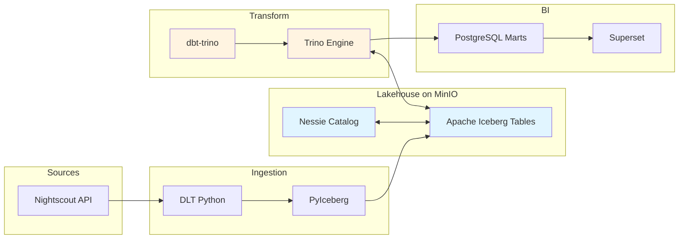

# Cascade: Modern Data Lakehouse

## Overview

Cascade is a production-ready, open-source data lakehouse platform built on Apache Iceberg and Project Nessie. It provides Git-like version control for data, ACID transactions, time travel, and a complete transformation pipeline from raw data to analytics-ready marts.

## Architecture

Cascade uses modern, enterprise-grade components in a fully open-source stack:

- **Apache Iceberg**: Open table format with ACID, schema evolution, and time travel
- **Project Nessie**: Git-like catalog with branching, tagging, and cross-table transactions
- **Trino**: Distributed SQL query engine for Iceberg tables
- **dbt**: SQL-based transformations and data modeling
- **Dagster**: Asset-based orchestration with lineage tracking
- **MinIO**: S3-compatible object storage for data and metadata
- **PostgreSQL**: Relational database for BI marts and service metadata
- **Superset**: Business intelligence and dashboards
- **Grafana + Prometheus + Loki**: Complete observability stack with metrics, logs, and dashboards
- **FastAPI REST API**: Programmatic data access with JWT authentication
- **Hasura GraphQL API**: GraphQL interface for flexible queries
- **OpenMetadata**: Data catalog for discovery, lineage, and metadata management

## Quick Start

### Prerequisites

- Docker and Docker Compose
- `uv` for Python package management (for development)

### Setup

1. Clone the repository and configure environment:
```bash
cp .env.example .env
# Edit .env with your passwords and configuration
```

2. Install Python dependencies (for development):
```bash
make setup
```

3. Start all services:
```bash
make up-all
```

Or start specific profiles:
```bash
make up-core       # postgres, minio, dagster, hub
make up-query      # trino, nessie
make up-bi         # superset, pgweb
make up-api        # rest api, graphql api
make up-catalog    # openmetadata data catalog
make up-observability  # grafana, prometheus, loki, alloy
```

4. Access the services using the provided make targets:

   ```bash
   # Core services
   make hub          # Service dashboard (localhost:10009)
   make dagster      # Pipeline orchestration (localhost:10006)
   make docs         # Documentation (localhost:10012)

   # Additional services
   make superset     # BI dashboards (localhost:10007)
   make catalog      # Data catalog (localhost:10020)
   make api          # REST API docs (localhost:10010/docs)
   make hasura       # GraphQL API (localhost:10011/console)
   make minio        # Object storage (localhost:10002)
   make grafana      # Observability (localhost:10016)
   make pgweb        # Database UI (localhost:10008)
   ```

   All services are accessible via **sequential ports (10000-10020)** with no additional setup required.
    - **Loki:** http://localhost:3100 (logs)

### First Pipeline Run

1. Materialize the Nightscout ingestion asset:
```bash
docker exec dagster-webserver dagster asset materialize --select entries
```

2. Run dbt transformations:
```bash
docker exec dagster-webserver dagster asset materialize --select "dbt:*"
```

3. Publish to PostgreSQL marts:
```bash
docker exec dagster-webserver dagster asset materialize --select "postgres_*"
```

4. View dashboards in Superset at http://localhost:8088

## Key Features

### Git-Like Branching for Data

Nessie provides branch isolation and atomic commits:

```sql
-- Work on dev branch
SELECT * FROM iceberg.bronze.stg_entries;

-- Promote to main via merge
-- (automated via Dagster assets)
```

### Time Travel Queries

Query data as it existed at any point in history:

```sql
-- Query as of specific timestamp
SELECT * FROM iceberg.silver.fct_glucose_readings
FOR TIMESTAMP AS OF '2024-10-15 12:00:00';

-- Query specific snapshot
SELECT * FROM iceberg.silver.fct_glucose_readings
FOR VERSION AS OF <snapshot-id>;
```

### Multi-Engine Analytics

Query Iceberg tables with multiple engines:

- **Trino**: Production queries and dbt transformations
- **DuckDB**: Fast ad-hoc analysis (via iceberg extension)
- **Spark**: Large-scale batch processing (future)

### Asset-Based Orchestration

Dagster manages the full pipeline as declarative assets:

```
nightscout_api
  → entries (Iceberg raw)
    → dbt:bronze.stg_entries
      → dbt:silver.fct_glucose_readings
        → dbt:gold.dim_date
          → postgres_marts
            → superset_dashboards
```

### APIs for Data Access

Cascade provides multiple APIs for programmatic data access:

#### REST API (FastAPI)
- **Endpoint:** http://localhost:8000
- **Authentication:** JWT tokens (admin/analyst roles)
- **Features:**
  - Query Iceberg tables via Trino
  - Access Postgres marts
  - Rate limiting and caching
  - OpenAPI/Swagger documentation

#### GraphQL API (Hasura)
- **Endpoint:** http://localhost:8081
- **Features:**
  - Flexible GraphQL queries
  - Real-time subscriptions
  - Schema introspection
  - Auto-generated documentation

#### Hub Dashboard
- **Endpoint:** http://localhost:54321
- **Features:**
  - Service status overview
  - Quick links to all services
  - Health checks
  - Configuration display

### Observability Stack

Complete monitoring and observability with industry-standard tools:

#### Grafana (Dashboards)
- **Endpoint:** http://localhost:3001
- **Features:**
  - Custom dashboards for metrics
  - Service health visualization
  - Alerting and notifications

#### Prometheus (Metrics)
- **Endpoint:** http://localhost:9090
- **Metrics collected:**
  - Service health and performance
  - Database query performance
  - API response times
  - Resource utilization

#### Loki (Logs)
- **Endpoint:** http://localhost:3100
- **Features:**
  - Centralized log aggregation
  - Structured logging queries
  - Integration with Grafana

#### Alloy (Telemetry Collector)
- **Endpoint:** http://localhost:12345
- **Features:**
  - Collects metrics from Docker containers
  - Forwards logs to Loki
  - Service discovery and auto-configuration

## Data Flow



## Project Structure

```
cascade/
├── src/cascade/
│   ├── config.py              # Centralized configuration
│   ├── definitions.py         # Dagster definitions entry point
│   ├── iceberg/               # PyIceberg catalog and tables
│   │   ├── catalog.py
│   │   ├── tables.py
│   │   └── schema.py
│   ├── defs/
│   │   ├── ingestion/         # DLT → Iceberg assets
│   │   ├── transform/         # dbt transformation assets
│   │   ├── publishing/        # Trino → Postgres publishing
│   │   ├── quality/           # Data quality checks
│   │   ├── resources/         # Dagster resources (Trino, Nessie, etc)
│   │   └── schedules/         # Pipeline schedules
│   └── schemas/               # Pandera validation schemas
├── services/
│   ├── api/                   # FastAPI REST service
│   │   ├── app/
│   │   │   ├── main.py        # API entry point
│   │   │   ├── routers/       # API endpoints
│   │   │   └── middleware/    # Auth, rate limiting
│   │   └── Dockerfile
│   └── hub/                   # Flask status dashboard
│       └── app.py
├── transforms/dbt/
│   ├── models/
│   │   ├── bronze/           # Staging layer
│   │   ├── silver/           # Fact tables
│   │   ├── gold/             # Dimensions
│   │   └── marts/            # Business metrics
│   └── profiles/
│       └── profiles.yml      # Trino connection config
├── docker/
│   ├── trino/catalog/        # Trino catalog configurations
│   ├── nessie/               # Nessie configuration
│   ├── prometheus/           # Prometheus configuration
│   ├── loki/                 # Loki configuration
│   ├── alloy/                # Grafana Alloy configuration
│   └── grafana/              # Grafana dashboards
└── docs/
    ├── ARCHITECTURE.md       # Detailed architecture guide
    ├── QUICK_START.md        # Setup instructions
    ├── NESSIE_WORKFLOW.md    # Branching workflow
    └── duckdb-iceberg-queries.md  # DuckDB analysis guide
```

## Development

### Local Development Setup

1. Install Python dependencies:
```bash
cd services/dagster
uv pip install -e .
```

2. Run type checking:
```bash
basedpyright src/cascade/
```

3. Run linting:
```bash
ruff check src/cascade/
ruff format src/cascade/
```

### Configuration

All service configuration is managed through environment variables in `.env`:

- **Nessie:** `NESSIE_PORT`, `NESSIE_VERSION`
- **Trino:** `TRINO_PORT`, `TRINO_VERSION`
- **Iceberg:** `ICEBERG_WAREHOUSE_PATH`, `ICEBERG_STAGING_PATH`
- **Database:** `POSTGRES_USER`, `POSTGRES_PASSWORD`, `POSTGRES_DB`
- **Storage:** `MINIO_ROOT_USER`, `MINIO_ROOT_PASSWORD`

See `src/cascade/config.py` for the complete configuration schema.

### Adding New Assets

1. Create asset function in appropriate module under `src/cascade/defs/`
2. Import and include in the relevant `__init__.py`
3. Asset will be automatically discovered by Dagster

### Testing

```bash
# Run integration tests
pytest tests/

# Test specific phase
./tests/test_phase3_ingestion.sh
./tests/test_phase4_transformation.sh
```

## Documentation

- **[Architecture Guide](./ARCHITECTURE.md)** - Detailed system design
- **[Quick Start](./QUICK_START.md)** - Step-by-step setup
- **[Nessie Workflow](./NESSIE_WORKFLOW.md)** - Branching and promotion
- **[DuckDB Queries](./docs/duckdb-iceberg-queries.md)** - Ad-hoc analysis

## Why This Architecture?

### Standardization
- Apache Iceberg is the industry-standard open table format
- Used by Snowflake, Databricks, AWS, Google Cloud, and more
- No vendor lock-in

### Git-Like Workflows
- Branch isolation for dev/test/prod
- Atomic commits across multiple tables
- Time travel to any historical state
- Tag releases for reproducibility

### Multi-Engine Flexibility
- Trino for production queries
- DuckDB for fast local analysis
- Easy to add Spark, Flink, or cloud engines

### Production Ready
- ACID transactions prevent data corruption
- Schema evolution without breaking changes
- Partition pruning for query performance
- Concurrent read/write support

### 12-Factor Compliance
- Stateless services
- Configuration via environment
- Logs to stdout
- Ready for Kubernetes deployment

## Troubleshooting

### Services Won't Start

```bash
# Check service status
docker compose ps

# View logs
docker compose logs nessie
docker compose logs trino
docker compose logs dagster-webserver
```

### Catalog Connection Issues

```bash
# Test Nessie API
curl http://localhost:19120/api/v2/config

# Test Trino connection
docker exec trino trino --execute "SHOW CATALOGS;"

# Verify Iceberg catalog
docker exec dagster-webserver python -c "
from cascade.iceberg.catalog import get_catalog
cat = get_catalog()
print(cat.list_namespaces())
"
```

### Asset Materialization Failures

```bash
# View Dagster logs
docker logs dagster-daemon

# Check asset details in Dagster UI
open http://localhost:3000

# Test dbt manually
docker exec dagster-webserver dbt run \
  --project-dir /dbt \
  --profiles-dir /dbt/profiles \
  --target dev
```

### Reset Everything

```bash
# WARNING: Destroys all data
make clean-all
make fresh-start
```

## Example Use Case: Nightscout Glucose Monitoring

Cascade includes a complete example pipeline ingesting Nightscout CGM data:

1. **Ingestion**: DLT fetches from Nightscout API → PyIceberg writes to raw.entries
2. **Bronze**: dbt stages data with type conversions → bronze.stg_entries
3. **Silver**: dbt creates fact table with metrics → silver.fct_glucose_readings
4. **Gold**: dbt builds dimension tables → gold.dim_date
5. **Marts**: Postgres marts for fast BI queries → marts.mrt_glucose_overview
6. **Dashboards**: Superset visualizations

Perfect for learning modern data engineering patterns with real-world data.

## Production Deployment

Cascade is designed for production use:

- **Docker Compose**: POC and small deployments
- **Kubernetes**: Enterprise scale (Helm charts planned)
- **Cloud**: Works with AWS S3, GCS, Azure Blob Storage
- **Hybrid**: Mix on-prem storage with cloud compute

See [ARCHITECTURE.md](./ARCHITECTURE.md) for production hardening guidance.

## Contributing

This is a personal project demonstrating modern data lakehouse patterns. Feel free to fork and adapt for your needs.

## License

MIT License - See LICENSE file for details.

## Acknowledgments

Built with excellent open-source tools:

- [Apache Iceberg](https://iceberg.apache.org/)
- [Project Nessie](https://projectnessie.org/)
- [Trino](https://trino.io/)
- [dbt](https://www.getdbt.com/)
- [Dagster](https://dagster.io/)
- [MinIO](https://min.io/)
- [Superset](https://superset.apache.org/)
- [FastAPI](https://fastapi.tiangolo.com/)
- [Hasura](https://hasura.io/)
- [Grafana](https://grafana.com/)
- [Prometheus](https://prometheus.io/)
- [Loki](https://grafana.com/oss/loki/)
