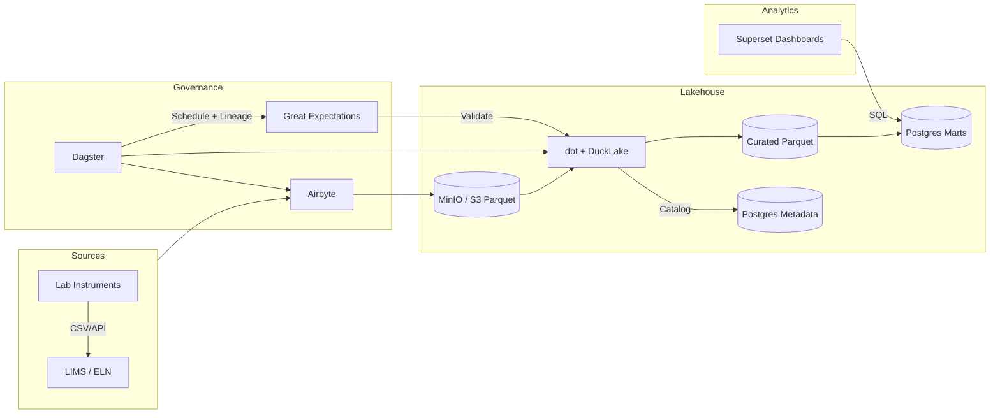

# 🧬 Data Lakehouse Architecture Overview

## Purpose

This platform provides a **modern, open-source data lakehouse** designed for **cell and gene therapy manufacturing and analytics**.
It enables secure, automated, and governed handling of scientific and operational data — from instruments and lab systems through to analytics, dashboards, and machine learning.

## 🚀 Quick Start

### Prerequisites

- Docker and Docker Compose
- `uv` for Python package management (optional, for local development)

### Setup

1. **Clone the repository and configure environment:**
   ```bash
   cp .env.example .env
   # Edit .env with your passwords and configuration
   ```

2. **Start all services:**
   ```bash
   docker-compose up -d
   ```

3. **Access the services:**
   - **Hub:** http://localhost:54321 (service status dashboard)
   - **Dagster:** http://localhost:3000 (orchestration UI)
   - **Superset:** http://localhost:8088 (dashboards)
   - **MinIO Console:** http://localhost:9001 (object storage)
   - **DataHub:** http://localhost:9002 (metadata catalog)

### Configuration

All service configuration is managed through environment variables in `.env`. Key settings:

- **Database:** `POSTGRES_USER`, `POSTGRES_PASSWORD`, `POSTGRES_DB`
- **Storage:** `MINIO_ROOT_USER`, `MINIO_ROOT_PASSWORD`
- **Services:** `AIRBYTE_HOST`, `DAGSTER_PORT`, `SUPERSET_PORT`
- **Paths:** `DBT_PROJECT_DIR`, `DUCKDB_WAREHOUSE_PATH`

See `lakehousekit/config.py` for the complete centralized configuration schema.

## 📚 Documentation

**[Full Documentation →](./docs/README.md)**

- **[Component Guides](./docs/components/)** - Individual tool documentation
- **[Integration Guides](./docs/integrations/)** - How components work together
- **[Asset-Based Architecture](./ASSET_BASED_ARCHITECTURE.md)** - Dagster asset details
- **[Airbyte Setup](./AIRBYTE_SETUP.md)** - Optional data ingestion

## 🎯 Example: Complete End-to-End Pipeline

**[Nightscout Glucose Monitoring Pipeline](./NIGHTSCOUT_EXAMPLE.md)**

A production-ready example demonstrating the full stack using real-world CGM data:
- REST API ingestion with Dagster assets
- 5-layer dbt transformations (staging → intermediate → curated → marts)
- Data quality validation with Great Expectations
- Lineage tracking with OpenLineage/Marquez
- Superset dashboards for visualization

Perfect for Python developers learning modern data engineering patterns.

---

## 1. Concept at a Glance

| Layer                           | Primary Tools                                         | Purpose                                                          |
| ------------------------------- | ----------------------------------------------------- | ---------------------------------------------------------------- |
| **Data Sources**                | Lab instruments, LIMS/ELN, process equipment exports  | Generate raw batch and assay data                                |
| **Landing / Data Lake**         | **MinIO (S3-compatible storage)** + **Parquet files** | Central repository for all raw and curated data in open formats  |
| **Processing & Transformation** | **Dagster + DLT + dbt + DuckLake**               | Orchestrates ingestion, validation, transformation, and loading  |
| **Metadata & Governance**       | **PostgreSQL + Great Expectations + Dagster lineage** | Maintains catalog, schema, data-quality checks, and audit trail  |
| **Analytics & Reporting**       | **Postgres Marts + Superset Dashboarding**            | Presents trusted, near-real-time insights and KPIs               |
| **Optional Extensions**         | **MotherDuck / OpenMetadata / MLflow**                | Cloud scalability, lineage catalog, and machine-learning support |

---

## 2. Why This Matters

- **Single Source of Truth** – All assay and manufacturing data are consolidated in one governed store.
- **Traceable & Compliant** – Each pipeline is version-controlled, validated, and logged for audit readiness.
- **Flexible Growth Path** – Starts small on-prem, scales to cloud or hybrid as data and user needs grow.
- **Vendor Independence** – Entirely open-source; no lock-in or recurring license fees.
- **Empowers Teams** – Scientists, analysts, and engineers can access clean, structured data safely and efficiently.

---

## 3. Components Explained

### **A. MinIO — Data Lake Storage**

- Acts as an **S3-compatible object store** for all raw and processed data files.
- Stores Parquet and CSV outputs from instruments, assays, and batch exports.
- Versioned buckets provide immutability and rollback capability (useful for GMP data integrity).

---

### **B. PostgreSQL — Metadata and Analytics Marts**

- Dual role:
  1. **Metadata catalog** for DuckDB (DuckLake) ensuring transactional consistency and schema management.
  2. **Analytics marts** – optimized relational tables (summaries, KPIs) for dashboards and external tools.
- Provides ACID compliance, user management, and straightforward backup/restore.

---

### **C. DuckLake / DuckDB — Analytical Engine**

- Performs **high-performance SQL analytics** directly on Parquet files.
- Enables “warehouse-like” queries without needing large cloud clusters.
- Supports batch-level processing ideal for manufacturing and QC data.
- Open, local, and fast – ideal starting point before scaling to cloud (MotherDuck).

---

### **D. Airbyte — Data Ingestion**

- Connects to multiple data sources (files, APIs, databases).
- Extracts and loads data automatically into MinIO (raw zone) or PostgreSQL (reference data).
- OSS with enterprise option – minimizes custom code while keeping control over data movement.

---

### **E. dbt — Data Transformation & Modeling**

- Manages all SQL-based transformations: cleaning, joining, aggregating, and enriching data.
- Separates raw, staging, curated, and mart layers using versioned, auditable models.
- Produces documentation and lineage for transparency.
- Targets both DuckLake (curated Parquet) and PostgreSQL (marts).

---

### **F. Dagster — Orchestration & Monitoring**

- Central orchestrator coordinating **Airbyte**, **dbt**, and **Great Expectations** runs.
- Provides a visual UI for pipeline runs, schedules, alerts, and asset lineage.
- Ensures each batch’s data follows the same controlled and validated process from ingestion to reporting.
- Can scale from a single node to distributed or cloud deployment as workloads increase.

---

### **G. Great Expectations — Data Quality & Validation**

- Enforces schema, range, and completeness checks at every stage of the pipeline.
- Automatically halts or flags failed loads, maintaining trust in reported data.
- Generates human-readable “data docs” for audits and internal quality reviews.

---

### **H. Superset — Business Intelligence & Dashboards**

- Provides browser-based dashboards and visual analytics.
- Connects directly to PostgreSQL marts for fast query performance.
- Supports secure access controls and shareable dashboards for management reporting.
- Easily extended with custom KPI dashboards for manufacturing, QC, or assay analytics.

---

### **I. Optional Extensions**

- **MotherDuck** – cloud-hosted DuckDB service enabling collaboration and larger compute.
- **OpenMetadata or DataHub** – enterprise metadata catalogs with full lineage and data discovery.
- **MLflow or JupyterHub** – add-on layer for model training, experiment tracking, and ML deployment.

---

## 4. Typical Data Flow

1. **Ingestion** – Airbyte automatically pulls new batch or assay files and stores them as Parquet in MinIO.
2. **Validation** – Great Expectations verifies data completeness and quality.
3. **Transformation** – dbt builds clean, structured “curated” datasets in DuckLake.
4. **Loading to Marts** – dbt materializes summarized and downsampled data into PostgreSQL for BI.
5. **Orchestration & Scheduling** – Dagster coordinates all these steps, logs results, and provides visibility.
6. **Analytics & Reporting** – Superset dashboards pull live metrics and trends from the Postgres marts.

---

## 5. Deployment Approach

- **On-Premise or Hybrid:**
  - Core stack (MinIO, Postgres, Dagster, dbt, Superset) runs on local or virtual infrastructure.
  - Cloud options (MotherDuck, S3) can be introduced incrementally as scale demands.

- **Open Source, No Lock-In:**
  - All components are free, OSS tools with optional paid enterprise tiers for support or advanced scaling.
  - Python dependencies managed with `uv` for fast, reliable package management.

- **Scalable & Modular:**
  - Each layer can evolve independently (e.g., replace Superset with Power BI, scale storage to cloud, or add new pipelines).

---

## 6. Development

### Local Development Setup

1. **Install Python dependencies:**
   ```bash
   cd dagster
   uv pip install -e .
   ```

2. **Run type checking:**
   ```bash
   basedpyright lakehousekit/
   ```

3. **Run linting:**
   ```bash
   ruff check lakehousekit/
   ruff format lakehousekit/
   ```

### Project Structure

```
lakehousekit/
├── config.py              # Centralized configuration management
├── definitions.py         # Main Dagster definitions entry point
├── defs/
│   ├── ingestion/        # Raw data ingestion assets (Airbyte, raw files)
│   ├── transform/        # dbt transformation assets
│   ├── publishing/       # Publishing to Postgres marts
│   ├── quality/          # Data quality checks (Pandera)
│   ├── metadata/         # Metadata ingestion (DataHub)
│   ├── resources/        # Dagster resources (Airbyte, dbt)
│   └── schedules/        # Job schedules
└── schemas/              # Pandera data validation schemas
```

### Adding New Assets

1. Create asset function in appropriate module under `lakehousekit/defs/`
2. Import and include in the relevant `__init__.py`
3. Asset will be automatically discovered by Dagster

### Testing

```bash
# Run Dagster definitions validation
dagster dev --workspace dagster/workspace.yaml

# Load and validate assets
dagster asset materialize --select my_asset_name
```

---

## 7. Troubleshooting

### Services Won't Start

**Check Docker resources:**
```bash
docker-compose ps
docker-compose logs <service-name>
```

**Common issues:**
- MinIO needs at least 512MB memory
- Dagster requires PostgreSQL to be healthy before starting

### Dagster Assets Failing

**Check environment variables:**
```bash
docker exec dagster-webserver env | grep POSTGRES
```

**View Dagster logs:**
```bash
docker logs dagster-webserver
```

### Database Connection Issues

**Verify PostgreSQL is accessible:**
```bash
docker exec -it postgres psql -U lake -d lakehouse -c "\dt"
```

**Reset database if needed:**
```bash
docker-compose down -v  # WARNING: Destroys all data
docker-compose up -d
```

### DuckLake Transaction Conflicts

DuckLake supports concurrent writers, but long-running jobs can still hold catalog locks.

**Solution:**
- Keep partition tasks scoped to a single day to minimize transaction duration.
- If a run crashes, rerun the failed partition—DuckLake retries now handle brief conflicts automatically.
- For stuck locks, restart the Dagster worker to release the open DuckDB session.

### Configuration Issues

**Validate configuration loads correctly:**
```python
from lakehousekit.config import config
print(config.model_dump())
```

---

## 8. Benefits to the Organization

- **Improved Decision-Making:** Rapid analytics from lab and manufacturing data within hours of batch completion.
- **Data Integrity & Compliance:** Full audit trail, reproducible transformations, and version-controlled codebase.
- **Operational Efficiency:** Automated ingestion and transformation remove manual spreadsheet work.
- **Future-Ready:** Easily extended for machine learning, digital twins, and advanced process optimization.

---

## 9. Summary Diagram (Conceptual)


